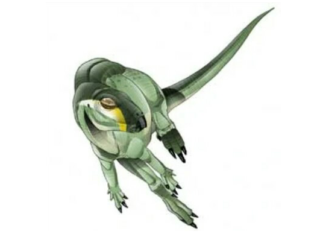
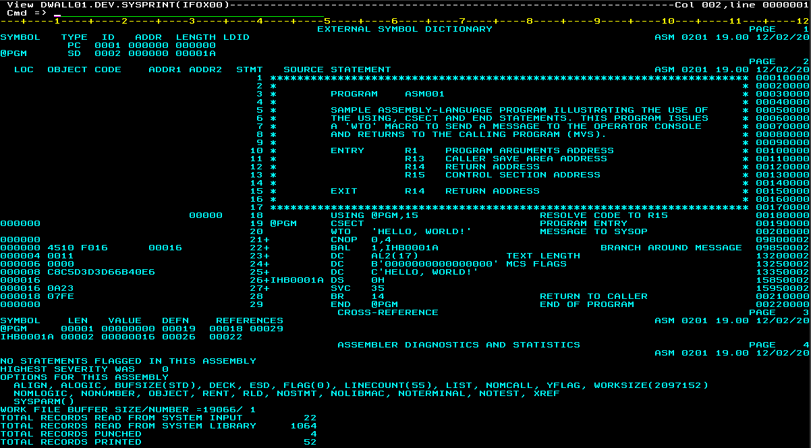

## drinker

### A System/370 Development Environment for MVS 3.8
<i>"Although based on good remains, it remains obscure."</i>

<table><tr><td>Welcome to the Jurassic! This project documents the installation and operation of a System/370 assembly-language development environment running on the Multiple Virtual Storage (MVS) Release 3.8 operating system. This OS is running in <a href="http://www.hercules-390.eu/">Hercules 3.13</a> S/370 emulation on Ubuntu Linux 20.04 hosted on Amazon Web Services (AWS).  "Drinker (for Edward Drinker Cope) was a genus of hypsilophodont dinosaur from the late Jurassic period of North America. Although based on good remains, it remains obscure due to a lack of post-naming publications."  <a href="https://fossil.fandom.com/wiki/Drinker">fossil.fandom.com</a>  This project is dedicated to all who work tirelessly to raise interest in mainframe technologies, especially <a href="http://jaymoseley.com/hercules">Jay Moseley</a>, <a href="http://www.rogerbowler.fr/hercules.htm">Roger Bowler</a>, <a href="http://www.cbttape.org/~jjaeger/">Jan Jaeger</a>, <a href="http://cbttape.org/~jmorrison/">Jim Morrison</a>, <a href="http://www.prince-webdesign.nl/index.php/software/rpf-english-version">Rob Prins</a>, <a href="http://tommysprinkle.com">Tommy Sprinkle</a>, <a href="http://prycroft6.com.au">Greg Price</a>, <a href="http://www.conmicro.com/">Jay Maynard</a>, <a href="http://www.softdevlabs.com/index.html">David Trout</a>, <a href="https://hansen-family.com/mvs/">Bob Hansen</a>, <a href="https://cbttape.org">Sam Knutson and Sam Golob</a>, and the many good people at the <a href="https://hercules-390.groups.io/g/group">Hercules 390 Forum</a> and <a href="http://bitsavers.org">bitsavers.org</a></td></tr></table>

[Prepare a Linux Server](docs/Linux.md)  
[Generate the System](docs/MVS.md)  
[Configure the Environment](docs/Development.md)  
[Sample Programs](docs/Samples.md)

<table width=100%><tr><td></td><td></td></tr></table>
drinker @ <a href="https://dinopedia.fandom.com/wiki/Drinker">dinopedia.fandom.com</a>

&copy; 2010-2020 David J. Walling. MIT License. <i>"What's a S0C4? To keep your feet warm."</i>
