## Configure the Environment

A useful development environment will require more DASD for libraries to keep our source, copy books, object decks, linked modules, etc. We'll also want some Job Control Language (JCL) to backup and restore Partitioned Data Set (PDS) members, run our assembler and linker and run our programs. The main tasks accomplished in this stage are:

* Add new storage for development artifacts
* Define development data sets
* Define job control language (JCL) for development tasks

### Create Development Environment DASD

Log on to the cloud server using the SSH client account and "su" to a user with sudo privilege. Use the Hercules dasdinit utility to create three new model 3380 and three new model 3390 disk packs, which is a lot easier than how we got them in 1989.
```
$ dasdinit -a dasd/daa181.3380 3380 111111
HHCDU044I Creating 3380 volume 111111: 886 cyls, 15 trks/cyl, 47616 bytes/track
HHCDU041I 886 cylinders successfully written to file dasd/daa181.3380
HHCDI001I DASD initialization successfully completed.
$ dasdinit -a dasd/daa191.3390 3390 222222
HHCDU044I Creating 3390 volume 222222: 1114 cyls, 15 trks/cyl, 56832 bytes/track
HHCDU041I 1114 cylinders successfully written to file dasd/daa191.3390
HHCDI001I DASD initialization successfully completed.
$ dasdinit -a dasd/daa280.3380 3380 333333
HHCDU044I Creating 3380 volume 333333: 886 cyls, 15 trks/cyl, 47616 bytes/track
HHCDU041I 886 cylinders successfully written to file dasd/daa280.3380
HHCDI001I DASD initialization successfully completed.
$ dasdinit -a dasd/daa281.3380 3380 444444
HHCDU044I Creating 3380 volume 444444: 886 cyls, 15 trks/cyl, 47616 bytes/track
HHCDU041I 886 cylinders successfully written to file dasd/daa281.3380
HHCDI001I DASD initialization successfully completed.
$ dasdinit -a dasd/daa290.3390 3390 555555
HHCDU044I Creating 3390 volume 555555: 1114 cyls, 15 trks/cyl, 56832 bytes/track
HHCDU041I 1114 cylinders successfully written to file dasd/daa290.3390
HHCDI001I DASD initialization successfully completed.
$ dasdinit -a dasd/daa291.3390 3390 666666
HHCDU044I Creating 3390 volume 666666: 1114 cyls, 15 trks/cyl, 56832 bytes/track
HHCDU041I 1114 cylinders successfully written to file dasd/daa291.3390
HHCDI001I DASD initialization successfully completed.
```

### Attach Development Environment DASD

Connect to the Hercules Web Console. Attach the new devices. These commands are Hercules commands. Do not start them with a slash "/".
```
(web console)
Command ==> attach 181 3380 dasd/daa181.3380
HHCDA020I dasd/daa181.3380 cyls=886 heads=15 tracks=13290 trklen=47616
Command ==> attach 191 3390 dasd/daa191.3390 cu=3880
HHCDA020I dasd/daa191.3390 cyls=1114 heads=15 tracks=16710 trklen=56832
Command ==> attach 280 3380 dasd/daa280.3380
HHCDA020I dasd/daa280.3380 cyls=886 heads=15 tracks=13290 trklen=47616
Command ==> attach 281 3380 dasd/daa281.3380
HHCDA020I dasd/daa281.3380 cyls=886 heads=15 tracks=13290 trklen=47616
Command ==> attach 290 3390 dasd/daa290.3390 cu=3880
HHCDA020I dasd/daa290.3390 cyls=1114 heads=15 tracks=16710 trklen=56832
Command ==> attach 291 3390 dasd/daa291.3390 cu=3880
HHCDA020I dasd/daa290.3390 cyls=1114 heads=15 tracks=16710 trklen=56832
```

<hr><table><tr><td>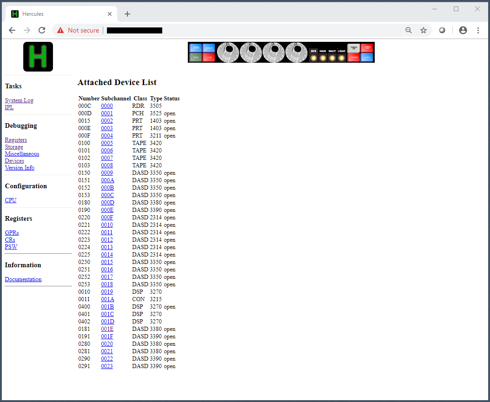</td></tr></table><hr>

### Initialize Development Environment DASD

We'll create and run a job to initialize the new DASD. Thanks to Jay, TSO users have several data sets created by default. Connect a TN3270 session and log on to TSO and run RPF. Rob Prins' excellent RPF allows cut-and-paste from a text file into a PDS member in edit mode even with num-mode on. At the PDF menu, select option 2 (edit) and enter the Member: MKDASD and the Dsname: DWALL01.CNTL. After entering the Job, use the "save" command to save the member. Use the "submit" command to send the job to the internal reader for execution.

(tn3270 tso)
(dwall01.cntl(mkdasd))
```
//MKDASD   JOB (1),'INITIALIZE DASD',
//             CLASS=A,MSGLEVEL=(1,1),MSGCLASS=A
//*
//ICKDSF   EXEC PGM=ICKDSF13,REGION=4096K
//SYSPRINT DD  SYSOUT=*
//SYSIN    DD  *
  INIT UNIT(181) -
               VERIFY(111111) -
               OWNER(HERCULES) -
               VOLID(DAA181) -
               VTOC(0,1,30)
  INIT UNIT(191) -
               VERIFY(222222) -
               OWNER(HERCULES) -
               VOLID(DAA191) -
               VTOC(0,1,60)
  INIT UNIT(280) -
               VERIFY(333333) -
               OWNER(HERCULES) -
               VOLID(DAA280) -
               VTOC(0,1,30)
  INIT UNIT(281) -
               VERIFY(444444) -
               OWNER(HERCULES) -
               VOLID(DAA281) -
               VTOC(0,1,30)
  INIT UNIT(290) -
               VERIFY(555555) -
               OWNER(HERCULES) -
               VOLID(DAA290) -
               VTOC(0,1,60)
  INIT UNIT(291) -
               VERIFY(666666) -
               OWNER(HERCULES) -
               VOLID(DAA291) -
               VTOC(0,1,60)
//
```

<hr><table><tr><td>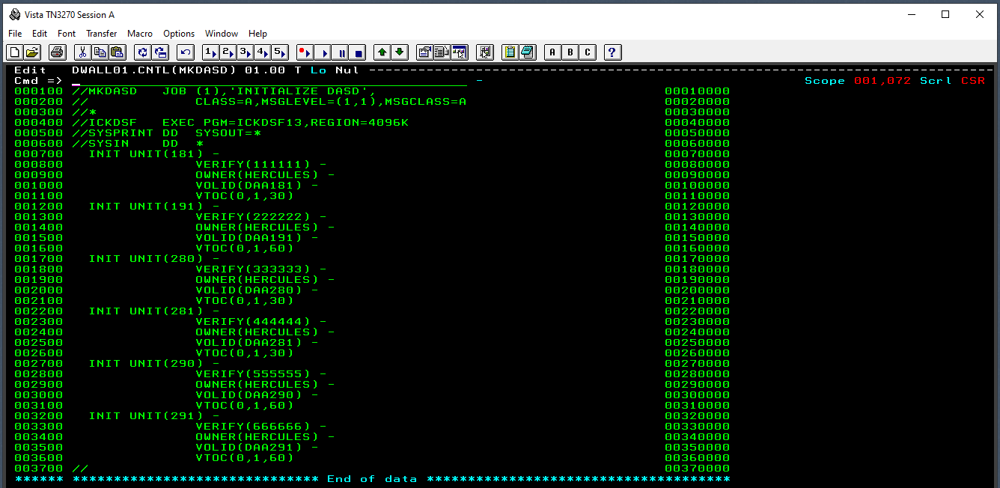</td></tr></table><hr>

At the web console, enter responses to allow each of the new DASD volumes to be altered by our job. These are console commands, so they are preceded with a forward slash "/".
```
(web client)
*02 ICK003D REPLY U TO ALTER VOLUME 0181 CONTENTS, ELSE T
Command: /r 2,u
...
*03 ICK003D REPLY U TO ALTER VOLUME 0191 CONTENTS, ELSE T
Command: /r 3,u
...
*04 ICK003D REPLY U TO ALTER VOLUME 0280 CONTENTS, ELSE T
Command: /r 4,u
...
*05 ICK003D REPLY U TO ALTER VOLUME 0281 CONTENTS, ELSE T
Command: /r 5,u
...
*06 ICK003D REPLY U TO ALTER VOLUME 0290 CONTENTS, ELSE T
Command: /r 6,u
...
*07 ICK003D REPLY U TO ALTER VOLUME 0291 CONTENTS, ELSE T
Command: /r 7,u
...
$HASP250 MKDASD   IS PURGED
```

<hr><table><tr><td>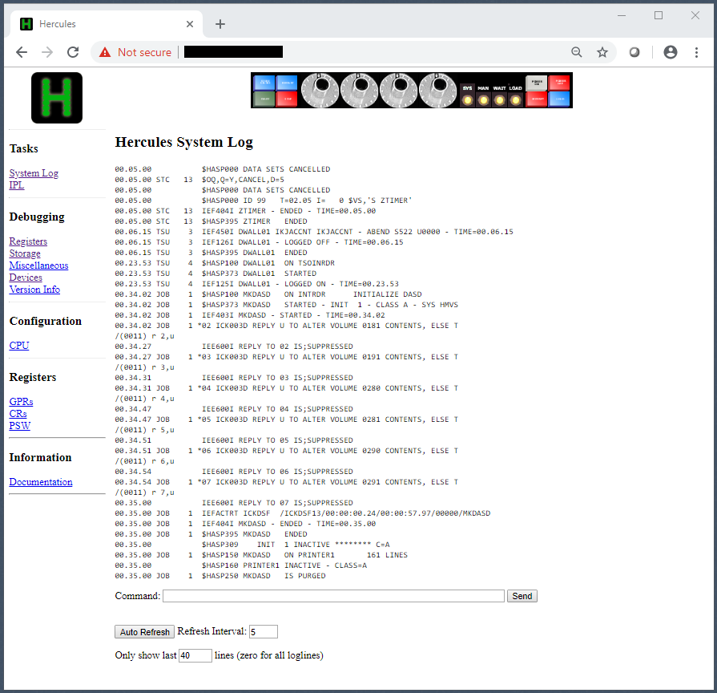</td></tr></table><hr>

You may run the condcode.rexx script from our SSH client bash session to confirm our job was successful. But, you can also determine that from the web console.
```
(bash)
$ bin/condcode.rexx sysout/prt00e.txt mkdasd
Searching sysout/prt00e.txt for MVS Job Name mkdasd

Job Name    Step Name    Proc Step Name    Completion Code
--------    ---------    --------------    ---------------
MKDASD      ICKDSF                         0000

  1 steps executed in selected jobs
  1 steps received completion code = 0000
```

### Vary Online and Mount Development DASD

Use the web console to vary online our newly initialized devices. These are console commands, so precede them with a forward slash "/".
```
(web console)
Command: /v 181,online
IEE302I 181      ONLINE
Command: /m 181,vol=(sl,daa181),use=private
 $HASP100 MOUNT    ON STCINRDR
 $HASP100 MOUNT    ON STCINRDR
 $HASP373 MOUNT    STARTED
 $HASP373 MOUNT    STARTED
 IEF403I MOUNT - STARTED - TIME=17.12.13
 IEF404I MOUNT - ENDED - TIME=17.12.13
 $HASP395 MOUNT    ENDED
 $HASP395 MOUNT    ENDED
Command: /v 191,online
IEE302I 191      ONLINE
Command: /m 191,vol=(sl,daa191),use=private
...
 $HASP395 MOUNT    ENDED
Command: /v 280,online
IEE302I 280      ONLINE
Command: /m 280,vol=(sl,daa280),use=private
...
 $HASP395 MOUNT    ENDED 
Command: /v 281,online
IEE302I 281      ONLINE
Command: /m 281,vol=(sl,daa281),use=private
...
 $HASP395 MOUNT    ENDED 
Command: /v 290,online
IEE302I 290      ONLINE
Command: /m 290,vol=(sl,daa290),use=private
...
 $HASP395 MOUNT    ENDED 
Command: /v 291,online
IEE302I 291      ONLINE
Command: /m 291,vol=(sl,daa291),use=private
...
 $HASP395 MOUNT    ENDED
```

<hr><table><tr><td>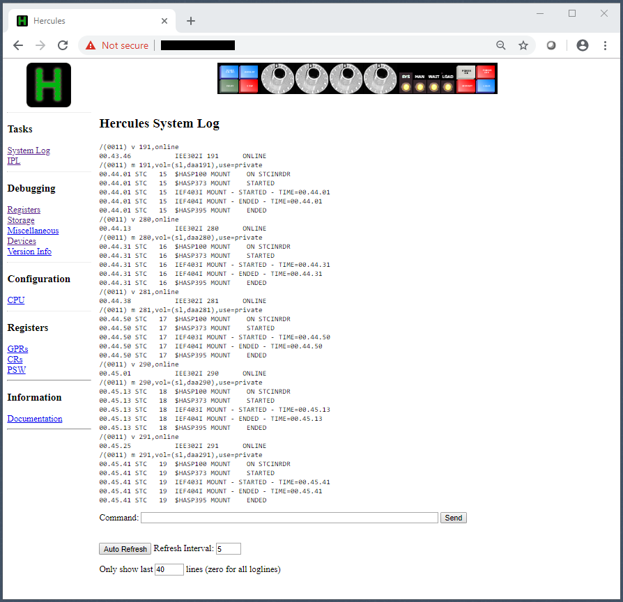</td></tr></table><hr>

### Examine VTOC Using RPF

Use RPF option 3.4 to view details about each new DASD device now that it is online and mounted.
```
(tn3270 tso)
Option  ===> 3.4
Option  ===> V
Data set level = 
Volume = DAA181
UCB=0181,Volume=DAA181,SMS=No ,date=20.337,time=16:28:59,VTOC=OS,parm=     
VTOC: CCHH=X'00000001'-X'00020000',DS4VTOCI=X'00',DSCB/TRK=53,DIR/TRK=46   
VTOC: Trks/cyl=15,Track length=47968,Number of cyls=00886                  
DAA181 free   882 cyls    14 trks max:   882 cyls    14 trks     0 datasets
Number of free VTOC index records (VIRS)= N/A  , blank DSCBS=  1588        
Volume = DAA191
UCB=0191,Volume=DAA191,SMS=No ,date=20.337,time=16:29:37,VTOC=OS,parm=     
VTOC: CCHH=X'00000001'-X'00040000',DS4VTOCI=X'00',DSCB/TRK=50,DIR/TRK=45   
VTOC: Trks/cyl=15,Track length=58786,Number of cyls=01114                  
DAA191 free  1108 cyls    14 trks max:  1108 cyls    14 trks     0 datasets
Number of free VTOC index records (VIRS)= N/A  , blank DSCBS=  2998        
Volume = DAA280
UCB=0280,Volume=DAA280,SMS=No ,date=20.337,time=16:30:02,VTOC=OS,parm=     
VTOC: CCHH=X'00000001'-X'00020000',DS4VTOCI=X'00',DSCB/TRK=53,DIR/TRK=46   
VTOC: Trks/cyl=15,Track length=47968,Number of cyls=00886                  
DAA280 free   882 cyls    14 trks max:   882 cyls    14 trks     0 datasets
Number of free VTOC index records (VIRS)= N/A  , blank DSCBS=  1588        
Volume = DAA281
UCB=0281,Volume=DAA281,SMS=No ,date=20.337,time=16:30:22,VTOC=OS,parm=      
VTOC: CCHH=X'00000001'-X'00020000',DS4VTOCI=X'00',DSCB/TRK=53,DIR/TRK=46    
VTOC: Trks/cyl=15,Track length=47968,Number of cyls=00886                   
DAA281 free   882 cyls    14 trks max:   882 cyls    14 trks     0 datasets 
Number of free VTOC index records (VIRS)= N/A  , blank DSCBS=  1588         
Volume = DAA290
UCB=0290,Volume=DAA290,SMS=No ,date=20.337,time=16:30:42,VTOC=OS,parm=     
VTOC: CCHH=X'00000001'-X'00040000',DS4VTOCI=X'00',DSCB/TRK=50,DIR/TRK=45   
VTOC: Trks/cyl=15,Track length=58786,Number of cyls=01114                  
DAA290 free  1108 cyls    14 trks max:  1108 cyls    14 trks     0 datasets
Number of free VTOC index records (VIRS)= N/A  , blank DSCBS=  2998        
Volume = DAA291
UCB=0291,Volume=DAA291,SMS=No ,date=20.337,time=16:31:00,VTOC=OS,parm=     
VTOC: CCHH=X'00000001'-X'00040000',DS4VTOCI=X'00',DSCB/TRK=50,DIR/TRK=45   
VTOC: Trks/cyl=15,Track length=58786,Number of cyls=01114                  
DAA291 free  1108 cyls    14 trks max:  1108 cyls    14 trks     0 datasets
Number of free VTOC index records (VIRS)= N/A  , blank DSCBS=  2998 
```

<hr><table><tr><td>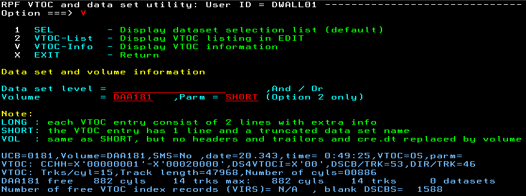</td></tr></table><hr>

### Update SYS1.PARMLIB(VATLST00) for New DASD

To make sure our new DASD is accessible on restart, add the new devices to SYS1.PARMLIB(VATLST00).
```
(tn3270 tso)
(SYS1.PARMLIB(VATLST00))
MVSRES,0,2,3350    ,Y        SYSTEM RESIDENCE (PRIVATE)                 
MVS000,0,2,3350    ,Y        SYSTEM DATASETS (PRIVATE)                  
PAGE00,0,2,3350    ,Y        PAGE DATASETS (PRIVATE)                    
PUB000,1,2,3380    ,N        PUBLIC DATASETS (PRIVATE)                  
PUB001,1,2,3390    ,N        PUBLIC DATASETS (PRIVATE)                  
SMP000,1,2,3350    ,N        DISTRIBUTION LIBRARIES (PRIVATE)           
SORTW1,1,1,2314    ,N        SORT WORK (PUBLIC)                         
SORTW2,1,1,2314    ,N        SORT WORK (PUBLIC)                         
SORTW3,1,1,2314    ,N        SORT WORK (PUBLIC)                         
SORTW4,1,1,2314    ,N        SORT WORK (PUBLIC)                         
SORTW5,1,1,2314    ,N        SORT WORK (PUBLIC)                         
SORTW6,1,1,2314    ,N        SORT WORK (PUBLIC)                         
SPOOL1,0,2,3350    ,Y        JES2 QUEUES (PRIVATE)                      
SYSCPK,1,2,3350    ,N        COMPILER/TOOLS (PRIVATE)                   
WORK00,1,0,3350    ,N        WORK PACK (STORAGE)                        
WORK01,1,0,3350    ,N        WORK PACK (STORAGE)                        
DAA181,1,2,3380    ,N        DEVELOPMENT (PRIVATE)                      
DAA191,1,2,3390    ,N        DEVELOPMENT (PRIVATE)                      
DAA280,1,2,3380    ,N        DEVELOPMENT (PRIVATE)                      
DAA281,1,2,3380    ,N        DEVELOPMENT (PRIVATE)                      
DAA290,1,2,3390    ,N        DEVELOPMENT (PRIVATE)                      
DAA291,1,2,3390    ,N        DEVELOPMENT (PRIVATE)         
```

<hr><table><tr><td>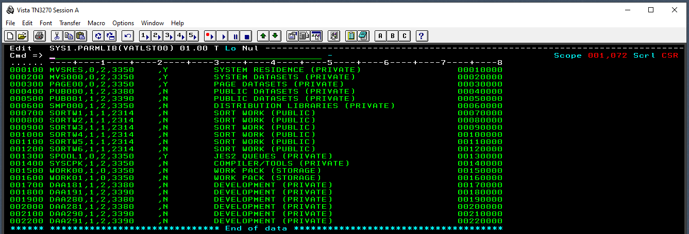</td></tr></table><hr>

### Add Development DASD to the Hercules Configuration

Edit the mvs.cnf configuration file to add rows for the new devices so that Hercules will attach them on restart.
```
(bash)
$ cp conf/mvs.cnf conf/mvs-syscpk.cnf
$ vi conf/mvs.cnf
#------------------------------------------------ 3380 on Channel 1
0180    3380    dasd/pub000.3380
0181    3380    dasd/daa181.3380
#------------------------------------------------ 3390 on Channel 1
0190    3390    dasd/pub001.3390 cu=3880
0191    3390    dasd/daa191.3390 cu=3880
...
#------------------------------------------------ 3380 on Channel 2
0280    3380    dasd/daa280.3380
0281    3380    dasd/daa281.3380
#------------------------------------------------ 3390 on Channel 2
0290    3390    dasd/daa290.3390 cu=3880
0291    3390    dasd/daa291.3390 cu=3880
:x
$
```

### Allocate Development Data Sets

Now we create data sets on our new disks. The table below illustrates data entered using RPF option 3.2 A (Allocate Data Set). The screen capture below the table illustrates the first row, where DWALL01.DEV.JCLLIB is allocated.
```
(tn3270 tso)
Option ===> 3.2
Option ===> A
Prefix  Lib Type     Unit  Vol    Spc RECFM LRECL BLKSIZE PRI SEC DIR
DWALL01 DEV JCLLIB   SYSDA DAA191 CYL FB    80    3120    40  5   20
DWALL01 DEV MACLIB   SYSDA DAA191 CYL FB    80    3120    40  5   20
DWALL01 DEV SORLIB   SYSDA DAA191 CYL FB    80    3120    40  5   20
DWALL01 DEV SYSPRINT SYSDA DAA191 CYL FB    121   1089    50  5   40
DWALL01 DEV OBJLIB   SYSDA DAA191 CYL FB    80    3120    50  5   40
DWALL01 DEV MODLIB   SYSDA DAA191 CYL U     0     19069   50  5   40
<pf3>
```

<hr><table><tr><td>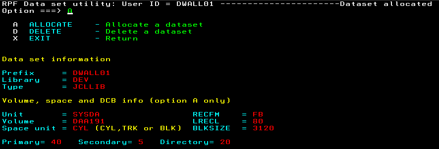</td></tr></table><hr>

### Verify Data Set Allocation

Use RPF option 3.4 to review allocated datasets at level DWALL01 on volume DAA191.
```
Option ==> 3.4      
Option ==> 1
Data set level = DWALL01
Volume = DAA191
Dataset name               Cre.dt Ref.dt Org  RECFM RECL   BLK Ext  Size Free
DWALL01.DEV.JCLLIB         20.337 00.000 PO   FB      80  3120   1   600  599
DWALL01.DEV.MACLIB         20.337 00.000 PO   FB      80  3120   1   600  599
DWALL01.DEV.MODLIB         20.337 00.000 PO   U        0 19069   1   750  749
DWALL01.DEV.OBJLIB         20.337 00.000 PO   FB      80  3120   1   750  749
DWALL01.DEV.SORLIB         20.337 00.000 PO   FB      80  3120   1   600  599
DWALL01.DEV.SYSPRINT       20.337 00.000 PO   FB     121  1089   1   750  749
```

<hr><table><tr><td>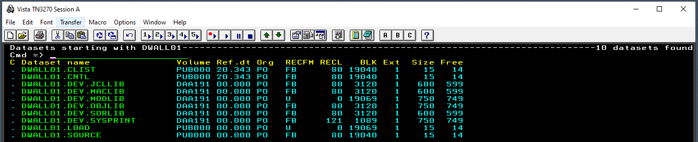</td></tr></table><hr>

### Create JCL to Backup Development Sources

Create a job to backup three of the data sets we just created: JCLLIB, MACLIB and SORLIB. The backup will delete and recreate backup data sets on a different volume and then copy the dataset members. The remaining development datasets, OBJLIB, MODLIB and SYSPRINT contain information generated from the first three, so we'll not create backup datasets for them. Note that the step that deletes the backup data sets before recreating them, JS010, has a condition code (COND) of "(0,LE)" by default. This will prevent that step from running since the backup data sets do not exist yet. After running this job the first time, change the COND to "(0,LT)". Or, allocate the backup data sets in RPF 3.2 Option A before running the job. I've put a "NOTIFY=DWALL01" statement in the JOB card. This will instruct TSO to send my session a message when the job completes.

(tn3270)
(dwall01.dev.jcllib(backup))
```
//BACKUP   JOB (001),'DWALL01',CLASS=A,MSGCLASS=A,                      
//             MSGLEVEL=(1,1),NOTIFY=DWALL01                            
//*                                                                     
//*        --> RUN THIS JOB FROM DWALL01.DEV.JCLLIB <--                 
//*                                                                     
//JS001   EXEC PGM=IEFBR14                                              
//*                                                                     
//*            DELETE THE TARGET DATA SETS                              
//*                                                                     
//JS010   EXEC PGM=IEFBR14,COND=(0,LE)                                  
//SYSPRINT  DD SYSOUT=*                                                 
//SYSUT1    DD DSN=DWALL01.BACKUP.JCLLIB,DISP=(OLD,DELETE)              
//SYSUT2    DD DSN=DWALL01.BACKUP.MACLIB,DISP=(OLD,DELETE)              
//SYSUT3    DD DSN=DWALL01.BACKUP.SORLIB,DISP=(OLD,DELETE)              
//*                                                                     
//*            CREATE THE TARGET DATASETS                               
//*                                                                     
//JS020   EXEC PGM=IEFBR14,COND=(0,LT)                                  
//SYSPRINT  DD SYSOUT=*                                                 
//SYSUT1    DD DSN=DWALL01.BACKUP.JCLLIB,                               
//             DISP=(NEW,CATLG,DELETE),                                 
//             UNIT=3390,VOL=SER=DAA291,                                
//             SPACE=(CYL,(40,5,20)),                                   
//             DCB=(RECFM=FB,LRECL=80,BLKSIZE=3120)                     
//SYSUT2    DD DSN=DWALL01.BACKUP.MACLIB,                               
//             DISP=(NEW,CATLG,DELETE),                                 
//             UNIT=3390,VOL=SER=DAA291,                                
//             SPACE=(CYL,(40,5,20)),                                   
//             DCB=(RECFM=FB,LRECL=80,BLKSIZE=3120)                     
//SYSUT3    DD DSN=DWALL01.BACKUP.SORLIB,                               
//             DISP=(NEW,CATLG,DELETE),                                 
//             UNIT=3390,VOL=SER=DAA291,                                
//             SPACE=(CYL,(40,5,20)),                                   
//             DCB=(RECFM=FB,LRECL=80,BLKSIZE=3120)                     
//*                                                                     
//*            BACKUP THE MEMBERS                                       
//*                                                                     
//JS030   EXEC PGM=IEBCOPY,COND=(0,LT)                                  
//SYSPRINT  DD DISP=SHR,DSN=DWALL01.DEV.SYSPRINT(BACKUP)                
//SYSUT1    DD DISP=SHR,DSN=DWALL01.DEV.JCLLIB                          
//SYSUT2    DD DISP=SHR,DSN=DWALL01.BACKUP.JCLLIB                       
//SYSUT3    DD DISP=SHR,DSN=DWALL01.DEV.MACLIB                          
//SYSUT4    DD DISP=SHR,DSN=DWALL01.BACKUP.MACLIB                       
//SYSUT5    DD DISP=SHR,DSN=DWALL01.DEV.SORLIB                          
//SYSUT6    DD DISP=SHR,DSN=DWALL01.BACKUP.SORLIB                       
//SYSIN     DD *                                                        
 COPY INDD=((SYSUT1,R)),OUTDD=SYSUT2                                    
 COPY INDD=((SYSUT3,R)),OUTDD=SYSUT4                                    
 COPY INDD=((SYSUT5,R)),OUTDD=SYSUT6                                    
/*                                                                      
//                                                                      
```

<hr><table><tr><td>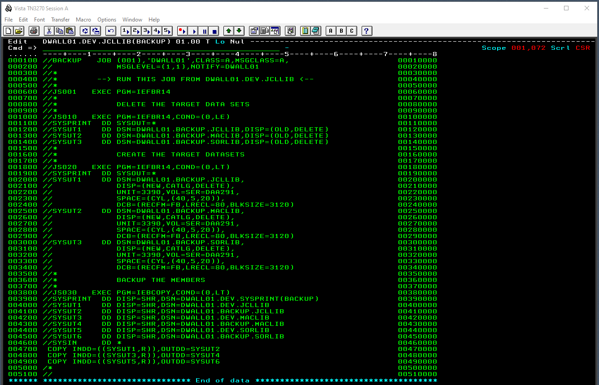</td></tr></table><hr>

### Create Sample Source File to Test the Backup Job

At this point, instead of documenting each individual RPF command, I'll note the session (tn3270 tso) and the PDS and member (dwall01.dev.sorlib(asm001)), since each time we edit in RPF, the commands to open the editor (Option ===> 2) are the same.

(tn3270 tso)
(dwall01.dev.sorlib(asm001))
```
***********************************************************************
*                                                                     *
*        PROGRAM    ASM001                                            *
*                                                                     *
*        SAMPLE ASSEMBLY-LANGUAGE PROGRAM ILLUSTRATING THE USE OF     *
*        THE USING, CSECT AND END STATEMENTS. THIS PROGRAM ISSUES     *
*        A 'WTO' MACRO TO SEND A MESSAGE TO THE OPERATOR CONSOLE      *
*        AND RETURNS TO THE CALLING PROGRAM (MVS).                    *
*                                                                     *
*        ENTRY      R1    PROGRAM ARGUMENTS ADDRESS                   *
*                   R13   CALLER SAVE AREA ADDRESS                    *
*                   R14   RETURN ADDRESS                              *
*                   R15   CONTROL SECTION ADDRESS                     *
*                                                                     *
*        EXIT       R14   RETURN ADDRESS                              *
*                                                                     *
***********************************************************************
         USING @PGM,15                  RESOLVE CODE TO R15            
@PGM     CSECT                          PROGRAM ENTRY                  
         WTO   'HELLO, WORLD!'          MESSAGE TO SYSOP               
         BR    14                       RETURN TO CALLER               
         END   @PGM                     END OF PROGRAM                 
```

### Backup Development Source Files

We can submit our backup job either by entering the "submit" command on the command line while editing the member (RPF Option 2) or outside of RPF by entering the submit command directly in TSO. Since we included a NOTIFY statement on the job card, once the job ends, a notification appears the next time we hit enter or send any other attention identifer (AID) from the terminal.

<hr><table><tr><td>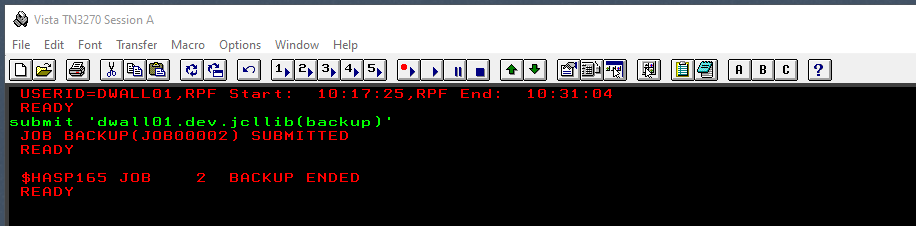</td></tr></table><hr>

On our web console, the BACKUP job is reported. Note that job step JS010 did not execute because COND=(0,LE). There was no need to delete backup data sets that did not exist.

<hr><table><tr><td>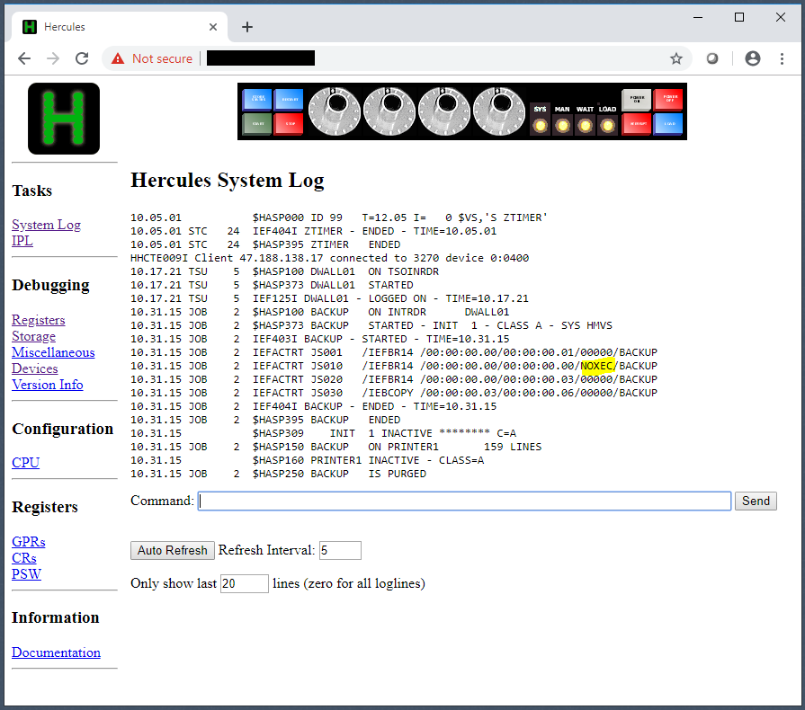</td></tr></table><hr>

### Inspect Job Output Messages in Sysprint PDS

Our JCL sent its job output messages to a newly-created partitioned data set (PDS) DWALL01.DEV.SYSPRINT. We can inspect messages reported by the IEBCOPY program in job step JS030 by viewing 'DWALL01.DEV.SYSPRINT(BACKUP)'. Each time the BACKUP job is run, this member will be replaced. Here we see that one member, "BACKUP" was copied from our development JCL data set and one member, "ASM001", was copied from our development source data set. The copy book data set, DWALL01.DEV.MACLIB, did not have any members in it to copy.

<hr><table><tr><td>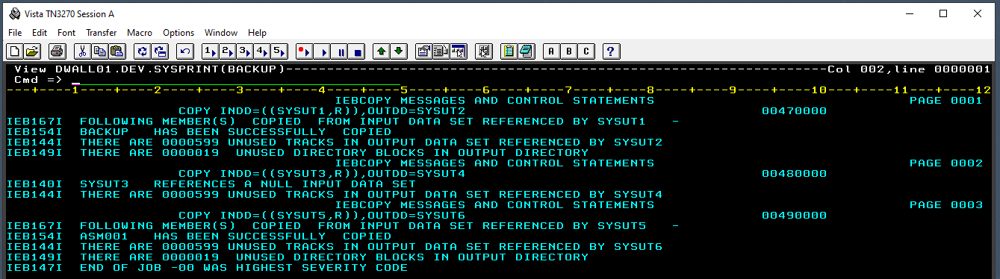</td></tr></table><hr>

### Create JCL to Restore Development Sources

Now we create a RESTORE job to perform the reverse action, restore PDS members from backup data sets to development data sets. The important thing about this job is that it must be run either from TSO outside of RPF or while editing the job in DWALL01.BACKUP.JCLLIB because the job deletes the DWALL01.DEV.JCLLIB data set. This deletion will fail if you are editing the member in DWALL01.DEV.JCLLIB at the time you submit the job.

(tn3270 tso)  
(dwall01.backup.jcllib(restore))
```
//RESTORE  JOB (001),'DWALL01',CLASS=A,MSGCLASS=A,          
//             MSGLEVEL=(1,1),NOTIFY=DWALL01                
//*                                                         
//*        --> RUN THIS JOB FROM DWALL01.BACKUP.JCLLIB <--  
//*                                                         
//JS001   EXEC PGM=IEFBR14                                  
//*                                                         
//*            DELETE THE TARGET DATA SETS                  
//*                                                         
//JS010   EXEC PGM=IEFBR14,COND=(0,LT)                      
//SYSPRINT  DD SYSOUT=*                                     
//SYSUT1    DD DSN=DWALL01.DEV.JCLLIB,DISP=(OLD,DELETE)     
//SYSUT2    DD DSN=DWALL01.DEV.MACLIB,DISP=(OLD,DELETE)     
//SYSUT3    DD DSN=DWALL01.DEV.SORLIB,DISP=(OLD,DELETE)     
//*                                                         
//*            CREATE THE TARGET DATASETS                   
//*                                                         
//JS020   EXEC PGM=IEFBR14,COND=(0,LT)                      
//SYSPRINT  DD SYSOUT=*                                     
//SYSUT1    DD DSN=DWALL01.DEV.JCLLIB,                      
//             DISP=(NEW,CATLG,DELETE),                     
//             UNIT=3390,VOL=SER=DAA191,                    
//             SPACE=(CYL,(40,5,20)),                       
//             DCB=(RECFM=FB,LRECL=80,BLKSIZE=3120)         
//SYSUT2    DD DSN=DWALL01.DEV.MACLIB,                      
//             DISP=(NEW,CATLG,DELETE),                     
//             UNIT=3390,VOL=SER=DAA191,                    
//             SPACE=(CYL,(40,5,20)),                       
//             DCB=(RECFM=FB,LRECL=80,BLKSIZE=3120)         
//SYSUT3    DD DSN=DWALL01.DEV.SORLIB,                      
//             DISP=(NEW,CATLG,DELETE),                     
//             UNIT=3390,VOL=SER=DAA191,                    
//             SPACE=(CYL,(40,5,20)),                       
//             DCB=(RECFM=FB,LRECL=80,BLKSIZE=3120)         
//*                                                         
//*            RESTORE THE MEMBERS                          
//*                                                         
//JS030   EXEC PGM=IEBCOPY,COND=(0,LT)                      
//SYSPRINT  DD DISP=SHR,DSN=DWALL01.DEV.SYSPRINT(RESTORE)   
//SYSUT1    DD DISP=SHR,DSN=DWALL01.BACKUP.JCLLIB   
//SYSUT2    DD DISP=SHR,DSN=DWALL01.DEV.JCLLIB       
//SYSUT3    DD DISP=SHR,DSN=DWALL01.BACKUP.MACLIB    
//SYSUT4    DD DISP=SHR,DSN=DWALL01.DEV.MACLIB       
//SYSUT5    DD DISP=SHR,DSN=DWALL01.BACKUP.SORLIB    
//SYSUT6    DD DISP=SHR,DSN=DWALL01.DEV.SORLIB       
//SYSIN     DD *                                     
 COPY INDD=((SYSUT1,R)),OUTDD=SYSUT2                 
 COPY INDD=((SYSUT3,R)),OUTDD=SYSUT4                 
 COPY INDD=((SYSUT5,R)),OUTDD=SYSUT6                 
/*                                                   
//  
```

### Create and Run JCL to Assemble and Link a Program

Now we'll create a job to assemble and link our sample program ASM001. This JCL is rudimentary in that you need to indicate the source member name, ASM001, in multiple places. To save time, we'll ultimately make this a cataloged procedure and run a simple job to call it passing a single source file name as a parameter. We'll save this JCL in DWALL01.DEV.JCLLIB(ASMLKED) and submit it to assemble and link our program. Then we'll inspect the results on our web console and in our SYSPRINT PDS.
```
//ASMLKED  JOB (001),'DWALL01',CLASS=A,MSGCLASS=A,
//             MSGLEVEL=(1,1),NOTIFY=DWALL01
//*
//*            ASSEMBLE THE PROGRAM
//*
//JS010   EXEC PGM=IFOX00,REGION=256K,
//             PARM='OBJ,RENT,XREF'
//SYSLIB    DD DISP=SHR,DSN=SYS1.MACLIB
//          DD DISP=SHR,DSN=DWALL01.DEV.MACLIB
//SYSUT1    DD DSN=&&SYSUT1,UNIT=SYSSQ,
//             SPACE=(1700,(600,100)),SEP=(SYSLIB)
//SYSUT2    DD DSN=&&SYSUT2,UNIT=SYSSQ,
//             SPACE=(1700,(300,50)),SEP=(SYSUT1)
//SYSUT3    DD DSN=&&SYSUT3,UNIT=SYSSQ,
//             SPACE=(1700,(300,50))
//SYSPRINT  DD DISP=SHR,DSN=DWALL01.DEV.SYSPRINT(IFOX00)
//SYSPUNCH  DD SYSOUT=B
//SYSGO     DD DISP=SHR,DSN=DWALL01.DEV.OBJLIB(ASM001)
//SYSIN     DD DISP=SHR,DSN=DWALL01.DEV.SORLIB(ASM001)
//*
//*            LINK THE PROGRAM
//*
//JS020   EXEC PGM=IEWL,REGION=256K,COND=(0,LT),
//             PARM='XREF,LET,LIST,NCAL,RENT'
//SYSUT1    DD DSN=&&SYSUT1,UNIT=(SYSDA,SEP=(SYSLIN,SYSLMOD)),
//             SPACE=(1024,(50,20))
//SYSPRINT  DD DISP=SHR,DSN=DWALL01.DEV.SYSPRINT(IEWL)
//SYSLMOD   DD DISP=SHR,DSN=DWALL01.DEV.MODLIB(ASM001)
//SYSLIN    DD DISP=SHR,DSN=DWALL01.DEV.OBJLIB(ASM001)
//SYSIN     DD *
NAME ASM001(R)
/*
//
```
<hr><table><tr><td>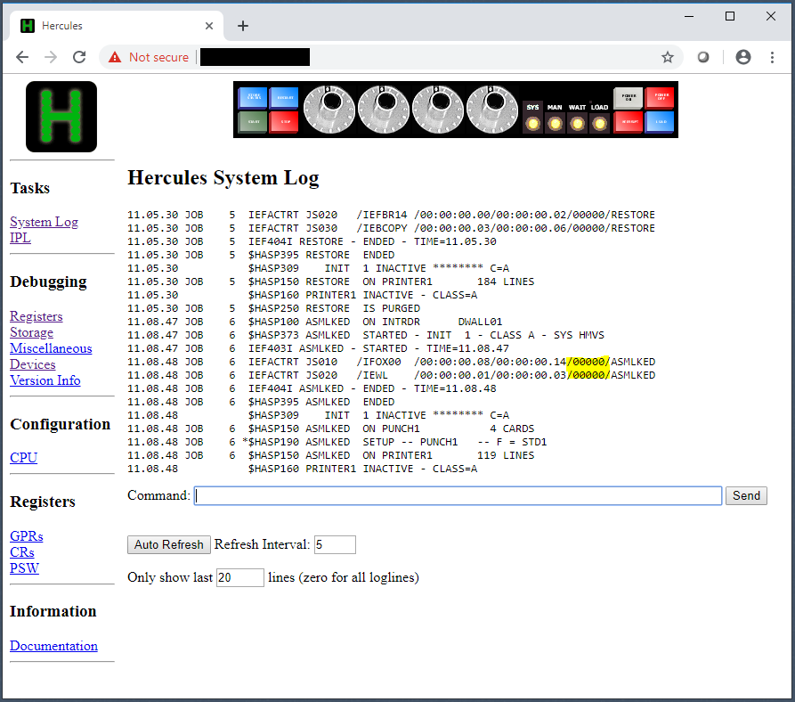</td></tr></table><hr>

Our first job step, JS010, wrote assembler output messages to DWALL01.DEV.SYSPRINT(IFOX00).

<hr><table><tr><td>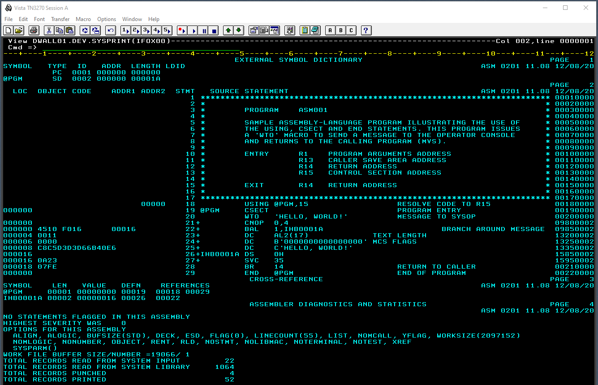</td></tr></table><hr>

The assembly output of our first job step is an object deck written to DWALL01.DEV.OBJLIB(ASM001). This file has both text and binary elements to it. Some binary values cannot be represented as printable characters.

<hr><table><tr><td>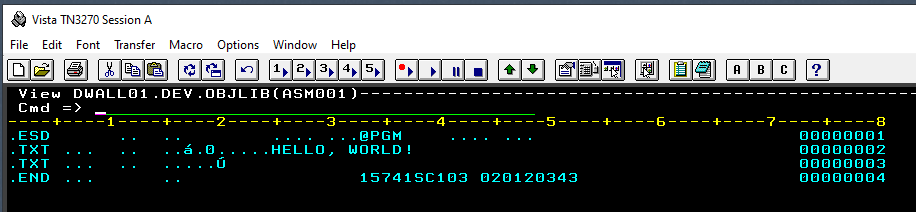</td></tr></table><hr>

Our second job step, JS020, wrote link editor messages to DWALL01.DEV.SYSPRINT(IEWL).

<hr><table><tr><td>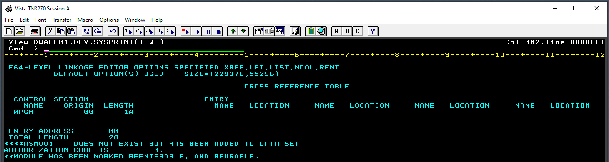</td></tr></table><hr>

The linkage output of the linkage editor step is an executable modules written to DWALL01.DEV.MODLIB(ASM001). This file is primarily binary. The actual machine instructions for the executable program are in the final record beginning with the x45 x10 xF0 x16 values. We saw these earlier in DWALL01.DEV.SYSPRINT(IFOX00).

<hr><table><tr><td>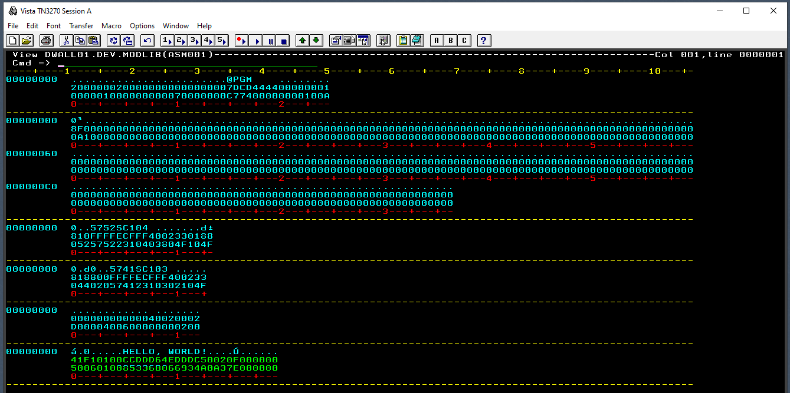</td></tr>
<tr><td>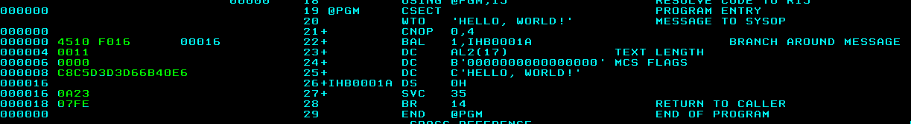</td></tr></table><hr>

### Create and Run JCL to Run a Program

Now that our sample program has been compiled and linked, we can run the program. The ASM001 program uses the WTO macro to write a message, "HELLO, WORLD!" to the operator console. We create a JCL job stream in DWALL01.DEV.JCLLIB(ASM001), save it and submit it. Then check the output on the console. The only job step, JS010, runs the ASM001 program that we linked in the previous step. The STEPLIB statement informs JES2 to find the executable program in DWALL01.DEV.MODLIB where our linkage editor created it. Output statements from the program (there are none) would be written to DWALL01.DEV.SYSPRINT(ASM001). But this member won't be created because the program does not write to SYSPRINT, it writes to the console.

(dwall01.dev.jcllib(asm001))
```
//ASM001   JOB (001),'DWALL01',CLASS=A,MSGCLASS=A,      
//             MSGLEVEL=(1,1),NOTIFY=DWALL01            
//JS010   EXEC PGM=ASM001,REGION=256K                   
//STEPLIB   DD DISP=SHR,DSN=DWALL01.DEV.MODLIB          
//SYSPRINT  DD DISP=SHR,DSN=DWALL01.DEV.SYSPRINT(ASM001)
//SYSUDUMP  DD SYSOUT=*                                 
//SYSABEND  DD SYSOUT=*                                 
//                                                      
```

<hr><table><tr><td>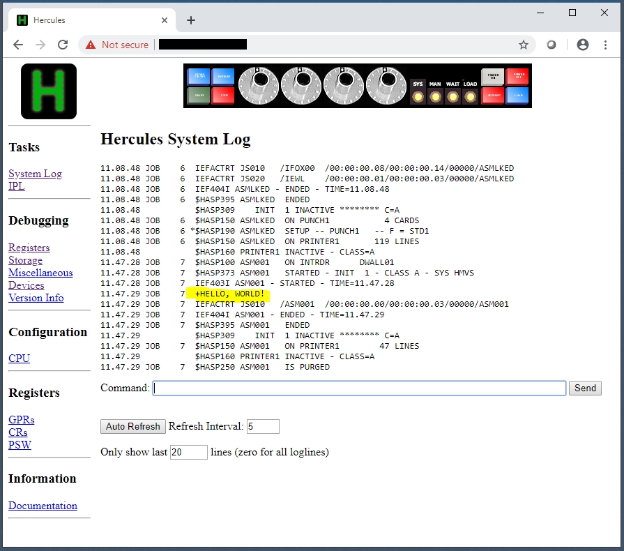</td></tr></table><hr>

### Stop the System and Backup the Development Environment

Exit RPF in the TSO session and disconnect and close that TN3270 session. Use the web console to normally terminate TSO, VTAM and JES2 and quiesce. In an SSH session to the cloud server, logon to a sudo-enabled account, use systemctl to stop the service and archive DASD. Restart hercules and follow the normal IPL process using the web console.

```
(bash)
$ sudo systmectl stop hercules
$ sudo tar -zcf backup/60-dasd-20201208.tar.gz dasd
$ sudo systemctl start hercules
$ sudo systemctl status hercules 
```

We've created DASD, data sets, JCL and source members, assembled, linked and run a test program. In the next section we'll look at BDAM and VSAM file access methods, Generation Data Group (GDG), using IEBGENER to make changes to an existing PDS member, modify the NETSOL VTAM welcome screen, introduce a object oriented method of using base registers, create reusable code objects for pseudo-random number generation, log-file I/O and Secure Hash Algorithm (SHA) computation, and demonstrate running a program as a started task.

Continue to [Sample Programs](Samples.md)  
Go back to [Generate the System](MVS.md)  
Return to [README](../README.md)
