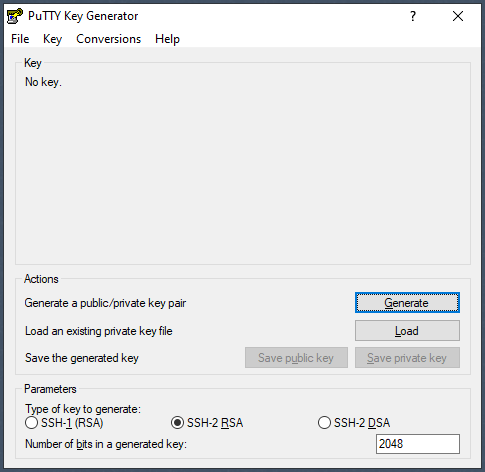
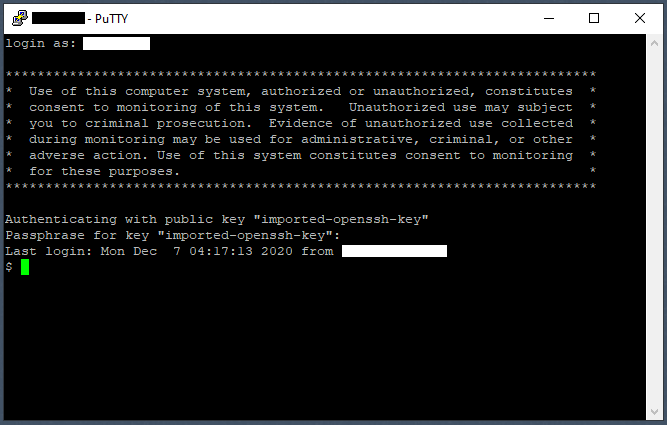

## Prepare a Linux Server

We're preparing a cloud-based Ubuntu Linux 20.04 server to run Hercules 3.13. The objective here is to continuously run Hercules securely and reliably. Commands documented here are those entered in a bash shell over a secure (SSH) connection. Instead of including links to images, commands are recorded here as text to make them easier to copy. We'll start out using an account with sudo (switch user and do) privilege, which might be typical for an account on a freshly-provisioned cloud-based server. But as we go along, we'll want to limit SSH access to a non-sudo account.

### Update System Packages

Before any installation, make sure existing packages are up-to-date. Debian-based distributions may provide the "apt-get" program (or "apt" for short). Three commands are used here. "apt update" identifies packages that can be updated. "apt upgrade" performs the updates. "apt autoremove" removes packages no longer needed after updates are performed. Prefixing privileged commands with "sudo" can seem tedious. But, I prefer that to acting as root ("sudo su -") because it does not switch environments and aids in documenting which commands require privileged access.
```
$ sudo apt update
$ sudo apt upgrade
$ sudo apt autoremove
```

### Disable vim Command History

If vim is installed, disable its recording of command history to help prevent unwanted visitors from gaining insight into your recent activity or skimming sensitive information.
```
$ which vim
/usr/bin/vim
$ vim
:set viminfo='0,:0,<0,@0,f0,%0,/0
:q
$
```

### Check or Install the SSH Server

Restrict SSH to a single user, having no "sudo" privilege, using a non-standard port from a limited range of IP addresses and authenticating using an asymmetric key-pair protected by a passphrase (public key authentication). We'll first confirm we have an SSH server installed. A cloud-server should but might not if you're initially accessing it using a web console.
```
$ sudo apt install openssh-server
...
openssh-server is already the newest version (1:8.2p1-4ubuntu0.1).
...
$ which sshd
/usr/sbin/sshd
$ systemctl status sshd
● ssh.service - OpenBSD Secure Shell server
     Loaded: loaded (/lib/systemd/system/ssh.service; enabled; vendor preset: enabled)
    Drop-In: /usr/lib/systemd/system/ssh.service.d
             └─ec2-instance-connect.conf
     Active: active (running) since Sat 2020-12-05 20:42:11 UTC; 1 day 2h ago
...
$
```

### Install net-tools

Install net-tools so we can use the "netstat" utility.
```
$ sudo apt install net-tools
...
Setting up net-tools (1.60+git20180626.aebd88e-1ubuntu1) ...
...
$ which netstat
/usr/bin/netstat
$
```

### Confirm the SSH Server Port

Confirm the SSH server is listening on port 22. We'll change the port after uploading our client SSH public key. For now, make sure your cloud service provider is allowing SSH connections to your server on port 22. Here I'm pretending my server's IP address is 23.45.67.89 as an example.
```
$ netstat -an | grep :22
tcp        0      0 23.45.67.89:22      0.0.0.0:*               LISTEN
$
```

### Create a Dedicated SSH Client Group and User

Create a non-sudo user intended only to accept SSH connections. I'm using "callisto" here as an example account name. When you assign a password to an account, use generally accepted best practices. The password should not be easily guessed nor forgotten, be at least 8 characters long, include upper and lower case alphabetic, numeric and other printable characters. Change passwords periodically. Do not use the same password for multiple sites.
```
$ sudo groupadd callisto
$ sudo useradd -m -d /home/callisto -g callisto callisto
$ sudo passwd callisto
New password: 
Retype new password: 
passwd: password updated successfully
$
```

### Create an SSH Key-Pair on your Client System and Upload it

When we use our SSH client account "callisto" to access our server, we will not be prompted for a password stored anywhere on the server. Instead, we will be prompted for a "passphrase" that has been used to encrypt a private key on our client computer. Here our client is a Windows 10 laptop. The private key must never leave the laptop. Its corresponding part, a public key, will be uploaded to the cloud-based server. The SSH service will confirm our identify by exchanging signed or encrypted data that can only be verified or decrypted by the other half of the key-pair. Here I use the popular puttygen utility to create the key-pair. PuTTY can be downloaded <a href="https://the.earth.li/~sgtatham/putty/latest/w64/putty-64bit-0.74-installer.msi">here</a>.

<hr><table><tr><td></td></tr></table><hr>

- Launch puttygen.exe.
- Select SSH-2 RSA as the key type.
- Enter 2048 as the number of bits in generated key.
- Click the Generate button.
- Move the mouse around in the "Key" area until enough random bits are generated.
- Enter a passphrase and again to confirm. Use a lengthier passphrase that is easy to remember but hard to guess. Do not use the same passphrase to protect multiple private keys.
- Click the "Save public key" button.
- Save the public key as putty_rsa.pub.
- Click the Save private key button.
- Save the private key as putty_rsa.ppk.
- Select the File|Exit menu option to exit.

Unlike public key certificates used by SSL, SSH private keys do not expire. But I would recommend replacing your SSH keys, even infrequently. It is not always immediately evident that a key has been compromised.

### Upload PuTTY-Format Public Key

Here we'll assume our cloud-based server is named "mycloudserver". Windows 10 has included scp (secure copy) since the Fall Creators Update 1709 in 2017.
```
C:\Windows\System32\OpenSSH> scp putty_rsa.pub callisto@mycloudserver:putty_rsa.pub
callisto@mycloudserver's password:
...
$
```

### Create the SSH Key-Pair on a Linux Client

If your local computer is a Linux box, you can use ssh-keygen to generate an SSH-compatible public key and use scp to upload it.
```
$ ssh-keygen
Enter file in which to save the key (/home/osboxes/.ssh/id_rsa):
Enter passphrase (empty for no passphrase): <passphrase>
Enter same passphrase again: 
$ scp ~/.ssh/id_rsa.pub callisto@mycloudserver:id_rsa.pub
callisto@mycloudserver's password: 
...
$
```

### Convert a PuTTY-Format Public Key to SSH Format
  
On the server, convert an uploaded PuTTY-format public key into OpenSSH format using ssh-keygen.
```
$ su -l callisto
Password: 
$ ssh-keygen -i -f putty_rsa.pub >> id_rsa.pub
$ rm -f putty_rsa.pub
$ exit
$
```

### Concatenate a Public Key to a Server's Authorized Hosts File

Append the SSH-format public key to the "authorized_keys" file in the .ssh folder of the "callisto" user we created for SSH access. 
```
$ su -l callisto
Password: 
$ cat id_rsa.pub >> ~/.ssh/authorized_keys
$ mv id_rsa.pub ~/.ssh
$ exit
$
```

### Restrict Access to Uploaded Public Keys on the Server

Limit access to the public keys stored in the "authorized_keys" file of your SSH client account.
```
$ su -l callisto
Passwword:
$ cd ~/.ssh
$ chmod 700 .
$ chmod 600 authorized_keys id_rsa.pub
$ exit
$
```

### Disable the SSH Message-of-the-Day

SSH servers sometimes report information when a client connects. I prefer my server to report as little information as possible, especially since the connection has not yet been authenticated. Disable the "message of the day" service.
```
$ sudo systemctl disable motd-news
```

### Create a Custom Greeting for SSH Clients

Compose and report your own security policy when an SSH client connects to your server. SSH can be configured to display the contents of a file when a client connects. Make sure this "banner" is kept in a secure folder that cannot be edited without "sudo" privilege.
```
sudo vi /etc/issue.net
  **************************************************************************
  *  Use of this computer system, authorized or unauthorized, constitutes  *
  *  consent to monitoring of this system.   Unauthorized use may subject  *
  *  you to criminal prosecution.  Evidence of unauthorized use collected  *
  *  during monitoring may be used for administrative, criminal, or other  *
  *  adverse action. Use of this system constitutes consent to monitoring  *
  *  for these purposes.                                                   *
  **************************************************************************
:x
$
```

### Configure SSH with a Non-Standard Port and Public-Key Access

Lock down the SSH service so that it listens on an alternate port, listens on only one interface, limits access to only our single SSH user, limits the time the client has to complete their log-in, disallows any access from the "root" user, allows only public-key authentication, times-out dormant connections and displays your policies. Make sure your service provider allows incoming connections on your chosen alternate port. In our example, our chosen alternate port is 6789.
```
$ sudo vi /etc/ssh/sshd_config
Port 6789
Protocol 2
ListenAddress 23.45.67.89
SyslogFacility AUTHPRIV
LoginGraceTime 30s
PubkeyAuthentication yes
PermitRootLogin no
PermitEmptyPasswords no
PasswordAuthentication no
ChallengeResponseAuthentication no
GSSAPIAuthentication no
X11Forwarding no
AllowUsers callisto
ClientAliveInterval 60
ClientAliveCountMax 15
Banner /etc/issue.net
```

### Restart the SSH Server

Restart the SSH server to make our changes active and reconnect over SSH using the SSH user account on the non-standard port. Use "su" (switch user) to change to your sudo-enabled user account. Here we're assuming that account is "ubuntu" as an example. Use netstat to confirm we are listening on our chosen address and port.
```
$ su -l ubuntu
Password:
$ sudo systemctl restart sshd
Password: 
$ netstat -an | grep :6789
tcp       0      23.45.67.89:6789   0.0.0.0:*       LISTEN
```

### Install iptables-persistent

Set server-based access rules to manage incoming and outgoing traffic.
```
$ sudo apt install iptables-persistent
(answer Yes when prompted.)
```

### Create a Firewall Defintion

Create a file that issues a series of "iptables" commands to build up rules restricting network connection traffic. Allow incoming connection to our Herclues Console (CNSLPORT) and Web port (HTTPPORT). Allow incoming UDP packets for the Network Time Protocol (NTP). Disallow some common malformed packet types. Remember "6789" as just an example of the allowed SSH port. Here we are using a made-up IP address range of 172.64.0.0-172.64.255.255 as an example to limit which source IP addresses can connect to our SSH and Hercules Web Console ports. Choose carefully which IP addresses should be able to connect to your administrative services so you don't accidentally lock yourself out. The penultimate command in this file, iptables-save, writes the rules to the /etc/iptables/rules.v4 file, where they will be loaded again when the server restarts.
```
$ sudo vi myfirewall
#!/bin/bash
#
#    Temporarily set input policy to accept; flush current rules
#
/sbin/iptables -P INPUT ACCEPT
/sbin/iptables --flush
/sbin/iptables -t nat --flush
/sbin/iptables -t mangle --flush
#
#    Allow locahost in/out; established and related packets
#
/sbin/iptables -A INPUT -i lo -j ACCEPT
/sbin/iptables -A OUTPUT -o lo -j ACCEPT
/sbin/iptables -A INPUT -m state --state ESTABLISHED,RELATED -j ACCEPT
#
#    Stop syn-flood, packet-fragment, x-mas tree, null packets
#
/sbin/iptables -A INPUT -p tcp ! --syn -m state --state NEW -j DROP
/sbin/iptables -A INPUT -f -j DROP
/sbin/iptables -A INPUT -p tcp --tcp-flags ALL ALL -j DROP
/sbin/iptables -A INPUT -p tcp --tcp-flags ALL NONE -j DROP
#
#    Stop syn-flood, furtive scan, ping-of-death
#
/sbin/iptables -A FORWARD -p tcp --syn -m limit --limit 1/s -j ACCEPT
/sbin/iptables -A FORWARD -p tcp --tcp-flags SYN,ACK,FIN,RST RST -m limit --limit 1/s -j ACCEPT
/sbin/iptables -A FORWARD -p icmp --icmp-type echo-request -m limit --limit 1/s -j ACCEPT
#
#    Allow port 123 for NTP over UDP
#    Allow port 5050 for TN3270 over TCP
#    Allow port 8081 for Hercules Web Console over TCP
#    Allow port 6789 for SSH over TCP
#
/sbin/iptables -A INPUT -p udp --dport 123 -j ACCEPT                                                   # ntp
/sbin/iptables -A INPUT -p tcp --dport 5050 -j ACCEPT                                                  # tn3270 non-standard
/sbin/iptables -A INPUT -p tcp --dport 8081 -m iprange --src-range 172.64.0.0-172.64.255.255 -j ACCEPT # hercules web console
/sbin/iptables -A INPUT -p tcp --dport 6789 -m iprange --src-range 172.64.0.0-172.64.255.255 -j ACCEPT # ssh non-standard
#
#    Drop any other input and forward and ACCEPT output
#
/sbin/iptables -P INPUT DROP
/sbin/iptables -P FORWARD DROP
/sbin/iptables -P OUTPUT ACCEPT
#
#    Save and list settings
#
/sbin/iptables-save
/sbin/iptables -L -v
:x
$
```

### Make our Firewall Rules Active

Make our script executable and run it.
```
$ chmod +x ./myfirewall
$ sudo ./myfirewall
```

<hr><table><tr><td></td></tr></table><hr>

That's it for preparing our Linux server in the cloud. There are other security-related things you might want to know about your server, though. For example, are there other account groups that have "sudo" privilege? What users are in those groups? You can use commands such as "visudo" and "grep" to find those things out.

Continue to [Generate the System](MVS.md)  
Return to [README](../README.md)
