## Generate the System

On this page, I'm following Jay Moseley's excellent <a href="http://www.jaymoseley.com/hercules/">installation instructions</a> for MVS 3.8j as of his September, 2020 revision. I encourage you to spend some quality time absorbing the significant amount of supporting material Jay has at his site.

Access your cloud server using the non-sudo account created in the last step. Then "su" (switch user) to a sudo-enabled account to follow these instructions.

### Install Required Packages for the Installation

The tar, unzip and wget packages might be already installed on your server. Requesting to install them is harmless. The apt program will let you know if the package is already installed. We'll use Jay's .rexx scripts during MVS installation. Install the version of regina-rexx that is part of Ubuntu's repositories. As of this writing, the version of Hercules that is included in Ubuntu's repositories is 3.13.
```
$ sudo apt install tar unzip wget hercules regina-rexx
```

### Create an Installation Folder

Create /var/opt/mvs and make its owner and group the same as the sudo-enabled account you are using. Here we'll pretend that account name is "ubuntu" and the account is in the "ubuntu" group.
```
$ sudo mkdir /var/opt/mvs && cd /var/opt/mvs
$ sudo chown ubuntu .
$ sudo chgrp ubuntu .
```

### Download Installation Archives

Note that Jay's sites use "http", not "https." Also note that 'ind$file' requires quotes when entered at a Linux command line because, outside of quotations, the dollar-sign is interpreted as the start of an environment variable reference. 
```
$ wget http://www.jaymoseley.com/hercules/downloads/archives/SYSCPK.tar.gz
$ wget http://www.jaymoseley.com/hercules/downloads/archives/mvsInstallationResources.tar.gz
$ wget http://www.jaymoseley.com/hercules/downloads/archives/vs2StarterTapes.tar.gz
$ wget http://www.jaymoseley.com/hercules/downloads/archives/vs2DistributionTapes.tar.gz
$ wget http://www.jaymoseley.com/hercules/downloads/archives/'ind$file.zip'
```

### Confirm Archive MD5 Hashes

Use the md5sum utility to display the Message Digest values calculated on the downloaded archives. Compare them to the values Jay has recorded on his site <a href="http://www.jaymoseley.com/hercules/installMVS/iPREREQv7.htm">here</a>, <a href="http://www.jaymoseley.com/hercules/compilers/syscpk.htm">here</a>, and <a href="http://www.jaymoseley.com/hercules/installMVS/ind$file.htm">here</a>. If your digest values differ, the files may have been altered or corrupted.
```
$ md5sum *.gz *.zip
59ba0d6654db8419d7b51a8aad3e9a3a  SYSCPK.tar.gz
f52d0d1007ef2a9f24cec6acb89337a9  mvsInstallationResources.tar.gz
ec9f1c8672bd406a4ff7bc00f139f5bc  vs2DistributionTapes.tar.gz
7c12c99c387193c8650f8ef78b4771c3  vs2StarterTapes.tar.gz
fb8299c89d533d32cae983b7dbe13878  ind$file.zip
```

### Expand the Archives

When using unzip on 'ind$file.jcl', I include the "-a" parameter to convert the DOS-format line-endings (CRLF) on that file to Unix format (LF). It will work either way. But having CRLF line endings in a Linux environment is unidiomatic.
```
$ tar -xvf SYSCPK.tar.gz
$ tar -xvf mvsInstallationResources.tar.gz
$ tar -xvf vs2StarterTapes.tar.gz
$ tar -xvf vs2DistributionTapes.tar.gz
$ unzip -a 'ind$file.zip' 'ind$file.jcl' -d jcl
$ unzip 'ind$file.zip' 'ind$file.het' -d tape
$ rm -f *.gz *.zip
```

### Fixup Archive Expansion

Create backup and bin folders. We'll store DASD (direct access storage device) archives in "backup" as we proceed. As a personal preference, I like to place the awk, rexx and shell scripts is a separate "bin" folder to keep the base folder tidy. Also, set the executable bit on these scripts so we can run them.
```
$ mkdir backup bin
$ mv *.awk *.rexx *.sh bin
$ chmod +x bin/*
```

### Create Starter DASD

The create.dasd.sh script invokes the Hercules dasdinit utility with parameters required to build disk storage files spool0.3350 and start1.3350 for the MVS 3.7 Starter System. I am not using the compressed DASD feature on my server.
```
$ bin/create.dasd.sh starter
This script creates DASD volumes for MVS 3.8j.
Do you want to create compressed DASD images? (y or n)n
Changed directory to: /var/opt/mvs/dasd
dasdinit -a  start1.3330 3330 111111
HHCDU044I Creating 3330 volume 111111: 411 cyls, 19 trks/cyl, 13312 bytes/track
HHCDU041I 411 cylinders successfully written to file start1.3330
HHCDI001I DASD initialization successfully completed.
dasdinit -a  spool0.3330 3330 222222
HHCDU044I Creating 3330 volume 222222: 411 cyls, 19 trks/cyl, 13312 bytes/track
HHCDU041I 411 cylinders successfully written to file spool0.3330
HHCDI001I DASD initialization successfully completed.
Returning to parent directory
Script completed successfully!
```

### Hercules and the Timer Thread Priority

By default, Hercules 3.13 sets its timer thread to an elevated priority. This is not an issue when Hercules runs with elevated privilege, as "root" or as a daemon started by systemd, which is how we will ultimately configure it. However, while we are still performing configuration steps, we will be starting and stopping Hercules several times using the sudo-enabled, but non-root, "ubuntu" account. This will generate a Hercules warning because this account does not have sufficient privilege to elevate the timer thread's priority. The warning doesn't indicate anything serious. But I'd prefer to work through configuration seeing Hercules behave like it will in a "production" setting. So, when we start Hercules as "ubuntu", we will use "sudo" to switch user before executing the command.

### Initialize DASD Volumes and Restore the Starter System

The integrated console in Hercules is a really useful feature. It allows us to work through complex installation steps without having to switch between Hercules and Telnet sessions. I'll take advantage of this feature throughout the installation process. To do that, it will require some minor edits to the provided configuration files.

In this sequence, be sure to wait for the "IBC163A  END OF JOB." message before entering a "stop" or "quit" command at the Hercules prompt.
```
$ sudo hercules -f conf/ibcdmprs.cnf
...
HHCAO001I Hercules Automatic Operator thread started;
...
Command ==> ipl 280
Command ==> /
/(0009)
IBC105A  DEFINE INPUT DEVICE. DASDI  7.80
HHC1C001A Enter input for console device 0009
Command ==> /input=1442,00c
...
IBC154A  READY READER 00C.  DEPRESS INTERRUPT KEY.
Command ==> stop
Command ==> ipl 280
Command ==> /
/(0009)
IBC105A DEFINE INPUT DEVICE. DUMP/RESTORE 7.83
HHC1C001A Enter input for console device 0009
Command ==> /input=1442,00d
...
IBC163A  END OF JOB.
Command ==> stop
Command ==> ipl 281
Command ==> /
/(0009)
IBC105A  DEFINE INPUT DEVICE. DASDI  7.80
HHC1C001A Enter input for console device 0009
Command ==> /input=1442,00e
...
IBC154A  READY READER 00E.  DEPRESS INTERRUPT KEY.
Command ==> stop
Command ==> ipl 281
Command ==> /
/(0009)
IBC105A DEFINE INPUT DEVICE. DUMP/RESTORE 7.83
HHC1C001A Enter input for console device 0009
Command ==> /input=1442,00f
IBC163A  END OF JOB.
Command ==> quit
...
HHCHD909I Shutdown sequence complete
```

### Backup DASD Following Completion of this Step

Backup our DASD at the end of the Restore Starter System step. The name of the compressed archive file you create here is up to you. I name them with ascending numbers by 10's just so I can organize them in the order they were created.
```
$ tar -zcf backup/10-dasd-ibcdmprs.tar.gz dasd
```

### Create SMP Work DASD

Start the next step by creating work "volumes" for the System Modification Program (SMP).
```
$ bin/create.dasd.sh dlibs
This script creates DASD volumes for MVS 3.8j.
Do you want to create compressed DASD images? (y or n)n
Changed directory to: /var/opt/mvs/dasd
dasdinit -a  work00.3350 3350 111111
HHCDU044I Creating 3350 volume 111111: 560 cyls, 30 trks/cyl, 19456 bytes/track
HHCDU041I 560 cylinders successfully written to file work00.3350
HHCDI001I DASD initialization successfully completed.
dasdinit -a  work01.3350 3350 222222
HHCDU044I Creating 3350 volume 222222: 560 cyls, 30 trks/cyl, 19456 bytes/track
HHCDU041I 560 cylinders successfully written to file work01.3350
HHCDI001I DASD initialization successfully completed.
dasdinit -a  smp000.3350 3350 333333
HHCDU044I Creating 3350 volume 333333: 560 cyls, 30 trks/cyl, 19456 bytes/track
HHCDU041I 560 cylinders successfully written to file smp000.3350
HHCDI001I DASD initialization successfully completed.
Returning to parent directory
Script completed successfully!
```

### Configure smp1.cnf

I'll make two edits in conf/smp1.cnf. First, I'll set OSTAILOR to "QUIET" to suppress internal memory check messages. I'll also edit the definition of device 01F to make that console internal to Hercules. This allows me to avoid having to open a Telnet session into Hercules for this configuration.
```
$ vi conf/smp1.cnf
OSTAILOR  QUIET
001F      3215-C  /
```

### Install SMP4 on the Starter System

In this and other steps, a separate bash shell is used to run the condcode.rexx script to search the printer output file prt00e.txt for job results. Where this happens, I insert "(hercules)" and "(bash)" lines into the command sequence to distinquish which shell is being used.

Remember to use the forward slash "/" when entering console commands at the Hercules command prompt. That is how Hercules distinguishes Hercules commands from the MVS console commands when an integrated console is being used.
```
(hercules)
$ sudo hercules -f conf/smp1.cnf
...
HHCAO001I Hercules Automatic Operator thread started;
          tid=7F623B4F9700, pri=0, pid=496577
Command ==> ipl 150
IEA101A SPECIFY SYSTEM PARAMETERS FOR RELEASE 03.70.VS2
HHCTE006A Enter input for console device 001F
Command ==> /r 0,clpa
 IEF165I // START JES2
 IEE351I SMF SYS1.MAN RECORDING NOT BEING USED
*00 $HASP426 SPECIFY OPTIONS - HASP-II, VERSION JES2 4.0
Command ==> /r 0,format,noreq
 IEE600I REPLY TO 00 IS;SUPPRESSED
*01 $HASP436 REPLY Y OR N TO CONFIRM CHECKPOINT RECORD CHANGE
Command ==> /r 1,y
 IEE600I REPLY TO 01 IS;SUPPRESSED
 $HASP423 SPOOL0 IS BEING FORMATTED
 IEE041I THE SYSTEM LOG IS NOW ACTIVE
 $HASP160 PRINTER1 INACTIVE - CLASS=AJ
 $HASP160 PUNCH1   INACTIVE - CLASS=BK
 $HASP125 READER1  SKIPPING FOR JOB CARD
 $HASP100 INIT     ON STCINRDR
 $HASP373 INIT     STARTED
 $HASP100 INIT     ON STCINRDR
 $HASP373 INIT     STARTED
 $HASP100 INIT     ON STCINRDR
 $HASP373 INIT     STARTED
 $HASP309    INIT  1 INACTIVE ******** C=A
 $HASP309    INIT  2 INACTIVE ******** C=BA
 $HASP309    INIT  3 INACTIVE ******** C=CBA
 $HASP099 ALL AVAILABLE FUNCTIONS COMPLETE
Command ==> /$pi2-3
 $HASP000 OK
 $HASP395 INIT     ENDED
 $HASP150 INIT     ON PRINTER1
 $HASP160 PRINTER1 INACTIVE - CLASS=AJ
 $HASP250 INIT     IS PURGED
 $HASP099 ALL AVAILABLE FUNCTIONS COMPLETE
 $HASP395 INIT     ENDED
 $HASP150 INIT     ON PRINTER1
 $HASP160 PRINTER1 INACTIVE - CLASS=AJ
 $HASP250 INIT     IS PURGED
 $HASP099 ALL AVAILABLE FUNCTIONS COMPLETE
Command ==> script conf/dlibs.script
...
attach 148 3350 dasd/smp000.3350
HHCDA020I dasd/smp000.3350 cyls=560 heads=30 tracks=16800 trklen=19456
attach 149 3350 dasd/work00.3350
HHCDA020I dasd/work00.3350 cyls=560 heads=30 tracks=16800 trklen=19456
attach 14a 3350 dasd/work01.3350
HHCDA020I dasd/work01.3350 cyls=560 heads=30 tracks=16800 trklen=19456
HHCPN013I EOF reached on SCRIPT file. Processing complete.
Command ==> devinit 12 jcl/smp4p44.jcl
 $HASP100 SMP4P44  ON READER1     SMP 4.44 FROM MVS38J
 $HASP104 SMP4P44  ************************************************************
 $HASP104 SMP4P44  * An IPL is required after this job has completed!!!       *
 $HASP104 SMP4P44  ************************************************************
 $HASP373 SMP4P44  STARTED - INIT  1 - CLASS A - SYS H158
 IEF244I SMP4P44 S1 - UNABLE TO ALLOCATE 1 UNIT(S)
         AT LEAST 1 OFFLINE UNIT(S) NEEDED.
 IEF489I SMP4P44 - 1 UNIT(S) NEEDED FOR I1
 IEF247I SMP4P44 - 182,183,184,170,171 OFFLINE
 IEF247I SMP4P44 - 282,283,284,382,383,384,482,483,484,582 NOT ACCESSIBLE
 IEF247I SMP4P44 - 583,584,682,683,684,270,271,370,371,470 NOT ACCESSIBLE
 IEF247I SMP4P44 - 471,570,571,670,671 NOT ACCESSIBLE
*02 IEF238D SMP4P44 - REPLY DEVICE NAME OR 'CANCEL'.
Command ==> devinit 170 tape/zdlib1.het
HHCTA004I 0170: tape/zdlib1.het is a Hercules Emulated Tape file
HHCPN098I Device 0:0170 initialized
Command ==> /r 2,170
 IEE600I REPLY TO 02 IS;170
 IEC502E K 170,MVS38J,SL,SMP4P44,S2
*IEC501A M 170,T74172,SL,6250 BPI,
 IEC501A SMP4P44,S2
Command ==> devinit 170 tape/smp4b.het
HHCTA004I 0170: tape/smp4b.het is a Hercules Emulated Tape file
HHCPN098I Device 0:0170 initialized
*IEC507D E 150,START1,SMP4P44,S2,
 IEC507D SYS1.PROCLIB
*03 IEC507D REPLY 'U'-USE OR 'M'-UNLOAD
Command ==> /r 3,u
 IEE600I REPLY TO 03 IS;U
 IEF234E K 170,T74172,PVT,SMP4P44,S2
*IEC507D E 150,START1,SMP4P44,LK,
 IEC507D SYS1.LINKLIB
*04 IEC507D REPLY 'U'-USE OR 'M'-UNLOAD
Command ==> /r 4,u
 IEE600I REPLY TO 04 IS;U
*IEC507D E 150,START1,SMP4P44,S4,
 IEC507D SYS1.PROCLIB
*05 IEC507D REPLY 'U'-USE OR 'M'-UNLOAD
Command ==> /r 5,u
 IEE600I REPLY TO 05 IS;U
*06 IEH841D 148    CONFIRM REQUEST TO INITIALIZE
Command ==> /r 6,u
 IEE600I REPLY TO 06 IS;U
*07 IEH841D 149    CONFIRM REQUEST TO INITIALIZE
Command ==> /r 7,u
 IEE600I REPLY TO 07 IS;U
*08 IEH841D 14A    CONFIRM REQUEST TO INITIALIZE
Command ==> /r 8,u
 IEE600I REPLY TO 08 IS;U
 IEH809I N 148,SMP000,SMP4P44 ,S5
 IEH809I N 149,WORK00,SMP4P44 ,S5
 IEH809I N 14A,WORK01,SMP4P44 ,S5
 IEF471E FOLLOWING RETAINED VOLUMES NO LONGER NEEDED BY SMP4P44
         MVS38J.
 $HASP395 SMP4P44  ENDED
 $HASP150 SMP4P44  ON PRINTER1
 $HASP309    INIT  1 INACTIVE ******** C=A
 $HASP160 PRINTER1 INACTIVE - CLASS=AJ
 $HASP250 SMP4P44  IS PURGED
 $HASP099 ALL AVAILABLE FUNCTIONS COMPLETE
```

Since we are running Hercules with "sudo" privilege, it creates punch and print output files owned by the "root" user. We'll change the owner and group of these text files now so that we don't have to use "sudo" to read them.
```
(bash)
$ sudo chown ubuntu *.txt
$ sudo chgrp ubuntu *.txt
```

Now we can run the "condcode.rexx" script, which searches the given text file prt00e.txt to find the completion codes of the jobs we have just run.
```
$ bin/condcode.rexx prt00e.txt smp4p44
Searching prt00e.txt for MVS Job Name smp4p44

Job Name    Step Name    Proc Step Name    Completion Code
--------    ---------    --------------    ---------------
SMP4P44     S1                             0000
SMP4P44     S2                             0000
SMP4P44     LK           S3                0000
SMP4P44     S4                             0000
SMP4P44     S5                             0000

  5 steps executed in selected jobs
  5 steps received completion code = 0000
```

### Stop the Starter System and Backup DASD

```
(hercules)
Command ==> /$pjes2
$HASP395 INIT     ENDED
 IEE043I A SYSTEM LOG DATA SET HAS BEEN QUEUED TO SYSOUT CLASS A
 IEE037I LOG NOT ACTIVE
2000 19.45.45 CONSOLE   IEE142I  01F NOW RECEIVING HARDCOPY
4000 19.45.45           IEE043I A SYSTEM LOG DATA SET HAS BEEN QUEUED TO SYSOUT CLASS A
4000 19.45.45           IEE037I LOG NOT ACTIVE
0000 19.45.45           IEF196I IEF142I JES2 JES2 - STEP WAS EXECUTED - COND CODE 0000
0000 19.45.45           IEF196I IEF285I   SYS1.PROCLIB                                 KEPT
0000 19.45.45           IEF196I IEF285I   VOL SER NOS= START1.
0000 19.45.45           IEF196I IEF285I   SYS1.HASPCKPT                                KEPT
0000 19.45.45           IEF196I IEF285I   VOL SER NOS= SPOOL0.
0000 19.45.45           IEF196I IEF285I   SYS1.HASPACE                                 KEPT
0000 19.45.45           IEF196I IEF285I   VOL SER NOS= SPOOL0.
Command ==> /z eod
4000 19.46.12           IEE334I HALT     EOD SUCCESSFUL
Command ==> /quiesce
HHCCP011I CPU0000: Disabled wait state
          PSW=000A0000 00000CCC
Command ==> quit
...
HHCHD909I Shutdown sequence complete
$ tar -zcf backup/20-dasd-smp1.tar.gz dasd
```

### Configure smp2.cnf

Make the same edits here that we did in conf/smp1.cnf.
```
$ vi conf/smp2.cnf
OSTAILOR  QUIET
001F      3215-C  /
```

### Build the MVS 3.8 Distribution Libraries

```
(hercules)
$ sudo hercules -f conf/smp2.cnf
...
HHCAO001I Hercules Automatic Operator thread started;
          tid=7F7CDCC16700, pri=0, pid=497138
Command ==> ipl 150
IEA101A SPECIFY SYSTEM PARAMETERS FOR RELEASE 03.70.VS2
HHCTE006A Enter input for console device 001F
Command ==> /
IEF165I // START JES2
 IEE351I SMF SYS1.MAN RECORDING NOT BEING USED
*00 $HASP426 SPECIFY OPTIONS - HASP-II, VERSION JES2 4.0
Command ==> /r 0,noreq
 IEE600I REPLY TO 00 IS;SUPPRESSED
 IEE041I THE SYSTEM LOG IS NOW ACTIVE
 $HASP160 PUNCH1   INACTIVE - CLASS=BK
 $HASP150 SYSLOG   ON PRINTER1
 $HASP100 SMPMOUNT ON READER1     ISSUE MOUNT COMMANDS
 $HASP150 INIT     ON PRINTER1
 $HASP250 SYSLOG   IS PURGED
 $HASP160 PRINTER1 INACTIVE - CLASS=AJ
 $HASP250 INIT     IS PURGED
 IEF165I // M 148,VOL=(SL,SMP000),USE=PRIVATE
*01 IEF166D REPLY Y/N TO EXECUTE/SUPPRESS COMMAND
 $HASP100 INIT     ON STCINRDR
 $HASP100 INIT     ON STCINRDR
 $HASP100 INIT     ON STCINRDR
Command==> /r 1,y
 IEE600I REPLY TO 01 IS;Y
 $HASP100 MOUNT    ON STCINRDR
 $HASP373 MOUNT    STARTED
 $HASP395 MOUNT    ENDED
 $HASP150 MOUNT    ON PRINTER1
 $HASP160 PRINTER1 INACTIVE - CLASS=AJ
 $HASP250 MOUNT    IS PURGED
 $HASP373 INIT     STARTED
 $HASP373 SMPMOUNT STARTED - INIT  1 - CLASS A - SYS H158
 $HASP395 SMPMOUNT ENDED
 $HASP150 SMPMOUNT ON PRINTER1
 $HASP309    INIT  1 INACTIVE ******** C=A
 $HASP309    INIT  2 INACTIVE ******** C=BA
 $HASP309    INIT  3 INACTIVE ******** C=CBA
 $HASP160 PRINTER1 INACTIVE - CLASS=AJ
 $HASP250 SMPMOUNT IS PURGED
 $HASP373 INIT     STARTED
 $HASP373 INIT     STARTED
 $HASP099 ALL AVAILABLE FUNCTIONS COMPLETE

(bash)
$ bin/condcode.rexx prt00e.txt mount
Searching prt00e.txt for MVS Job Name mount

Job Name    Step Name    Proc Step Name    Completion Code
--------    ---------    --------------    ---------------
MOUNT       148                            0000

  1 steps executed in selected jobs
  1 steps received completion code = 0000
```

### Intitialize the SMP Environment

```
(hercules)
Command ==> devinit 12 jcl/smpjob00.jcl
HHCPN098I Device 0:0012 initialized
 $HASP100 SMPJOB00 ON READER1     PREP FOR RECEIVE
 $HASP373 SMPJOB00 STARTED - INIT  1 - CLASS A - SYS H158
 $HASP395 SMPJOB00 ENDED
 $HASP309    INIT  1 INACTIVE ******** C=A
 $HASP150 SMPJOB00 ON PRINTER1
 $HASP160 PRINTER1 INACTIVE - CLASS=AJ
 $HASP250 SMPJOB00 IS PURGED
 $HASP099 ALL AVAILABLE FUNCTIONS COMPLETE

(bash)
$ bin/condcode.rexx prt00e.txt smpjob00
Searching prt00e.txt for MVS Job Name smpjob00

Job Name    Step Name    Proc Step Name    Completion Code
--------    ---------    --------------    ---------------
SMPJOB00    IEHPROGM                       0008 <--
SMPJOB00    IEFBR14                        0000
SMPJOB00    SMP          DLBUCL            0008 <--

  3 steps executed in selected jobs
  1 steps received completion code = 0000
  2 steps received completion code = 0008
```

### Receive the MVS 3.8 Product Elements

The standard instructions for this step call for initializing the reader device at 012 before mounting the tape at device 170. This causes the control program to issue a request to the operator to load the tape. In following steps, I'll modify the sequence slightly to mount the tape first and then initialize the reader. This will help reduce the number of operator console requests.
```
(hercules)
Command ==> devinit 12 jcl/smpjob01.jcl
HHCPN098I Device 0:0012 initialized
 $HASP100 SMPJOB01 ON READER1     RECEIVE PRODUCT TAPE
 $HASP373 SMPJOB01 STARTED - INIT  1 - CLASS A - SYS H158
 IEF244I SMPJOB01 SMP DLBUCL - UNABLE TO ALLOCATE 1 UNIT(S)
         AT LEAST 1 OFFLINE UNIT(S) NEEDED.
 IEF489I SMPJOB01 - 1 UNIT(S) NEEDED FOR SMPPTFIN
 IEF247I SMPJOB01 - 182,183,184,170,171 OFFLINE
 IEF247I SMPJOB01 - 282,283,284,382,383,384,482,483,484,582 NOT ACCESSIBLE
 IEF247I SMPJOB01 - 583,584,682,683,684,270,271,370,371,470 NOT ACCESSIBLE
 IEF247I SMPJOB01 - 471,570,571,670,671 NOT ACCESSIBLE
*02 IEF238D SMPJOB01 - REPLY DEVICE NAME OR 'CANCEL'.
Command ==> devinit 170 tape/zdlib1.het
HHCTA004I 0170: tape/zdlib1.het is a Hercules Emulated Tape file
HHCPN098I Device 0:0170 initialized
Command ==> /r 2,170
 IEE600I REPLY TO 02 IS;170
*IEF233A M 170,MVS38J,,SMPJOB01,SMP
 IEF234E K 170,MVS38J,PVT,SMPJOB01
 $HASP395 SMPJOB01 ENDED
 $HASP309    INIT  1 INACTIVE ******** C=A
 $HASP150 SMPJOB01 ON PRINTER1
 $HASP160 PRINTER1 INACTIVE - CLASS=AJ
 $HASP250 SMPJOB01 IS PURGED
 $HASP099 ALL AVAILABLE FUNCTIONS COMPLETE

(bash)
$ bin/condcode.rexx prt00e.txt smpjob01
Searching prt00e.txt for MVS Job Name smpjob01

Job Name    Step Name    Proc Step Name    Completion Code
--------    ---------    --------------    ---------------
SMPJOB01    SMP          DLBUCL            0000

  1 steps executed in selected jobs
  1 steps received completion code = 0000
```

### Receive MVS 3.8 PTFs

We load the tape first here and then read the JCL so we can avoid having the system prompt the operator to mount the tape and respond.
```
(hercules)
Command ==> devinit 170 tape/ptfs.het
HHCTA004I 0170: tape/ptfs.het is a Hercules Emulated Tape file
HHCPN098I Device 0:0170 initialized
Command ==> devinit 12 jcl/smpjob02.jcl
HHCPN098I Device 0:0012 initialized
 $HASP100 SMPJOB02 ON READER1     RECEIVE ALL PTFS
 $HASP373 SMPJOB02 STARTED - INIT  1 - CLASS A - SYS H158
 IEF234E K 170,PTFS20,PVT,SMPJOB02,SMP
 $HASP395 SMPJOB02 ENDED
 $HASP309    INIT  1 INACTIVE ******** C=A
 $HASP150 SMPJOB02 ON PRINTER1
 $HASP160 PRINTER1 INACTIVE - CLASS=AJ
 $HASP250 SMPJOB02 IS PURGED
 $HASP099 ALL AVAILABLE FUNCTIONS COMPLETE

(bash)
$ bin/condcode.rexx prt00e.txt smpjob02
Searching prt00e.txt for MVS Job Name smpjob02

Job Name    Step Name    Proc Step Name    Completion Code
--------    ---------    --------------    ---------------
SMPJOB02    SMP          DLBUCL            0000

  1 steps executed in selected jobs
  1 steps received completion code = 0000
```

### Accept the MVS 3.8 Product Elements and PTFs

```
(hercules)
Command ==> devinit 12 jcl/smpjob03.jcl
HHCPN098I Device 0:0012 initialized
 $HASP100 SMPJOB03 ON READER1     ACCEPT FMIDS/PTFS
 $HASP373 SMPJOB03 STARTED - INIT  1 - CLASS A - SYS H158
 $HASP395 SMPJOB03 ENDED
 $HASP309    INIT  1 INACTIVE ******** C=A
 $HASP150 SMPJOB03 ON PRINTER1
 $HASP160 PRINTER1 INACTIVE - CLASS=AJ
 $HASP250 SMPJOB03 IS PURGED
 $HASP099 ALL AVAILABLE FUNCTIONS COMPLETE

(bash)
$ bin/condcode.rexx prt00e.txt smpjob03
Searching prt00e.txt for MVS Job Name smpjob03

Job Name    Step Name    Proc Step Name    Completion Code
--------    ---------    --------------    ---------------
SMPJOB03    SMP          DLBUCL1           0000
SMPJOB03    SMP          DLBUCL2           0000
SMPJOB03    SMP          DLBUCL3           0000
SMPJOB03    SMP          DLBUCL4           0004 <--
SMPJOB03    SMP          DLBUCL5           0000

  5 steps executed in selected jobs
  4 steps received completion code = 0000
  1 steps received completion code = 0004
```

### Add 3375, 3380, and 3390 DASD Support

Tape first. JCL second.
```
(hercules)
Command ==> devinit 170 tape/j90009.het
HHCTA004I 0170: tape/j90009.het is a Hercules Emulated Tape file
HHCPN098I Device 0:0170 initialized
Command ==> devinit 12 jcl/smpjob04.jcl
HHCPN098I Device 0:0012 initialized
 $HASP100 SMPJOB04 ON READER1     RECEIVE USERMODS
 $HASP373 SMPJOB04 STARTED - INIT  1 - CLASS A - SYS H158
 IEF234E K 170,J90009,PVT,SMPJOB04
 $HASP395 SMPJOB04 ENDED
 $HASP309    INIT  1 INACTIVE ******** C=A
 $HASP150 SMPJOB04 ON PRINTER1
 $HASP160 PRINTER1 INACTIVE - CLASS=AJ
 $HASP250 SMPJOB04 IS PURGED
 $HASP099 ALL AVAILABLE FUNCTIONS COMPLETE

(bash)
$ bin/condcode.rexx prt00e.txt smpjob04
Searching prt00e.txt for MVS Job Name smpjob04

Job Name    Step Name    Proc Step Name    Completion Code
--------    ---------    --------------    ---------------
SMPJOB04    SMP          DLBUCL            0000

  1 steps executed in selected jobs
  1 steps received completion code = 0000

(hercules)
Command ==> devinit 12 jcl/smpjob05.jcl
HHCPN098I Device 0:0012 initialized
 $HASP100 SMPJOB05 ON READER1     ACCEPT USERMODS
 $HASP373 SMPJOB05 STARTED - INIT  1 - CLASS A - SYS H158
 $HASP395 SMPJOB05 ENDED
 $HASP309    INIT  1 INACTIVE ******** C=A
 $HASP150 SMPJOB05 ON PRINTER1
 $HASP160 PRINTER1 INACTIVE - CLASS=AJ
 $HASP250 SMPJOB05 IS PURGED
 $HASP099 ALL AVAILABLE FUNCTIONS COMPLETE

(bash)
$ bin/condcode.rexx prt00e.txt smpjob05
Searching prt00e.txt for MVS Job Name smpjob05

Job Name    Step Name    Proc Step Name    Completion Code
--------    ---------    --------------    ---------------
SMPJOB05    SMP          DLBUCL            0004 <--

  1 steps executed in selected jobs
  1 steps received completion code = 0004
```

### Cleanup Work Volumes

```
(hercules)
Command ==> devinit 12 jcl/smpjob06.jcl
HHCPN098I Device 0:0012 initialized
 $HASP100 SMPJOB06 ON READER1
 $HASP373 SMPJOB06 STARTED - INIT  1 - CLASS A - SYS H158
 $HASP395 SMPJOB06 ENDED
 $HASP309    INIT  1 INACTIVE ******** C=A
 $HASP150 SMPJOB06 ON PRINTER1
 $HASP160 PRINTER1 INACTIVE - CLASS=AJ
 $HASP250 SMPJOB06 IS PURGED
 $HASP099 ALL AVAILABLE FUNCTIONS COMPLETE

(bash)
$ bin/condcode.rexx prt00e.txt smpjob06
Searching prt00e.txt for MVS Job Name smpjob06

Job Name    Step Name    Proc Step Name    Completion Code
--------    ---------    --------------    ---------------
SMPJOB06    SMP          DLBUCL            0004 <--

  1 steps executed in selected jobs
  1 steps received completion code = 0004
```

### Build ICKDSF Utility and Relink IFOX00

```
(hercules)
Command ==> devinit 12 jcl/smpjob07.jcl
HHCPN098I Device 0:0012 initialized
 $HASP100 SMPJOB07 ON READER1     GENERATE ICKDSF
 $HASP104 SMPJOB07 ************************************************************
 $HASP104 SMPJOB07 * AN IPL IS REQUIRED AFTER THIS JOB HAS COMPLETED!!!       *
 $HASP104 SMPJOB07 ************************************************************
 $HASP373 SMPJOB07 STARTED - INIT  1 - CLASS A - SYS H158
 $HASP100 SMPJOB07 ON INTRDR      LINK IFOX00/ICKDSF
 $HASP301 SMPJOB07 - DUPLICATE JOB NAME - JOB DELAYED
*IEC507D E 150,START1,SMPJOB07,
 IEC507D IEBCOPY,SYS1.SVCLIB
*03 IEC507D REPLY 'U'-USE OR 'M'-UNLOAD
Command ==> /r 3,u
IEE600I REPLY TO 03 IS;U
 $HASP395 SMPJOB07 ENDED
 $HASP150 SMPJOB07 ON PRINTER1
 $HASP160 PRINTER1 INACTIVE - CLASS=AJ
 $HASP250 SMPJOB07 IS PURGED
 $HASP373 SMPJOB07 STARTED - INIT  1 - CLASS A - SYS H158
*IEC507D E 150,START1,SMPJOB07,LK,
 IEC507D SYS1.LINKLIB
*04 IEC507D REPLY 'U'-USE OR 'M'-UNLOAD
Command ==> /r 4,u
 IEE600I REPLY TO 04 IS;U
*IEC507D E 150,START1,SMPJOB07,LK,
 IEC507D SYS1.LINKLIB
*05 IEC507D REPLY 'U'-USE OR 'M'-UNLOAD
Command ==> /r 5,u
 IEE600I REPLY TO 05 IS;U
 $HASP395 SMPJOB07 ENDED
 $HASP309    INIT  1 INACTIVE ******** C=A
 $HASP150 SMPJOB07 ON PRINTER1
 $HASP160 PRINTER1 INACTIVE - CLASS=AJ
 $HASP250 SMPJOB07 IS PURGED
 $HASP099 ALL AVAILABLE FUNCTIONS COMPLETE

(bash)
$ bin/condcode.rexx prt00e.txt smpjob07
Searching prt00e.txt for MVS Job Name smpjob07

Job Name    Step Name    Proc Step Name    Completion Code
--------    ---------    --------------    ---------------
SMPJOB07    ASM                            0000
SMPJOB07    IDCAMS                         0000
SMPJOB07    IEBGENER                       0000
SMPJOB07    IEBCOPY                        0000
SMPJOB07    LK           LINK              0000
SMPJOB07    LK           LINK              0000

  6 steps executed in selected jobs
  6 steps received completion code = 0000
```

### Stop the Starter System and Backup DASD

```
(hercules)
Command ==> /$pjes2
$HASP395 INIT     ENDED
 $HASP395 INIT     ENDED
 $HASP395 INIT     ENDED
 IEE043I A SYSTEM LOG DATA SET HAS BEEN QUEUED TO SYSOUT CLASS A
 IEE037I LOG NOT ACTIVE
2000 21.02.18 CONSOLE   IEE142I  01F NOW RECEIVING HARDCOPY
4000 21.02.18           IEE043I A SYSTEM LOG DATA SET HAS BEEN QUEUED TO SYSOUT CLASS A
4000 21.02.18           IEE037I LOG NOT ACTIVE
0000 21.02.18           IEF196I IEF142I JES2 JES2 - STEP WAS EXECUTED - COND CODE 0000
0000 21.02.18           IEF196I IEF285I   SYS1.PROCLIB                                 KEPT
0000 21.02.18           IEF196I IEF285I   VOL SER NOS= START1.
0000 21.02.18           IEF196I IEF285I   SYS1.HASPCKPT                                KEPT
0000 21.02.18           IEF196I IEF285I   VOL SER NOS= SPOOL0.
0000 21.02.18           IEF196I IEF285I   SYS1.HASPACE                                 KEPT
0000 21.02.18           IEF196I IEF285I   VOL SER NOS= SPOOL0.
Command ==> /z eod
4000 21.02.40           IEE334I HALT     EOD SUCCESSFUL
Command ==> /quiesce
HHCCP011I CPU0000: Disabled wait state
          PSW=000A0000 00000CCC
Command ==> quit
...
HHCHD909I Shutdown sequence complete
$ tar -zcf backup/30-dasd-smp2.tar.gz dasd
```

### Create System Generation Volumes

Create the DASD volumes on which to create MVS 3.8 and the spooling and paging volumes used during system generation.
```
$ bin/create.dasd.sh sysgen
This script creates DASD volumes for MVS 3.8j.
Do you want to create compressed DASD images? (y or n)n
Changed directory to: /var/opt/mvs/dasd
dasdinit -a  mvsres.3350 3350 111111
HHCDU044I Creating 3350 volume 111111: 560 cyls, 30 trks/cyl, 19456 bytes/track
HHCDU041I 560 cylinders successfully written to file mvsres.3350
HHCDI001I DASD initialization successfully completed.
dasdinit -a  mvs000.3350 3350 222222
HHCDU044I Creating 3350 volume 222222: 560 cyls, 30 trks/cyl, 19456 bytes/track
HHCDU041I 560 cylinders successfully written to file mvs000.3350
HHCDI001I DASD initialization successfully completed.
dasdinit -a  spool1.3350 3350 333333
HHCDU044I Creating 3350 volume 333333: 560 cyls, 30 trks/cyl, 19456 bytes/track
HHCDU041I 560 cylinders successfully written to file spool1.3350
HHCDI001I DASD initialization successfully completed.
dasdinit -a  page00.3350 3350 444444
HHCDU044I Creating 3350 volume 444444: 560 cyls, 30 trks/cyl, 19456 bytes/track
HHCDU041I 560 cylinders successfully written to file page00.3350
HHCDI001I DASD initialization successfully completed.
Returning to parent directory
Script completed successfully!
```

### Configure sysgen.cnf

Again, for sysgen.cnf, suppress diagnostic messages and enable integrated console.
```
$ vi conf/sysgen.cnf
OSTAILOR  QUIET
001F      3215-C  /
```

### Add 3215 Devices to sysgen01.jcl

To support integrated console in MVS 3.8, add two 3215 devices at units 011 and 012. We will include device 011 in mvs.cnf as a 3215-C web console.
```
$ vi jcl/sysgen01.jcl
...
*                                                                       
CONSW11  CONSOLE                                                       C
               SECONS=011,                                             C
               ALTCONS=012,                                            C
               ROUTCDE=ALL                                              
*                                                                       
CONSW12  CONSOLE                                                       C
               SECONS=012,                                             C
               ALTCONS=011,                                            C
               ROUTCDE=ALL                                              
...
*                                                                       
W11CONS  IODEVICE                                                      C
               UNIT=3215,                                              C
               ADDRESS=011                                              
*                                                                       
W12CONS  IODEVICE                                                      C
               UNIT=3215,                                              C
               ADDRESS=012                                              
```

### IPL the Starter System

```
(hercules)
$ sudo hercules -f conf/sysgen.cnf
...
HHCAO001I Hercules Automatic Operator thread started;
          tid=7F912D15F700, pri=0, pid=497279
Command ==> ipl 150
IEA101A SPECIFY SYSTEM PARAMETERS FOR RELEASE 03.70.VS2
HHCTE006A Enter input for console device 001F
Command ==> /r 0,clpa
 IEF165I // START JES2
 IEE351I SMF SYS1.MAN RECORDING NOT BEING USED
*00 $HASP426 SPECIFY OPTIONS - HASP-II, VERSION JES2 4.0
Command ==> /r 0,noreq
 IEE600I REPLY TO 00 IS;SUPPRESSED
 IEE041I THE SYSTEM LOG IS NOW ACTIVE
 $HASP160 PUNCH1   INACTIVE - CLASS=BK
 $HASP125 READER1  SKIPPING FOR JOB CARD
 $HASP150 SYSLOG   ON PRINTER1
 $HASP150 INIT     ON PRINTER1
 $HASP250 SYSLOG   IS PURGED
 $HASP150 INIT     ON PRINTER1
 $HASP250 INIT     IS PURGED
 $HASP150 INIT     ON PRINTER1
 $HASP250 INIT     IS PURGED
 $HASP160 PRINTER1 INACTIVE - CLASS=AJ
 $HASP250 INIT     IS PURGED
 $HASP100 INIT     ON STCINRDR
 $HASP373 INIT     STARTED
 $HASP100 INIT     ON STCINRDR
 $HASP373 INIT     STARTED
 $HASP100 INIT     ON STCINRDR
 $HASP373 INIT     STARTED
 $HASP309    INIT  1 INACTIVE ******** C=A
 $HASP309    INIT  2 INACTIVE ******** C=BA
 $HASP309    INIT  3 INACTIVE ******** C=CBA
 $HASP099 ALL AVAILABLE FUNCTIONS COMPLETE
Command ==> /$pi2-3
 $HASP000 OK
 $HASP395 INIT     ENDED
 $HASP150 INIT     ON PRINTER1
 $HASP160 PRINTER1 INACTIVE - CLASS=AJ
 $HASP250 INIT     IS PURGED
 $HASP099 ALL AVAILABLE FUNCTIONS COMPLETE
 $HASP395 INIT     ENDED
 $HASP150 INIT     ON PRINTER1
 $HASP160 PRINTER1 INACTIVE - CLASS=AJ
 $HASP250 INIT     IS PURGED
 $HASP099 ALL AVAILABLE FUNCTIONS COMPLETE
Command ==> script conf/sysgen.script
...
attach 149 3350 dasd/mvsres.3350
HHCDA020I dasd/mvsres.3350 cyls=560 heads=30 tracks=16800 trklen=19456
attach 14a 3350 dasd/mvs000.3350
HHCDA020I dasd/mvs000.3350 cyls=560 heads=30 tracks=16800 trklen=19456
attach 14b 3350 dasd/spool1.3350
HHCDA020I dasd/spool1.3350 cyls=560 heads=30 tracks=16800 trklen=19456
attach 14c 3350 dasd/page00.3350
HHCDA020I dasd/page00.3350 cyls=560 heads=30 tracks=16800 trklen=19456
HHCPN013I EOF reached on SCRIPT file. Processing complete.
```

### Initialize DASD Target Volumes

Operator responses 5-9 are "y" not "u".
```
(hercules)
Command ==> devinit 12 jcl/sysgen00.jcl
 $HASP100 SYSGEN00 ON READER1     INITIALIZE DASD
 $HASP373 SYSGEN00 STARTED - INIT  1 - CLASS A - SYS H158
*01 ICK003D REPLY U TO ALTER VOLUME 149 CONTENTS, ELSE T
Command ==> /r 1,u
 IEE600I REPLY TO 01 IS;SUPPRESSED
*02 ICK003D REPLY U TO ALTER VOLUME 14A CONTENTS, ELSE T
Command ==> /r 2,u
 IEE600I REPLY TO 02 IS;SUPPRESSED
*03 ICK003D REPLY U TO ALTER VOLUME 14B CONTENTS, ELSE T
Command ==> /r 3,u
 IEE600I REPLY TO 03 IS;SUPPRESSED
*04 ICK003D REPLY U TO ALTER VOLUME 14C CONTENTS, ELSE T
Command ==> /r 4,u
 IEE600I REPLY TO 04 IS;SUPPRESSED
 $HASP100 SYSGEN00 ON INTRDR      MOUNT DASD
 $HASP100 SYSGEN00 ON INTRDR      SETUP FOR SYSGEN
 IEF165I // V (149,14A,14B,14C),ONLINE
*05 IEF166D REPLY Y/N TO EXECUTE/SUPPRESS COMMAND
 $HASP395 SYSGEN00 ENDED
 $HASP150 SYSGEN00 ON PRINTER1
 $HASP309    INIT  1 INACTIVE ******** C=A
 $HASP160 PRINTER1 INACTIVE - CLASS=AJ
 $HASP250 SYSGEN00 IS PURGED
Command ==> /r 5,y
 IEE600I REPLY TO 05 IS;Y
 IEE302I 149      ONLINE
 IEE302I 14A      ONLINE
 IEE302I 14B      ONLINE
 IEE302I 14C      ONLINE
 IEF165I // M 149,VOL=(SL,MVSRES),USE=PRIVATE
*06 IEF166D REPLY Y/N TO EXECUTE/SUPPRESS COMMAND
Command ==> /r 6,y
 IEE600I REPLY TO 06 IS;Y
 IEF165I // M 14A,VOL=(SL,MVS000),USE=PRIVATE
*07 IEF166D REPLY Y/N TO EXECUTE/SUPPRESS COMMAND
 $HASP100 MOUNT    ON STCINRDR
Command ==> /r 7,y
 IEE600I REPLY TO 07 IS;Y
 IEF165I // M 14B,VOL=(SL,SPOOL1),USE=PRIVATE
*08 IEF166D REPLY Y/N TO EXECUTE/SUPPRESS COMMAND
 $HASP100 MOUNT    ON STCINRDR
Command ==> /r 8,y
 IEE600I REPLY TO 08 IS;Y
 IEF165I // M 14C,VOL=(SL,PAGE00),USE=PRIVATE
*09 IEF166D REPLY Y/N TO EXECUTE/SUPPRESS COMMAND
 $HASP100 MOUNT    ON STCINRDR
Command ==> /r 9,y
 IEE600I REPLY TO 09 IS;Y
 $HASP373 MOUNT    STARTED
 $HASP395 MOUNT    ENDED
 $HASP100 MOUNT    ON STCINRDR
 $HASP373 MOUNT    STARTED
 $HASP150 MOUNT    ON PRINTER1
 $HASP160 PRINTER1 INACTIVE - CLASS=AJ
 $HASP250 MOUNT    IS PURGED
 $HASP373 SYSGEN00 STARTED - INIT  1 - CLASS A - SYS H158
 $HASP395 SYSGEN00 ENDED
 $HASP150 SYSGEN00 ON PRINTER1
 $HASP160 PRINTER1 INACTIVE - CLASS=AJ
 $HASP250 SYSGEN00 IS PURGED
 $HASP373 SYSGEN00 STARTED - INIT  1 - CLASS A - SYS H158
 $HASP373 MOUNT    STARTED
 IEF861I FOLLOWING RESERVED DATA SET NAMES UNAVAILABLE TO MOUNT
 IEF863I DSN=SYSMOUNT
*IEF099I JOB MOUNT    WAITING FOR DATA SETS
 $HASP395 MOUNT    ENDED
 $HASP150 MOUNT    ON PRINTER1
 $HASP160 PRINTER1 INACTIVE - CLASS=AJ
 $HASP250 MOUNT    IS PURGED
 $HASP373 MOUNT    STARTED
 IEF861I FOLLOWING RESERVED DATA SET NAMES UNAVAILABLE TO MOUNT
 IEF863I DSN=SYSMOUNT
*IEF099I JOB MOUNT    WAITING FOR DATA SETS
 $HASP395 MOUNT    ENDED
 $HASP150 MOUNT    ON PRINTER1
 $HASP160 PRINTER1 INACTIVE - CLASS=AJ
 $HASP250 MOUNT    IS PURGED
 $HASP395 MOUNT    ENDED
 $HASP150 MOUNT    ON PRINTER1
 $HASP160 PRINTER1 INACTIVE - CLASS=AJ
 $HASP250 MOUNT    IS PURGED
 $HASP395 SYSGEN00 ENDED
 $HASP150 SYSGEN00 ON PRINTER1
 $HASP309    INIT  1 INACTIVE ******** C=A
 $HASP160 PRINTER1 INACTIVE - CLASS=AJ
 $HASP250 SYSGEN00 IS PURGED
 $HASP099 ALL AVAILABLE FUNCTIONS COMPLETE

(bash)
$ bin/condcode.rexx prt00e.txt sysgen00
Searching prt00e.txt for MVS Job Name sysgen00

Job Name    Step Name    Proc Step Name    Completion Code
--------    ---------    --------------    ---------------
SYSGEN00    IEHPROGM                       0008 <--
SYSGEN00    ICKDSF                         0000
SYSGEN00    IEBGENER                       0000
SYSGEN00    IEFBR14                        0000
SYSGEN00    DEFCAT                         0000
SYSGEN00    ALLOC                          0000
SYSGEN00    ASM                            0000
SYSGEN00    LINK                           0000
SYSGEN00    RECATLG                        0000

  9 steps executed in selected jobs
  8 steps received completion code = 0000
  1 steps received completion code = 0008


$ bin/condcode.rexx prt00e.txt mount
Searching prt00e.txt for MVS Job Name mount

Job Name    Step Name    Proc Step Name    Completion Code
--------    ---------    --------------    ---------------
MOUNT       14A                            0000
MOUNT       14B                            0000
MOUNT       14C                            0000
MOUNT       149                            0000

  4 steps executed in selected jobs
  4 steps received completion code = 0000
```

### System Generation Stage 1

```
(hercules)
Command ==> devinit 12 jcl/sysgen01.jcl
 $HASP100 SYSGEN01 ON READER1     ASSEMBLE STAGE 1
 $HASP373 SYSGEN01 STARTED - INIT  1 - CLASS A - SYS H158
 $HASP100 SYSGEN01 ON INTRDR      STAGE2 DECK TO TAPE
 $HASP395 SYSGEN01 ENDED
 $HASP150 SYSGEN01 ON PRINTER1
 $HASP373 SYSGEN01 STARTED - INIT  1 - CLASS A - SYS H158
 $HASP160 PRINTER1 INACTIVE - CLASS=AJ
 $HASP250 SYSGEN01 IS PURGED
 IEC705I TAPE ON 170,STAGE1,SL,
 IEC705I 6250 BPI,SYSGEN01,PUNCH
 IEF234E K 170,STAGE1,PVT,SYSGEN01,PUNCH
 $HASP395 SYSGEN01 ENDED
 $HASP150 SYSGEN01 ON PRINTER1
 $HASP309    INIT  1 INACTIVE ******** C=A
 $HASP160 PRINTER1 INACTIVE - CLASS=AJ
 $HASP250 SYSGEN01 IS PURGED
 $HASP099 ALL AVAILABLE FUNCTIONS COMPLETE

(bash)
$ bin/condcode.rexx prt00e.txt sysgen01
Searching prt00e.txt for MVS Job Name sysgen01

Job Name    Step Name    Proc Step Name    Completion Code
--------    ---------    --------------    ---------------
SYSGEN01    CLEANUP                        0008 <--
SYSGEN01    ASMBLR                         0000
SYSGEN01    IEBGENER                       0000
SYSGEN01    PUNCH                          0000

  4 steps executed in selected jobs
  3 steps received completion code = 0000
  1 steps received completion code = 0008
```

### Extract and Clean Stage 1 Output

```
(bash)
$ hetget -a tape/stage1.het stage1.output 1
Hercules HET extract files program Version 3.13
(c)Copyright 1999-2015 by Roger Bowler, Jan Jaeger, and others
File Info:
  DSN=STAGE1.OUTPUT
DCB Attributes used:
  RECFM=F     LRECL=00080  BLKSIZE=3120
$ bin/stage2.rexx
$ mv stage1.output jcl
```

### System Generation Stage 2

This JCL reads in six jobs that have TYPRUN=HOLD. The "/a$'sysgen1'" syntax, for example, releases a held job to be run.
```
(hercules)
Command ==> devinit 12 jcl/stage2.jcl
HHCPN098I Device 0:0012 initialized
 $HASP100 SYSGEN1  ON READER1     SYSTEM GENERATION
 $HASP100 SYSGEN2  ON READER1     SYSTEM GENERATION
 $HASP100 SYSGEN3  ON READER1     SYSTEM GENERATION
 $HASP100 SYSGEN4  ON READER1     SYSTEM GENERATION
 $HASP100 SYSGEN5  ON READER1     SYSTEM GENERATION
 $HASP100 SYSGEN6  ON READER1     SYSTEM GENERATION
 $HASP101 SYSGEN1  HELD
 $HASP101 SYSGEN2  HELD
 $HASP101 SYSGEN3  HELD
 $HASP101 SYSGEN4  HELD
 $HASP101 SYSGEN5  HELD
 $HASP101 SYSGEN6  HELD
 $HASP099 ALL AVAILABLE FUNCTIONS COMPLETE
Command ==> /$a'sysgen1'
 $HASP000 SYSGEN1  RELEASED
 $HASP373 SYSGEN1  STARTED - INIT  1 - CLASS A - SYS H158
 $HASP395 SYSGEN1  ENDED
 $HASP309    INIT  1 INACTIVE ******** C=A
 $HASP150 SYSGEN1  ON PRINTER1
 $HASP160 PRINTER1 INACTIVE - CLASS=AJ
 $HASP250 SYSGEN1  IS PURGED
 $HASP099 ALL AVAILABLE FUNCTIONS COMPLETE

(bash)
$ bin/condcode.rexx prt00e.txt sysgen1
Searching prt00e.txt for MVS Job Name sysgen1

Job Name    Step Name    Proc Step Name    Completion Code
--------    ---------    --------------    ---------------
SYSGEN1     LPA1                           0000
SYSGEN1     A            SG2               0000
SYSGEN1     A            SG3               0000
SYSGEN1     A            SG4               0000
SYSGEN1     A            SG5               0000
SYSGEN1     A            SG6               0000
SYSGEN1     A            SG7               0000
SYSGEN1     A            SG8               0000
SYSGEN1     A            SG9               0000
SYSGEN1     A            SG10              0000
SYSGEN1     LPA11                          0000
SYSGEN1     LK           SG12              0000
SYSGEN1     LK           SG13              0000
SYSGEN1     LK           SG14              0000
SYSGEN1     LK           SG15              0000
SYSGEN1     LK           SG16              0000
SYSGEN1     LK           SG17              0000
SYSGEN1     LK           SG18              0000
SYSGEN1     LK           SG19              0004 <--
SYSGEN1     LK           SG20              0000
SYSGEN1     LK           SG21              0000
SYSGEN1     LK           SG22              0000
SYSGEN1     LK           SG23              0000
SYSGEN1     LK           SG24              0000
SYSGEN1     LK           SG25              0000
SYSGEN1     LK           SG26              0000
SYSGEN1     LK           SG27              0000
SYSGEN1     LK           SG28              0004 <--
SYSGEN1     LK           SG29              0004 <--
SYSGEN1     LK           SG30              0000
SYSGEN1     LK           SG31              0004 <--
SYSGEN1     LK           SG32              0004 <--
SYSGEN1     LK           SG33              0000
SYSGEN1     LK           SG34              0000
SYSGEN1     LK           SG35              0000
SYSGEN1     LK           SG36              0000
SYSGEN1     LK           SG37              0004 <--
SYSGEN1     LK           SG38              0000
SYSGEN1     LK           SG39              0000
SYSGEN1     LK           SG40              0000

 40 steps executed in selected jobs
 34 steps received completion code = 0000
  6 steps received completion code = 0004

(hercules)
Command ==> /$a'sysgen2'
 $HASP000 SYSGEN2  RELEASED
 $HASP373 SYSGEN2  STARTED - INIT  1 - CLASS A - SYS H158
 $HASP395 SYSGEN2  ENDED
 $HASP309    INIT  1 INACTIVE ******** C=A
 $HASP150 SYSGEN2  ON PRINTER1
 $HASP160 PRINTER1 INACTIVE - CLASS=AJ
 $HASP250 SYSGEN2  IS PURGED
 $HASP099 ALL AVAILABLE FUNCTIONS COMPLETE

(bash)
$ bin/condcode.rexx prt00e.txt sysgen2
Searching prt00e.txt for MVS Job Name sysgen2

Job Name    Step Name    Proc Step Name    Completion Code
--------    ---------    --------------    ---------------
SYSGEN2     LNK1                           0000
SYSGEN2     A            SG2               0000
SYSGEN2     A            SG3               0000
SYSGEN2     A            SG4               0000
SYSGEN2     A            SG5               0000
SYSGEN2     LNK6                           0000
SYSGEN2     LK           SG7               0000
SYSGEN2     LK           SG8               0004 <--
SYSGEN2     LK           SG9               0000
SYSGEN2     LK           SG10              0000
SYSGEN2     LK           SG11              0000
SYSGEN2     LK           SG12              0000
SYSGEN2     LK           SG13              0004 <--
SYSGEN2     LK           SG14              0000
SYSGEN2     LK           SG15              0000
SYSGEN2     LK           SG16              0000
SYSGEN2     LK           SG17              0000
SYSGEN2     LK           SG18              0000
SYSGEN2     LK           SG19              0000
SYSGEN2     LK           SG20              0000
SYSGEN2     LK           SG21              0000
SYSGEN2     LK           SG22              0000
SYSGEN2     LK           SG23              0000
SYSGEN2     LK           SG24              0000
SYSGEN2     LK           SG25              0000
SYSGEN2     LK           SG26              0000
SYSGEN2     LK           SG27              0000
SYSGEN2     LK           SG28              0000
SYSGEN2     LK           SG29              0000
SYSGEN2     LK           SG30              0000
SYSGEN2     LK           SG31              0000
SYSGEN2     LK           SG32              0000
SYSGEN2     LK           SG33              0004 <--
SYSGEN2     LK           SG34              0000
SYSGEN2     LK           SG35              0000
SYSGEN2     LK           SG36              0000
SYSGEN2     LK           SG37              0000
SYSGEN2     LK           SG38              0000
SYSGEN2     LK           SG39              0000
SYSGEN2     LK           SG40              0000
SYSGEN2     LK           SG41              0000
SYSGEN2     LK           SG42              0000
SYSGEN2     LK           SG43              0000
SYSGEN2     LK           SG44              0000
SYSGEN2     LK           SG45              0000

 45 steps executed in selected jobs
 42 steps received completion code = 0000
  3 steps received completion code = 0004

(hercules)
Command ==> /$a'sysgen3'
 $HASP000 SYSGEN3  RELEASED
 $HASP373 SYSGEN3  STARTED - INIT  1 - CLASS A - SYS H158
 $HASP395 SYSGEN3  ENDED
 $HASP150 SYSGEN3  ON PRINTER1
 $HASP309    INIT  1 INACTIVE ******** C=A
 $HASP160 PRINTER1 INACTIVE - CLASS=AJ
 $HASP250 SYSGEN3  IS PURGED
 $HASP099 ALL AVAILABLE FUNCTIONS COMPLETE

(bash)
$ bin/condcode.rexx prt00e.txt sysgen3
Searching prt00e.txt for MVS Job Name sysgen3

Job Name    Step Name    Proc Step Name    Completion Code
--------    ---------    --------------    ---------------
SYSGEN3     SVC1                           0000
SYSGEN3     SVC2                           0000
SYSGEN3     SVC3                           0000

  3 steps executed in selected jobs
  3 steps received completion code = 0000

(hercules)
Command ==> /$a'sysgen4'
 $HASP000 SYSGEN4  RELEASED
 $HASP373 SYSGEN4  STARTED - INIT  1 - CLASS A - SYS H158
 $HASP395 SYSGEN4  ENDED
 $HASP150 SYSGEN4  ON PRINTER1
 $HASP309    INIT  1 INACTIVE ******** C=A
 $HASP160 PRINTER1 INACTIVE - CLASS=AJ
 $HASP250 SYSGEN4  IS PURGED
 $HASP099 ALL AVAILABLE FUNCTIONS COMPLETE

(bash)
$ bin/condcode.rexx prt00e.txt sysgen4
Searching prt00e.txt for MVS Job Name sysgen4

Job Name    Step Name    Proc Step Name    Completion Code
--------    ---------    --------------    ---------------
SYSGEN4     NUC1                           0000
SYSGEN4     A            SG2               0000
SYSGEN4     A            SG3               0000
SYSGEN4     A            SG4               0000
SYSGEN4     A            SG5               0000
SYSGEN4     A            SG6               0000
SYSGEN4     A            SG7               0000
SYSGEN4     A            SG8               0000
SYSGEN4     A            SG9               0000
SYSGEN4     A            SG10              0000
SYSGEN4     A            SG11              0000
SYSGEN4     A            SG12              0000
SYSGEN4     NUC13                          0000
SYSGEN4     LK           NUC14             0000
SYSGEN4     LK           SG15              0000
SYSGEN4     LK           SG16              0000
SYSGEN4     LK           SG17              0000
SYSGEN4     LK           SG18              0000

 18 steps executed in selected jobs
 18 steps received completion code = 0000

(hercules)
Command ==> /$a'sysgen5'
 $HASP000 SYSGEN5  RELEASED
 $HASP373 SYSGEN5  STARTED - INIT  1 - CLASS A - SYS H158
 +IFC001I  D=3350 N=0B F=01070000 L=0107001D S=0107000002 DIP COMPLETE
 $HASP395 SYSGEN5  ENDED
 $HASP150 SYSGEN5  ON PRINTER1
 $HASP309    INIT  1 INACTIVE ******** C=A
 $HASP160 PRINTER1 INACTIVE - CLASS=AJ
 $HASP250 SYSGEN5  IS PURGED
 $HASP099 ALL AVAILABLE FUNCTIONS COMPLETE

(bash)
$ bin/condcode.rexx prt00e.txt sysgen5
Searching prt00e.txt for MVS Job Name sysgen5

Job Name    Step Name    Proc Step Name    Completion Code
--------    ---------    --------------    ---------------
SYSGEN5     MISC1                          0000
SYSGEN5     SG2                            0000
SYSGEN5     SG3                            0000
SYSGEN5     A            SG4               0000
SYSGEN5     A            SG5               0000
SYSGEN5     MISC6                          0000
SYSGEN5     LK           SG7               0000
SYSGEN5     LK           SG8               0000
SYSGEN5     LK           SG9               0000
SYSGEN5     LK           SG10              0000
SYSGEN5     LK           SG11              0000
SYSGEN5     LK           SG12              0000
SYSGEN5     LK           SG13              0000
SYSGEN5     LK           SG14              0000
SYSGEN5     LK           SG15              0000
SYSGEN5     LK           SG16              0000
SYSGEN5     LK           SG17              0000
SYSGEN5     SG18                           0000
SYSGEN5     SG19                           0000
SYSGEN5     SG20                           0000

 20 steps executed in selected jobs
 20 steps received completion code = 0000

(hercules)
Command ==> /$a'sysgen6'
 $HASP000 SYSGEN6  RELEASED
 $HASP373 SYSGEN6  STARTED - INIT  1 - CLASS A - SYS H158
 $HASP395 SYSGEN6  ENDED
 $HASP150 SYSGEN6  ON PRINTER1
 $HASP309    INIT  1 INACTIVE ******** C=A
 $HASP160 PRINTER1 INACTIVE - CLASS=AJ
 $HASP250 SYSGEN6  IS PURGED
 $HASP099 ALL AVAILABLE FUNCTIONS COMPLETE

(bash)
$ bin/condcode.rexx prt00e.txt sysgen6
Searching prt00e.txt for MVS Job Name sysgen6

Job Name    Step Name    Proc Step Name    Completion Code
--------    ---------    --------------    ---------------
SYSGEN6     LIST1                          0000
SYSGEN6     LIST2                          0000
SYSGEN6     STEPY                          0000
SYSGEN6     STEPZ1                         0008 <--
SYSGEN6     STEPZ2                         0000

  5 steps executed in selected jobs
  4 steps received completion code = 0000
  1 steps received completion code = 0008
```

### JES2 Generation

```
(hercules)
Command ==> devinit 12 jcl/sysgen02.jcl
HHCPN098I Device 0:0012 initialized
 $HASP100 SYSGEN02 ON READER1     LINK JES2
 $HASP373 SYSGEN02 STARTED - INIT  1 - CLASS A - SYS H158
 $HASP395 SYSGEN02 ENDED
 $HASP150 SYSGEN02 ON PRINTER1
 $HASP309    INIT  1 INACTIVE ******** C=A
 $HASP160 PRINTER1 INACTIVE - CLASS=AJ
 $HASP099 ALL AVAILABLE FUNCTIONS COMPLETE
 $HASP250 SYSGEN02 IS PURGED

(bash)
$ bin/condcode.rexx prt00e.txt sysgen02
Searching prt00e.txt for MVS Job Name sysgen02

Job Name    Step Name    Proc Step Name    Completion Code
--------    ---------    --------------    ---------------
SYSGEN02    JES2                           0000
SYSGEN02    SSSM                           0000
SYSGEN02    JES2PARM                       0000
SYSGEN02    JES2PRC                        0000
SYSGEN02    IEFBR14                        0000

  5 steps executed in selected jobs
  5 steps received completion code = 0000
```

### Complete the Target System

```
(hercules)
Command ==> devinit 170 tape/apvtmacs.het
HHCTA004I 0170: tape/apvtmacs.het is a Hercules Emulated Tape file
HHCPN098I Device 0:0170 initialized
Command ==> devinit 12 jcl/sysgen03.jcl
HHCPN098I Device 0:0012 initialized
 $HASP100 SYSGEN03 ON READER1     LOAD SYS1.APVTMACS
 $HASP373 SYSGEN03 STARTED - INIT  1 - CLASS A - SYS H158
 $HASP150 SYSGEN03 ON PRINTER1
 IEF234E K 170,PVTMAC,PVT,SYSGEN03,PVTMAC01
 $HASP395 SYSGEN03 ENDED
 $HASP309    INIT  1 INACTIVE ******** C=A
 $HASP150 SYSGEN03 ON PRINTER1
 $HASP160 PRINTER1 INACTIVE - CLASS=AJ
 $HASP250 SYSGEN03 IS PURGED
 $HASP099 ALL AVAILABLE FUNCTIONS COMPLETE

(bash)
$ bin/condcode.rexx prt00e.txt sysgen03
Searching prt00e.txt for MVS Job Name sysgen03

Job Name    Step Name    Proc Step Name    Completion Code
--------    ---------    --------------    ---------------
SYSGEN03    PVTMAC01                       0000

  1 steps executed in selected jobs
  1 steps received completion code = 0000

(hercules)
Command ==> devinit 12 jcl/sysgen04.jcl
HHCPN098I Device 0:0012 initialized
 $HASP100 SYSGEN04 ON READER1     ADD PARMS/PROCS/PGMS
 $HASP373 SYSGEN04 STARTED - INIT  1 - CLASS A - SYS H158
*IEC507D E 150,START1,SYSGEN04,
 IEC507D UPDATE08,SYS1.PROCLIB
*10 IEC507D REPLY 'U'-USE OR 'M'-UNLOAD
Command ==> /r 10,u
 IEE600I REPLY TO 10 IS;U
 $HASP100 SYSGEN04 ON INTRDR
 $HASP395 SYSGEN04 ENDED
 $HASP150 SYSGEN04 ON PRINTER1
 $HASP373 SYSGEN04 STARTED - INIT  1 - CLASS A - SYS H158
 $HASP160 PRINTER1 INACTIVE - CLASS=AJ
 $HASP250 SYSGEN04 IS PURGED
 $HASP395 SYSGEN04 ENDED
 $HASP150 SYSGEN04 ON PRINTER1
 $HASP309    INIT  1 INACTIVE ******** C=A
 $HASP160 PRINTER1 INACTIVE - CLASS=AJ
 $HASP250 SYSGEN04 IS PURGED
 $HASP099 ALL AVAILABLE FUNCTIONS COMPLETE

(bash)
$ bin/condcode.rexx prt00e.txt sysgen04
Searching prt00e.txt for MVS Job Name sysgen04

Job Name    Step Name    Proc Step Name    Completion Code
--------    ---------    --------------    ---------------
SYSGEN04    BACKUP01                       0000
SYSGEN04    UPDATE02                       0000
SYSGEN04    ALLOC03                        0000
SYSGEN04    BACKUP04                       0000
SYSGEN04    UPDATE05                       0000
SYSGEN04    UPDATE06                       0000
SYSGEN04    COPY07                         0000
SYSGEN04    UPDATE08                       0000
SYSGEN04    UPDATE09                       0000
SYSGEN04    SUBMIT10                       0000
SYSGEN04    UPDATE11                       0000
SYSGEN04    ASM          ASMFCL12          0000
SYSGEN04    LKED         ASMFCL12          0000
SYSGEN04    ASM          ASMFCL13          0000
SYSGEN04    LKED         ASMFCL13          0000
SYSGEN04    UPDATE14                       0000
SYSGEN04    ASM          ASMFCL15          0000
SYSGEN04    LKED         ASMFCL15          0000
SYSGEN04    UPDATE16                       0000
SYSGEN04    UPDATE17                       0000
SYSGEN04    ASM          ASMFCL18          0000
SYSGEN04    LKED         ASMFCL18          0000
SYSGEN04    UPDATE19                       0000
SYSGEN04    UPDATE20                       0000
SYSGEN04    HMASMP       SMPAPP            0000

 25 steps executed in selected jobs
 25 steps received completion code = 0000

(hercules)
Command ==> devinit 12 jcl/sysgen05.jcl

 $HASP100 SYSGEN05 ON READER1     SETUP VTAM/TSO
 $HASP373 SYSGEN05 STARTED - INIT  1 - CLASS A - SYS H158
 $HASP395 SYSGEN05 ENDED
 $HASP150 SYSGEN05 ON PRINTER1
 $HASP309    INIT  1 INACTIVE ******** C=A
 $HASP160 PRINTER1 INACTIVE - CLASS=AJ
 $HASP250 SYSGEN05 IS PURGED
 $HASP099 ALL AVAILABLE FUNCTIONS COMPLETE

(bash)
$ bin/condcode.rexx prt00e.txt sysgen05
Searching prt00e.txt for MVS Job Name sysgen05

Job Name    Step Name    Proc Step Name    Completion Code
--------    ---------    --------------    ---------------
SYSGEN05    UPDATE01                       0000
SYSGEN05    UPDATE02                       0000
SYSGEN05    UPDATE03                       0000
SYSGEN05    UPDATE04                       0000
SYSGEN05    UPDATE05                       0000
SYSGEN05    UPDATE06                       0000
SYSGEN05    ASM          LOGTAB07          0000
SYSGEN05    LKED         LOGTAB07          0000
SYSGEN05    ASM          LOGMODE8          0000
SYSGEN05    LKED         LOGMODE8          0000
SYSGEN05    UPDATE09                       0000
SYSGEN05    UPDATE10                       0000
SYSGEN05    ASM11                          0000
SYSGEN05    LKED12                         0000

 14 steps executed in selected jobs
 14 steps received completion code = 0000

(hercules)
Command ==> devinit 12 jcl/sysgen06.jcl
HHCPN098I Device 0:0012 initialized
 $HASP100 SYSGEN06 ON READER1     APPLY NEEDED PTFS
 $HASP373 SYSGEN06 STARTED - INIT  1 - CLASS A - SYS H158
 $HASP395 SYSGEN06 ENDED
 $HASP150 SYSGEN06 ON PRINTER1
 $HASP309    INIT  1 INACTIVE ******** C=A
 $HASP160 PRINTER1 INACTIVE - CLASS=AJ
 $HASP250 SYSGEN06 IS PURGED
 $HASP099 ALL AVAILABLE FUNCTIONS COMPLETE

(bash)
$ bin/condcode.rexx prt00e.txt sysgen06
Searching prt00e.txt for MVS Job Name sysgen06

Job Name    Step Name    Proc Step Name    Completion Code
--------    ---------    --------------    ---------------
SYSGEN06    HMASMP       SMPAPP            0004 <--

  1 steps executed in selected jobs
  1 steps received completion code = 0004
```

### Apply User Modifications

```
(hercules)
Command ==> devinit 12 jcl/usermods1.jcl
HHCPN098I Device 0:0012 initialized
 $HASP125 READER1  SKIPPING FOR JOB CARD
 $HASP100 AY12275  ON READER1     J01 M01: AY12275
 $HASP100 JLM0001  ON READER1     J02 M02: JLM0001
 $HASP100 JLM0002  ON READER1     J03 M03: JLM0002
 $HASP100 JLM0003  ON READER1     J04 M04: JLM0003
 $HASP100 JLM0004  ON READER1     J05 M05: JLM0004
 $HASP100 SLB0002  ON READER1     J06 M06: SLB0002
 $HASP100 SYZM001  ON READER1     J07 M07: SYZM001
 $HASP100 TIST801  ON READER1     J08 M08: TIST801
 $HASP100 TJES801  ON READER1     J09 M09: TJES801
 $HASP373 AY12275  STARTED - INIT  1 - CLASS A - SYS H158
 $HASP395 AY12275  ENDED
 $HASP150 AY12275  ON PRINTER1
 $HASP373 JLM0001  STARTED - INIT  1 - CLASS A - SYS H158
 $HASP160 PRINTER1 INACTIVE - CLASS=AJ
 $HASP250 AY12275  IS PURGED
 $HASP395 JLM0001  ENDED
 $HASP150 JLM0001  ON PRINTER1
 $HASP373 JLM0002  STARTED - INIT  1 - CLASS A - SYS H158
 $HASP160 PRINTER1 INACTIVE - CLASS=AJ
 $HASP250 JLM0001  IS PURGED
 $HASP395 JLM0002  ENDED
 $HASP150 JLM0002  ON PRINTER1
 $HASP373 JLM0003  STARTED - INIT  1 - CLASS A - SYS H158
 $HASP160 PRINTER1 INACTIVE - CLASS=AJ
 $HASP250 JLM0002  IS PURGED
 $HASP395 JLM0003  ENDED
 $HASP150 JLM0003  ON PRINTER1
 $HASP373 JLM0004  STARTED - INIT  1 - CLASS A - SYS H158
 $HASP160 PRINTER1 INACTIVE - CLASS=AJ
 $HASP250 JLM0003  IS PURGED
 $HASP395 JLM0004  ENDED
 $HASP150 JLM0004  ON PRINTER1
 $HASP160 PRINTER1 INACTIVE - CLASS=AJ
 $HASP250 JLM0004  IS PURGED
 $HASP373 SLB0002  STARTED - INIT  1 - CLASS A - SYS H158
 $HASP395 SLB0002  ENDED
 $HASP150 SLB0002  ON PRINTER1
 $HASP160 PRINTER1 INACTIVE - CLASS=AJ
 $HASP250 SLB0002  IS PURGED
 $HASP373 SYZM001  STARTED - INIT  1 - CLASS A - SYS H158
 $HASP395 SYZM001  ENDED
 $HASP150 SYZM001  ON PRINTER1
 $HASP160 PRINTER1 INACTIVE - CLASS=AJ
 $HASP250 SYZM001  IS PURGED
 $HASP373 TIST801  STARTED - INIT  1 - CLASS A - SYS H158
 $HASP395 TIST801  ENDED
 $HASP150 TIST801  ON PRINTER1
 $HASP160 PRINTER1 INACTIVE - CLASS=AJ
 $HASP250 TIST801  IS PURGED
 $HASP373 TJES801  STARTED - INIT  1 - CLASS A - SYS H158
 $HASP395 TJES801  ENDED
 $HASP150 TJES801  ON PRINTER1
 $HASP309    INIT  1 INACTIVE ******** C=A
 $HASP160 PRINTER1 INACTIVE - CLASS=AJ
 $HASP250 TJES801  IS PURGED
 $HASP099 ALL AVAILABLE FUNCTIONS COMPLETE

(bash)
$ bin/condcode.rexx prt00e.txt usermods1
Searching prt00e.txt for MVS Job Name usermods1

Job Name    Step Name    Proc Step Name    Completion Code
--------    ---------    --------------    ---------------
AY12275     HMASMP       RECEIVE           0000
AY12275     HMASMP       APPLYCK           0000
AY12275     HMASMP       APPLY             0000

JLM0001     UPDATE01                       0000
JLM0001     ASM          SMPASM02          0000
JLM0001     HMASMP       RECV03            0000

JLM0002     UPDATE01                       0000
JLM0002     ASM          SMPASM02          0000
JLM0002     HMASMP       RECV03            0000
JLM0002     UPDATE04                       0000
JLM0002     UPDATE05                       0000

JLM0003     UPDATE01                       0000
JLM0003     ASM          SMPASM02          0000
JLM0003     LINK         SMPASM02          0000
JLM0003     HMASMP       RECV03            0000

JLM0004     UPDATE01                       0000
JLM0004     ASM          SMPASM02          0000
JLM0004     LINK         SMPASM02          0000
JLM0004     HMASMP       RECV03            0000

SLB0002     HMASMP       RECEIVE           0000
SLB0002     HMASMP       APPLYCK           0000
SLB0002     HMASMP       APPLY             0000

SYZM001     HMASMP       RECEIVE           0000
SYZM001     HMASMP       APPLYCK           0000
SYZM001     HMASMP       APPLY             0000

TIST801     HMASMP       RECEIVE           0000
TIST801     HMASMP       APPLYCK           0000
TIST801     HMASMP       APPLY             0000

TJES801     HMASMP       RECEIVE           0000
TJES801     HMASMP       APPLYCK           0000
TJES801     HMASMP       APPLY             0000

 31 steps executed in selected jobs
 31 steps received completion code = 0000

(hercules)
Command ==> devinit 12 jcl/usermods2.jcl
HHCPN098I Device 0:0012 initialized
 $HASP125 READER1  SKIPPING FOR JOB CARD
 $HASP100 TMVS804  ON READER1     J01 M10: TMVS804
 $HASP100 TMVS816  ON READER1     J02 M11/12: TMVS816
 $HASP373 TMVS804  STARTED - INIT  1 - CLASS A - SYS H158
 $HASP100 TTSO801  ON READER1     J03 M13: TTSO801
 $HASP100 VS49603  ON READER1     J04 M14: VS49603
 $HASP100 WM00017  ON READER1     J05 M15: WM00017
 $HASP100 ZP60001  ON READER1     J06 M16: ZP60001
 $HASP100 ZP60002  ON READER1     J07 M17: ZP60002
 $HASP100 ZP60003  ON READER1     J08 M18: ZP60003
 $HASP100 ZP60004  ON READER1     J09 M19: ZP60004
 $HASP395 TMVS804  ENDED
 $HASP150 TMVS804  ON PRINTER1
 $HASP373 TMVS816  STARTED - INIT  1 - CLASS A - SYS H158
 $HASP160 PRINTER1 INACTIVE - CLASS=AJ
 $HASP250 TMVS804  IS PURGED
 $HASP395 TMVS816  ENDED
 $HASP150 TMVS816  ON PRINTER1
 $HASP373 TTSO801  STARTED - INIT  1 - CLASS A - SYS H158
 $HASP160 PRINTER1 INACTIVE - CLASS=AJ
 $HASP250 TMVS816  IS PURGED
 $HASP395 TTSO801  ENDED
 $HASP150 TTSO801  ON PRINTER1
 $HASP160 PRINTER1 INACTIVE - CLASS=AJ
 $HASP250 TTSO801  IS PURGED
 $HASP373 VS49603  STARTED - INIT  1 - CLASS A - SYS H158
 $HASP395 VS49603  ENDED
 $HASP150 VS49603  ON PRINTER1
 $HASP373 WM00017  STARTED - INIT  1 - CLASS A - SYS H158
 $HASP160 PRINTER1 INACTIVE - CLASS=AJ
 $HASP250 VS49603  IS PURGED
 $HASP395 WM00017  ENDED
 $HASP150 WM00017  ON PRINTER1
 $HASP373 ZP60001  STARTED - INIT  1 - CLASS A - SYS H158
 $HASP160 PRINTER1 INACTIVE - CLASS=AJ
 $HASP250 WM00017  IS PURGED
 $HASP395 ZP60001  ENDED
 $HASP150 ZP60001  ON PRINTER1
 $HASP160 PRINTER1 INACTIVE - CLASS=AJ
 $HASP250 ZP60001  IS PURGED
 $HASP373 ZP60002  STARTED - INIT  1 - CLASS A - SYS H158
 $HASP395 ZP60002  ENDED
 $HASP150 ZP60002  ON PRINTER1
 $HASP160 PRINTER1 INACTIVE - CLASS=AJ
 $HASP250 ZP60002  IS PURGED
 $HASP373 ZP60003  STARTED - INIT  1 - CLASS A - SYS H158
 $HASP395 ZP60003  ENDED
 $HASP150 ZP60003  ON PRINTER1
 $HASP373 ZP60004  STARTED - INIT  1 - CLASS A - SYS H158
 $HASP160 PRINTER1 INACTIVE - CLASS=AJ
 $HASP250 ZP60003  IS PURGED
 $HASP395 ZP60004  ENDED
 $HASP150 ZP60004  ON PRINTER1
 $HASP309    INIT  1 INACTIVE ******** C=A
 $HASP160 PRINTER1 INACTIVE - CLASS=AJ
 $HASP099 ALL AVAILABLE FUNCTIONS COMPLETE
 $HASP250 ZP60004  IS PURGED

(bash)
$ bin/condcode.rexx prt00e.txt usermods2
Searching prt00e.txt for MVS Job Name usermods2

Job Name    Step Name    Proc Step Name    Completion Code
--------    ---------    --------------    ---------------
TMVS804     HMASMP       RECEIVE           0000
TMVS804     HMASMP       APPLYCK           0000
TMVS804     HMASMP       APPLY             0000

TMVS816     HMASMP       RECEIVE           0000
TMVS816     HMASMP       APPLYCK           0000
TMVS816     HMASMP       APPLY             0000

TTSO801     HMASMP       RECEIVE           0000
TTSO801     HMASMP       APPLYCK           0000
TTSO801     HMASMP       APPLY             0000

VS49603     HMASMP       RECEIVE           0000
VS49603     HMASMP       APPLYCK           0000
VS49603     HMASMP       APPLY             0000

WM00017     HMASMP       RECV25            0000
WM00017     HMASMP       APPLY             0000

ZP60001     GENER01                        0000
ZP60001     IFOX00                         0000
ZP60001     GENER2                         0000
ZP60001     HMASMP       RECEIVE           0000
ZP60001     HMASMP       APPLYCK           0000
ZP60001     HMASMP       APPLY             0000

ZP60002     HMASMP       RECEIVE           0000
ZP60002     HMASMP       APPLYCK           0000
ZP60002     HMASMP       APPLY             0000

ZP60003     HMASMP       RECEIVE           0000
ZP60003     HMASMP       APPLY             0000
ZP60003     HMASMP       APPLYCK           0000

ZP60004     HMASMP       RECEIVE           0000
ZP60004     HMASMP       APPLYCK           0000
ZP60004     HMASMP       APPLY             0000

 29 steps executed in selected jobs
 29 steps received completion code = 0000

(hercules)
Command ==> devinit 12 jcl/usermods3.jcl
HHCPN098I Device 0:0012 initialized
 $HASP125 READER1  SKIPPING FOR JOB CARD
 $HASP100 ZP60005  ON READER1     J01 M20: ZP60005
 $HASP100 ZP60006  ON READER1     J02 M21: ZP60006
 $HASP100 ZP60007  ON READER1     J03 M22: ZP60007
 $HASP100 ZP60008  ON READER1     J04 M23: ZP60008
 $HASP100 ZP60009  ON READER1     J05 M24: ZP60009
 $HASP373 ZP60005  STARTED - INIT  1 - CLASS A - SYS H158
 $HASP100 ZP60011  ON READER1     J06 M25: ZP60011
 $HASP100 ZP60012  ON READER1     J07 M26: ZP60012
 $HASP100 ZP60013  ON READER1     J08 M27: ZP60013
 $HASP100 ZP60014  ON READER1     J09 M28: ZP60014
 $HASP395 ZP60005  ENDED
 $HASP150 ZP60005  ON PRINTER1
 $HASP373 ZP60006  STARTED - INIT  1 - CLASS A - SYS H158
 $HASP160 PRINTER1 INACTIVE - CLASS=AJ
 $HASP250 ZP60005  IS PURGED
 $HASP395 ZP60006  ENDED
 $HASP150 ZP60006  ON PRINTER1
 $HASP373 ZP60007  STARTED - INIT  1 - CLASS A - SYS H158
 $HASP160 PRINTER1 INACTIVE - CLASS=AJ
 $HASP250 ZP60006  IS PURGED
 $HASP395 ZP60007  ENDED
 $HASP150 ZP60007  ON PRINTER1
 $HASP373 ZP60008  STARTED - INIT  1 - CLASS A - SYS H158
 $HASP160 PRINTER1 INACTIVE - CLASS=AJ
 $HASP250 ZP60007  IS PURGED
 $HASP395 ZP60008  ENDED
 $HASP150 ZP60008  ON PRINTER1
 $HASP373 ZP60009  STARTED - INIT  1 - CLASS A - SYS H158
 $HASP160 PRINTER1 INACTIVE - CLASS=AJ
 $HASP250 ZP60008  IS PURGED
 $HASP395 ZP60009  ENDED
 $HASP150 ZP60009  ON PRINTER1
 $HASP373 ZP60011  STARTED - INIT  1 - CLASS A - SYS H158
 $HASP160 PRINTER1 INACTIVE - CLASS=AJ
 $HASP250 ZP60009  IS PURGED
 $HASP395 ZP60011  ENDED
 $HASP150 ZP60011  ON PRINTER1
 $HASP373 ZP60012  STARTED - INIT  1 - CLASS A - SYS H158
 $HASP160 PRINTER1 INACTIVE - CLASS=AJ
 $HASP250 ZP60011  IS PURGED
 $HASP395 ZP60012  ENDED
 $HASP150 ZP60012  ON PRINTER1
 $HASP160 PRINTER1 INACTIVE - CLASS=AJ
 $HASP250 ZP60012  IS PURGED
 $HASP373 ZP60013  STARTED - INIT  1 - CLASS A - SYS H158
 $HASP395 ZP60013  ENDED
 $HASP150 ZP60013  ON PRINTER1
 $HASP373 ZP60014  STARTED - INIT  1 - CLASS A - SYS H158
 $HASP160 PRINTER1 INACTIVE - CLASS=AJ
 $HASP250 ZP60013  IS PURGED
 $HASP395 ZP60014  ENDED
 $HASP150 ZP60014  ON PRINTER1
 $HASP309    INIT  1 INACTIVE ******** C=A
 $HASP160 PRINTER1 INACTIVE - CLASS=AJ
 $HASP250 ZP60014  IS PURGED
 $HASP099 ALL AVAILABLE FUNCTIONS COMPLETE

(bash)
$ bin/condcode.rexx prt00e.txt usermods3
Searching prt00e.txt for MVS Job Name usermods3

Job Name    Step Name    Proc Step Name    Completion Code
--------    ---------    --------------    ---------------
ZP60005     HMASMP       RECEIVE           0000
ZP60005     HMASMP       APPLYCK           0000
ZP60005     HMASMP       APPLY             0000

ZP60006     HMASMP       RECEIVE           0000
ZP60006     HMASMP       APPLYCK           0000
ZP60006     HMASMP       APPLY             0000

ZP60007     STEP1                          0000
ZP60007     STEP2                          0000
ZP60007     STEP3                          0000
ZP60007     HMASMP       STEP4             0000
ZP60007     HMASMP       STEP5CK           0000
ZP60007     HMASMP       STEP5             0000

ZP60008     STEP1                          0000
ZP60008     STEP2                          0000
ZP60008     STEP3                          0000
ZP60008     HMASMP       STEP4             0000
ZP60008     HMASMP       STEP5CK           0000
ZP60008     HMASMP       STEP5             0000

ZP60009     STEP01                         0000
ZP60009     STEP02                         0000
ZP60009     STEP03                         0000
ZP60009     STEP04                         0000
ZP60009     STEP05                         0000
ZP60009     STEP06                         0000
ZP60009     STEP07                         0000
ZP60009     STEP08                         0000
ZP60009     STEP09                         0000
ZP60009     STEP10                         0000
ZP60009     STEP11                         0000
ZP60009     STEP12                         0000
ZP60009     STEP13                         0000
ZP60009     STEP14                         0000
ZP60009     STEP15                         0000
ZP60009     STEP16                         0000
ZP60009     STEP17                         0000
ZP60009     HMASMP       STEP18            0000
ZP60009     HMASMP       STEP19            0000
ZP60009     HMASMP       STEP20            0004 <--

ZP60011     STEP1                          0000
ZP60011     STEP2                          0000
ZP60011     STEP3                          0000
ZP60011     STEP4                          0000
ZP60011     STEP5                          0000
ZP60011     HMASMP       STEP6             0000
ZP60011     HMASMP       STEP7CK           0000
ZP60011     HMASMP       STEP7             0000

ZP60012     HMASMP       RECEIVE           0000
ZP60012     HMASMP       APPLYCK           0000
ZP60012     HMASMP       APPLY             0000

ZP60013     STEP1                          0000
ZP60013     STEP2                          0000
ZP60013     STEP3                          0000
ZP60013     HMASMP       STEP4             0000
ZP60013     HMASMP       STEP5CK           0000
ZP60013     HMASMP       STEP5             0000

ZP60014     STEP01                         0000
ZP60014     STEP02                         0000
ZP60014     STEP03                         0000
ZP60014     STEP04                         0000
ZP60014     STEP05                         0000
ZP60014     STEP06                         0000
ZP60014     STEP07                         0000
ZP60014     HMASMP       STEP08            0000
ZP60014     HMASMP       STEP09CK          0000
ZP60014     HMASMP       STEP09            0000

 65 steps executed in selected jobs
 64 steps received completion code = 0000
  1 steps received completion code = 0004

(hercules)
Command ==> devinit 12 jcl/usermods4.jcl
HHCPN098I Device 0:0012 initialized
 $HASP125 READER1  SKIPPING FOR JOB CARD
 $HASP100 ZP60015  ON READER1     J01 M29: ZP60015
 $HASP100 ZP60016  ON READER1     J02 M30: ZP60016
 $HASP100 ZP60017  ON READER1     J03 M31: ZP60017
 $HASP100 ZP60018  ON READER1     J04 M32: ZP60018
 $HASP100 ZP60019  ON READER1     J05 M33: ZP60019
 $HASP100 ZP60020  ON READER1     J06 M34: ZP60020
 $HASP100 ZP60021  ON READER1     J07 M35: ZP60021
 $HASP100 ZP60022  ON READER1     J08 M36: ZP60022
 $HASP100 ZP60026  ON READER1     J09 M37: ZP60026
 $HASP373 ZP60015  STARTED - INIT  1 - CLASS A - SYS H158
 $HASP395 ZP60015  ENDED
 $HASP150 ZP60015  ON PRINTER1
 $HASP373 ZP60016  STARTED - INIT  1 - CLASS A - SYS H158
 $HASP160 PRINTER1 INACTIVE - CLASS=AJ
 $HASP250 ZP60015  IS PURGED
 $HASP395 ZP60016  ENDED
 $HASP150 ZP60016  ON PRINTER1
 $HASP160 PRINTER1 INACTIVE - CLASS=AJ
 $HASP250 ZP60016  IS PURGED
 $HASP373 ZP60017  STARTED - INIT  1 - CLASS A - SYS H158
 $HASP395 ZP60017  ENDED
 $HASP150 ZP60017  ON PRINTER1
 $HASP160 PRINTER1 INACTIVE - CLASS=AJ
 $HASP250 ZP60017  IS PURGED
 $HASP373 ZP60018  STARTED - INIT  1 - CLASS A - SYS H158
 $HASP395 ZP60018  ENDED
 $HASP150 ZP60018  ON PRINTER1
 $HASP373 ZP60019  STARTED - INIT  1 - CLASS A - SYS H158
 $HASP160 PRINTER1 INACTIVE - CLASS=AJ
 $HASP250 ZP60018  IS PURGED
 $HASP395 ZP60019  ENDED
 $HASP150 ZP60019  ON PRINTER1
 $HASP160 PRINTER1 INACTIVE - CLASS=AJ
 $HASP250 ZP60019  IS PURGED
 $HASP373 ZP60020  STARTED - INIT  1 - CLASS A - SYS H158
 $HASP395 ZP60020  ENDED
 $HASP150 ZP60020  ON PRINTER1
 $HASP160 PRINTER1 INACTIVE - CLASS=AJ
 $HASP250 ZP60020  IS PURGED
 $HASP373 ZP60021  STARTED - INIT  1 - CLASS A - SYS H158
 $HASP395 ZP60021  ENDED
 $HASP150 ZP60021  ON PRINTER1
 $HASP373 ZP60022  STARTED - INIT  1 - CLASS A - SYS H158
 $HASP160 PRINTER1 INACTIVE - CLASS=AJ
 $HASP250 ZP60021  IS PURGED
 $HASP395 ZP60022  ENDED
 $HASP150 ZP60022  ON PRINTER1
 $HASP160 PRINTER1 INACTIVE - CLASS=AJ
 $HASP250 ZP60022  IS PURGED
 $HASP373 ZP60026  STARTED - INIT  1 - CLASS A - SYS H158
 $HASP395 ZP60026  ENDED
 $HASP150 ZP60026  ON PRINTER1
 $HASP309    INIT  1 INACTIVE ******** C=A
 $HASP160 PRINTER1 INACTIVE - CLASS=AJ
 $HASP250 ZP60026  IS PURGED
 $HASP099 ALL AVAILABLE FUNCTIONS COMPLETE

(bash)
$ bin/condcode.rexx prt00e.txt usermods4
Searching prt00e.txt for MVS Job Name usermods4

Job Name    Step Name    Proc Step Name    Completion Code
--------    ---------    --------------    ---------------
ZP60015     HMASMP       RECEIVE           0000
ZP60015     HMASMP       APPLYCK           0000
ZP60015     HMASMP       APPLY             0000

ZP60016     HMASMP       RECEIVE           0000
ZP60016     HMASMP       APPLYCK           0000
ZP60016     HMASMP       APPLY             0000

ZP60017     HMASMP       RECEIVE           0000
ZP60017     HMASMP       APPLYCK           0000
ZP60017     HMASMP       APPLY             0000

ZP60018     STEP1                          0000
ZP60018     STEP2                          0000
ZP60018     STEP3                          0000
ZP60018     HMASMP       STEP4             0000
ZP60018     HMASMP       STEP5CK           0000
ZP60018     HMASMP       STEP5             0000

ZP60019     HMASMP       RECEIVE           0000
ZP60019     HMASMP       APPLYCK           0000
ZP60019     HMASMP       APPLY             0000

ZP60020     HMASMP       RECEIVE           0000
ZP60020     HMASMP       APPLYCK           0000
ZP60020     HMASMP       APPLY             0000

ZP60021     HMASMP       RECEIVE           0000
ZP60021     HMASMP       APPLYCK           0000
ZP60021     HMASMP       APPLY             0000

ZP60022     HMASMP       RECEIVE           0000
ZP60022     HMASMP       APPLYCK           0000
ZP60022     HMASMP       APPLY             0000

ZP60026     STEP01                         0000
ZP60026     STEP02                         0000
ZP60026     STEP03                         0000
ZP60026     STEP04                         0000
ZP60026     STEP05                         0000
ZP60026     STEP06                         0000
ZP60026     STEP07                         0000
ZP60026     STEP08                         0000
ZP60026     STEP09                         0000
ZP60026     STEP10                         0000
ZP60026     STEP11                         0000
ZP60026     STEP12                         0000
ZP60026     STEP13                         0000
ZP60026     STEP14                         0000
ZP60026     STEP15                         0000
ZP60026     STEP16                         0000
ZP60026     STEP17                         0000
ZP60026     HMASMP       STEP18            0000
ZP60026     HMASMP       STEP19CK          0000
ZP60026     HMASMP       STEP19            0000

 47 steps executed in selected jobs
 47 steps received completion code = 0000

(hercules)
Command ==> devinit 12 jcl/usermods5.jcl
HHCPN098I Device 0:0012 initialized
 $HASP125 READER1  SKIPPING FOR JOB CARD
 $HASP100 ZP60027  ON READER1     J01 M38: ZP60027
 $HASP100 ZP60028  ON READER1     J02 M39: ZP60028
 $HASP100 ZP60029  ON READER1     J03 M40: ZP60029
 $HASP100 ZP60030  ON READER1     J04 M41: ZP60030
 $HASP100 ZP60031  ON READER1     J05 M42: ZP60031
 $HASP100 ZP60032  ON READER1     J06 M43: ZP60032
 $HASP100 ZP60033  ON READER1     J07 M44: ZP60033
 $HASP100 ZP60034  ON READER1     J08 M45: ZP60034
 $HASP100 ZP60035  ON READER1     J09 M46: ZP60035
 $HASP373 ZP60027  STARTED - INIT  1 - CLASS A - SYS H158
 $HASP395 ZP60027  ENDED
 $HASP150 ZP60027  ON PRINTER1
 IEE043I A SYSTEM LOG DATA SET HAS BEEN QUEUED TO SYSOUT CLASS A
 $HASP150 SYSLOG   ON PRINTER1
 $HASP250 ZP60027  IS PURGED
 $HASP160 PRINTER1 INACTIVE - CLASS=AJ
 $HASP373 ZP60028  STARTED - INIT  1 - CLASS A - SYS H158
 $HASP395 ZP60028  ENDED
 $HASP150 ZP60028  ON PRINTER1
 $HASP373 ZP60029  STARTED - INIT  1 - CLASS A - SYS H158
 $HASP160 PRINTER1 INACTIVE - CLASS=AJ
 $HASP250 ZP60028  IS PURGED
 $HASP395 ZP60029  ENDED
 $HASP150 ZP60029  ON PRINTER1
 $HASP160 PRINTER1 INACTIVE - CLASS=AJ
 $HASP250 ZP60029  IS PURGED
 $HASP373 ZP60030  STARTED - INIT  1 - CLASS A - SYS H158
 $HASP395 ZP60030  ENDED
 $HASP150 ZP60030  ON PRINTER1
 $HASP373 ZP60031  STARTED - INIT  1 - CLASS A - SYS H158
 $HASP160 PRINTER1 INACTIVE - CLASS=AJ
 $HASP250 ZP60030  IS PURGED
 $HASP395 ZP60031  ENDED
 $HASP150 ZP60031  ON PRINTER1
 $HASP373 ZP60032  STARTED - INIT  1 - CLASS A - SYS H158
 $HASP160 PRINTER1 INACTIVE - CLASS=AJ
 $HASP250 ZP60031  IS PURGED
 $HASP395 ZP60032  ENDED
 $HASP150 ZP60032  ON PRINTER1
 $HASP160 PRINTER1 INACTIVE - CLASS=AJ
 $HASP250 ZP60032  IS PURGED
 $HASP373 ZP60033  STARTED - INIT  1 - CLASS A - SYS H158
 $HASP395 ZP60033  ENDED
 $HASP150 ZP60033  ON PRINTER1
 $HASP160 PRINTER1 INACTIVE - CLASS=AJ
 $HASP250 ZP60033  IS PURGED
 $HASP373 ZP60034  STARTED - INIT  1 - CLASS A - SYS H158
 $HASP395 ZP60034  ENDED
 $HASP150 ZP60034  ON PRINTER1
 $HASP373 ZP60035  STARTED - INIT  1 - CLASS A - SYS H158
 $HASP160 PRINTER1 INACTIVE - CLASS=AJ
 $HASP250 ZP60034  IS PURGED
 $HASP395 ZP60035  ENDED
 $HASP150 ZP60035  ON PRINTER1
 $HASP309    INIT  1 INACTIVE ******** C=A
 $HASP160 PRINTER1 INACTIVE - CLASS=AJ
 $HASP250 ZP60035  IS PURGED
 $HASP099 ALL AVAILABLE FUNCTIONS COMPLETE

(bash)
$ bin/condcode.rexx prt00e.txt usermods5
Searching prt00e.txt for MVS Job Name usermods5

Job Name    Step Name    Proc Step Name    Completion Code
--------    ---------    --------------    ---------------
ZP60027     HMASMP       RECEIVE           0000
ZP60027     HMASMP       APPLYCK           0000
ZP60027     HMASMP       APPLY             0000

ZP60028     STEP1                          0000
ZP60028     STEP2                          0000
ZP60028     STEP3                          0000
ZP60028     HMASMP       STEP4CK           0000
ZP60028     HMASMP       STEP5             0000
ZP60028     HMASMP       STEP5             0000

ZP60029     HMASMP       RECEIVE           0000
ZP60029     HMASMP       APPLY             0000
ZP60029     HMASMP       APPLYCK           0000

ZP60030     STEP01                         0000
ZP60030     STEP02                         0000
ZP60030     STEP03                         0000
ZP60030     STEP04                         0000
ZP60030     STEP05                         0000
ZP60030     HMASMP       STEP06            0000
ZP60030     HMASMP       STEP07CK          0000
ZP60030     HMASMP       STEP07            0000

ZP60031     HMASMP       RECEIVE           0000
ZP60031     HMASMP       APPLYCK           0000
ZP60031     HMASMP       APPLY             0000

ZP60032     HMASMP       RECEIVE           0000
ZP60032     HMASMP       APPLYCK           0000
ZP60032     HMASMP       APPLY             0000

ZP60033     HMASMP       RECEIVE           0000
ZP60033     HMASMP       APPLYCK           0000
ZP60033     HMASMP       APPLY             0000

ZP60034     STEP1                          0000
ZP60034     STEP2                          0000
ZP60034     STEP3                          0000
ZP60034     HMASMP       STEP4             0000
ZP60034     HMASMP       STEP5             0000
ZP60034     HMASMP       STEP5             0000

ZP60035     STEP1                          0000
ZP60035     STEP2                          0000
ZP60035     STEP3                          0000
ZP60035     HMASMP       STEP4             0000
ZP60035     HMASMP       STEP5CK           0000
ZP60035     HMASMP       STEP5             0000

 41 steps executed in selected jobs
 41 steps received completion code = 0000

(hercules)
Command ==> devinit 12 jcl/usermods6.jcl
HHCPN098I Device 0:0012 initialized
 $HASP125 READER1  SKIPPING FOR JOB CARD
 $HASP100 ZP60036  ON READER1     J01 M47: ZP60036
 $HASP100 ZP60037  ON READER1     J02 M48: ZP60037
 $HASP100 ZP60038  ON READER1     J03 M49: ZP60038
 $HASP100 ZP60039  ON READER1     J04 M50/51: ZP60039
 $HASP373 ZP60036  STARTED - INIT  1 - CLASS A - SYS H158
 $HASP100 ZUM0007  ON READER1     J05 M52: ZUM0007
 $HASP100 ZUM0008  ON READER1     J06 M53: ZUM0008
 $HASP395 ZP60036  ENDED
 $HASP150 ZP60036  ON PRINTER1
 $HASP373 ZP60037  STARTED - INIT  1 - CLASS A - SYS H158
 $HASP160 PRINTER1 INACTIVE - CLASS=AJ
 $HASP250 ZP60036  IS PURGED
 $HASP395 ZP60037  ENDED
 $HASP150 ZP60037  ON PRINTER1
 $HASP373 ZP60038  STARTED - INIT  1 - CLASS A - SYS H158
 $HASP160 PRINTER1 INACTIVE - CLASS=AJ
 $HASP250 ZP60037  IS PURGED
 $HASP395 ZP60038  ENDED
 $HASP150 ZP60038  ON PRINTER1
 $HASP373 ZP60039  STARTED - INIT  1 - CLASS A - SYS H158
 $HASP160 PRINTER1 INACTIVE - CLASS=AJ
 $HASP250 ZP60038  IS PURGED
 $HASP395 ZP60039  ENDED
 $HASP150 ZP60039  ON PRINTER1
 $HASP373 ZUM0007  STARTED - INIT  1 - CLASS A - SYS H158
 $HASP160 PRINTER1 INACTIVE - CLASS=AJ
 $HASP250 ZP60039  IS PURGED
 $HASP395 ZUM0007  ENDED
 $HASP150 ZUM0007  ON PRINTER1
 $HASP160 PRINTER1 INACTIVE - CLASS=AJ
 $HASP250 ZUM0007  IS PURGED
 $HASP373 ZUM0008  STARTED - INIT  1 - CLASS A - SYS H158
 $HASP395 ZUM0008  ENDED
 $HASP150 ZUM0008  ON PRINTER1
 $HASP309    INIT  1 INACTIVE ******** C=A
 $HASP160 PRINTER1 INACTIVE - CLASS=AJ
 $HASP250 ZUM0008  IS PURGED
 $HASP099 ALL AVAILABLE FUNCTIONS COMPLETE

(bash)
$ bin/condcode.rexx prt00e.txt usermods6
Searching prt00e.txt for MVS Job Name usermods6

Job Name    Step Name    Proc Step Name    Completion Code
--------    ---------    --------------    ---------------
ZP60036     STEP1                          0000
ZP60036     MACLIB                         0000
ZP60036     STEP2                          0000
ZP60036     STEP3                          0000
ZP60036     HMASMP       STEP4             0000
ZP60036     HMASMP       STEP5CK           0000
ZP60036     HMASMP       STEP5             0000

ZP60037     STEP1                          0000
ZP60037     STEP2                          0000
ZP60037     STEP3                          0000
ZP60037     HMASMP       STEP4             0000
ZP60037     HMASMP       STEP5CK           0000
ZP60037     HMASMP       STEP5             0000

ZP60038     STEP01                         0000
ZP60038     STEP02                         0000
ZP60038     STEP03                         0000
ZP60038     HMASMP       STEP04            0000
ZP60038     HMASMP       STEP05CK          0000
ZP60038     HMASMP       STEP05            0000

ZP60039     STEP01                         0000
ZP60039     STEP02                         0000
ZP60039     STEP03                         0000
ZP60039     STEP04                         0000
ZP60039     STEP05                         0000
ZP60039     STEP06                         0000
ZP60039     STEP07                         0000
ZP60039     STEP08                         0000
ZP60039     STEP09                         0000
ZP60039     STEP10                         0000
ZP60039     STEP11                         0000
ZP60039     STEP12                         0000
ZP60039     STEP13                         0000
ZP60039     STEP14                         0000
ZP60039     STEP15                         0000
ZP60039     HMASMP       STEP16            0000
ZP60039     HMASMP       STEP17            0000

ZUM0007     HMASMP       RECEIVE           0000
ZUM0007     HMASMP       APPLYCK           0000
ZUM0007     HMASMP       APPLY             0000

ZUM0008     HMASMP       RECEIVE           0000
ZUM0008     HMASMP       APPLYCK           0000
ZUM0008     HMASMP       APPLY             0000

 42 steps executed in selected jobs
 42 steps received completion code = 0000

(hercules)
Command ==> devinit 170 tape/dz1d02.het
HHCTA004I 0170: tape/dz1d02.het is a Hercules Emulated Tape file
HHCPN098I Device 0:0170 initialized
Command ==> devinit 12 jcl/fdz1d02.jcl
HHCPN098I Device 0:0012 initialized
 $HASP100 FDZ1D02  ON READER1     INSTALL DSF R13
 $HASP373 FDZ1D02  STARTED - INIT  1 - CLASS A - SYS H158
 $HASP100 FDZ1D02  ON INTRDR      INSTALL DSF R13
 IEF234E K 170,MVS38J,PVT,FDZ1D02
 $HASP395 FDZ1D02  ENDED
 $HASP150 FDZ1D02  ON PRINTER1
 $HASP373 FDZ1D02  STARTED - INIT  1 - CLASS A - SYS H158
 $HASP160 PRINTER1 INACTIVE - CLASS=AJ
 $HASP250 FDZ1D02  IS PURGED
 $HASP395 FDZ1D02  ENDED
 $HASP150 FDZ1D02  ON PRINTER1
 $HASP309    INIT  1 INACTIVE ******** C=A
 $HASP160 PRINTER1 INACTIVE - CLASS=AJ
 $HASP250 FDZ1D02  IS PURGED
 $HASP099 ALL AVAILABLE FUNCTIONS COMPLETE

(bash)
$ bin/condcode.rexx prt00e.txt fdz1d02
Searching prt00e.txt for MVS Job Name fdz1d02

Job Name    Step Name    Proc Step Name    Completion Code
--------    ---------    --------------    ---------------
FDZ1D02     IEBCOPY                        0000
FDZ1D02     IDCAMS                         0000
FDZ1D02     IEBGENER                       0000
FDZ1D02     IEWL                           0000
FDZ1D02     IEHPROGM                       0000

  5 steps executed in selected jobs
  5 steps received completion code = 0000
```

### Stop the Starter System and Backup DASD

```
(hercules)
Command==> /$pjes2
 $HASP395 INIT     ENDED
 IEE043I A SYSTEM LOG DATA SET HAS BEEN QUEUED TO SYSOUT CLASS A
 IEE037I LOG NOT ACTIVE
2000 23.06.18 CONSOLE   IEE142I  01F NOW RECEIVING HARDCOPY
4000 23.06.18           IEE043I A SYSTEM LOG DATA SET HAS BEEN QUEUED TO SYSOUT CLASS A
4000 23.06.18           IEE037I LOG NOT ACTIVE
0000 23.06.18           IEF196I IEF142I JES2 JES2 - STEP WAS EXECUTED - COND CODE 0000
0000 23.06.18           IEF196I IEF285I   SYS1.PROCLIB                                 KEPT
0000 23.06.18           IEF196I IEF285I   VOL SER NOS= START1.
0000 23.06.18           IEF196I IEF285I   SYS1.HASPCKPT                                KEPT
0000 23.06.18           IEF196I IEF285I   VOL SER NOS= SPOOL0.
0000 23.06.18           IEF196I IEF285I   SYS1.HASPACE                                 KEPT
0000 23.06.18           IEF196I IEF285I   VOL SER NOS= SPOOL0.
Command ==> /z eod
4000 23.06.41           IEE334I HALT     EOD SUCCESSFUL
Command==> /quiesce
...
HHCCP011I CPU0000: Disabled wait state
          PSW=000A0000 00000CCC
Command ==> quit
...
HHCHD909I Shutdown sequence complete
$ tar -zcf backup/40-dasd-sysgen.tar.gz dasd
```

### Create Additional System DASD for Catalog and Sort Work

```
(bash)
$ bin/create.dasd.sh user
This script creates DASD volumes for MVS 3.8j.
Do you want to create compressed DASD images? (y or n)n
Changed directory to: /var/opt/mvs/dasd
dasdinit -a  pub000.3380 3380 111111
HHCDU044I Creating 3380 volume 111111: 886 cyls, 15 trks/cyl, 47616 bytes/track
HHCDU041I 886 cylinders successfully written to file pub000.3380
HHCDI001I DASD initialization successfully completed.
dasdinit -a  pub001.3390 3390 222222
HHCDU044I Creating 3390 volume 222222: 1114 cyls, 15 trks/cyl, 56832 bytes/track
HHCDU041I 1114 cylinders successfully written to file pub001.3390
HHCDI001I DASD initialization successfully completed.
dasdinit -a  sortw1.2314 2314 333333
HHCDU044I Creating 2314 volume 333333: 203 cyls, 20 trks/cyl, 7680 bytes/track
HHCDU041I 203 cylinders successfully written to file sortw1.2314
HHCDI001I DASD initialization successfully completed.
dasdinit -a  sortw2.2314 2314 444444
HHCDU044I Creating 2314 volume 444444: 203 cyls, 20 trks/cyl, 7680 bytes/track
HHCDU041I 203 cylinders successfully written to file sortw2.2314
HHCDI001I DASD initialization successfully completed.
dasdinit -a  sortw3.2314 2314 555555
HHCDU044I Creating 2314 volume 555555: 203 cyls, 20 trks/cyl, 7680 bytes/track
HHCDU041I 203 cylinders successfully written to file sortw3.2314
HHCDI001I DASD initialization successfully completed.
dasdinit -a  sortw4.2314 2314 666666
HHCDU044I Creating 2314 volume 666666: 203 cyls, 20 trks/cyl, 7680 bytes/track
HHCDU041I 203 cylinders successfully written to file sortw4.2314
HHCDI001I DASD initialization successfully completed.
dasdinit -a  sortw5.2314 2314 777777
HHCDU044I Creating 2314 volume 777777: 203 cyls, 20 trks/cyl, 7680 bytes/track
HHCDU041I 203 cylinders successfully written to file sortw5.2314
HHCDI001I DASD initialization successfully completed.
dasdinit -a  sortw6.2314 2314 888888
HHCDU044I Creating 2314 volume 888888: 203 cyls, 20 trks/cyl, 7680 bytes/track
HHCDU041I 203 cylinders successfully written to file sortw6.2314
HHCDI001I DASD initialization successfully completed.
Returning to parent directory
Script completed successfully!
```

### Create a Dedicated Folder for Sysout (System Output)

I like having all system output written to a dedicated folder. Create a "sysout" folder and we'll update configurations to reference it.
```
$ mkdir sysout
$ mv *.txt sysout
```

### Update Hercules Configuration for MVS 3.8j

Apply updates to the mvs.cnf file similar to the above configuration file edits plus defining port numbers for the 3270 connections (5050) and the web console (8081).

We also comment out the extra reader (01C) and punch (01D) so the system doesn't issue a warning that our maximum reader and/or punch device limits are exceeded. The partioned data set (PDS) member SYS1.PARMLIB(JES2PM00) specifies a limit of 1 for both punch and reader devices. We also limit tapes to 4 devices on channel 1 and limit 3270 devices to 3 on channel 4. We add our web console device 011 that we included above in sysgen01.jcl so we can issue console commands from Hercules. For output, we update the file names to include the "sysout/" path we just created.

Use a more secure password in the HTTPPORT definition in mvs.cnf. Even though we've restricted incoming connections on the web console port to our reserved IP address range, it's still a good idea to follow standard password policies.
```
$ cp conf/mvs.cnf conf/mvs-original.cnf
$ vi conf/mvs.cnf
CNSLPORT  5050
OSTAILOR  QUIET
PGMPRDOS  LICENSED
HTTPPORT  8081 AUTH hercules hb_G7@n5
MODPATH   /usr/lib/hercules
...
000C    3505    localhost:3505 sockdev autopad trunc ascii eof
#001C    3505    jcl/null.jcl eof
000D    3525    sysout/pch00d.txt ascii      #JES2
#001D    3525    sysout/pch01d.txt ascii
0015    1403    sysout/mvslog.txt
000E    1403    sysout/prt00e.txt ascii      #JES2
000F    3211    sysout/prt00f.txt ascii      #JES2
...
#0310.4  3420    *
...
0011    3215-C /
#0012    3215-C %
...
0400.3  3270    tso
```

### Create a Customized Hercules Welcome Screen

There are three screens we will ultimately customize, the Hercules screen that displays on a 3270 connection, the TSO user's logon message and the VTAM screen sent by the network solicitor (NETSOL) program. Here we edit the Hercules screen which is stored in a file and referenced by hercules on start-up.
```
$ vi conf/herclogo
@ALIGN NONE
@SBA 1,0
@SF P
Welcome to the S/370 Development Environment
@NL
@NL
Device:
@SBA 3,12
@SF HP
$(CCUU)
@SBA 4,0
@SF P
Subchannel:
@SBA 4,12
@SF HP
$(SUBCHAN)
@SBA 18,0
@SF P
Hercules S/370, ESA/390 and z/Architecture Emulator
@NL
Copyright (c) 1999-2015 Roger Bowler, Jan Jaeger, and others.
@SBA 21,0
Configuration Samples and Source Code
@NL
Copyright (c) 2010-2021 David J. Walling. MIT License.
```

### Start Hercules with MVS 3.8 Configuration and Custom Hercules Screen

Using netstat, we see that Hercules has bound its listeners to all interfaces (0.0.0.0) on our CNSLPORT and HTTPPORT. In the Hercules window, you can toggle between output and system view using the Escape key.
```
(hercules)
$ sudo hercules -f conf/mvs.cnf -b conf/herclogo
...
HHCAO001I Hercules Automatic Operator thread started;
          tid=7F5D8262A700, pri=0, pid=450651

(bash)
$ netstat -an | grep :5050
tcp        0      0 0.0.0.0:5050            0.0.0.0:*               LISTEN 
$ netstat -an | grep :8081
tcp        0      0 0.0.0.0:8081            0.0.0.0:*               LISTEN 
```
<hr><table><tr>
<td>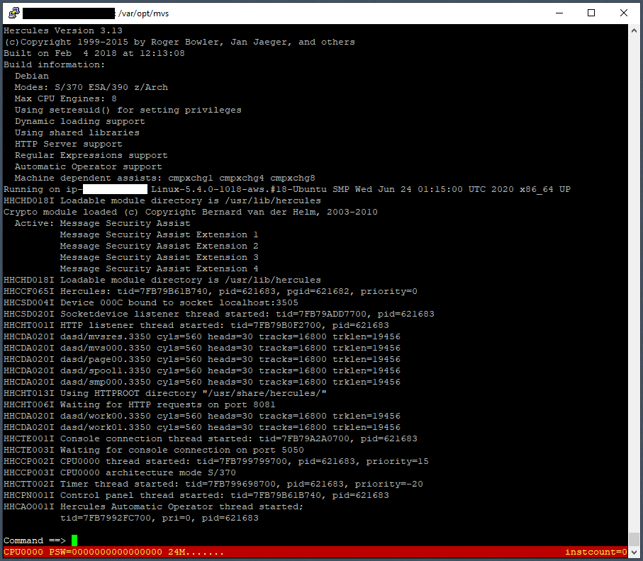</td>
<td>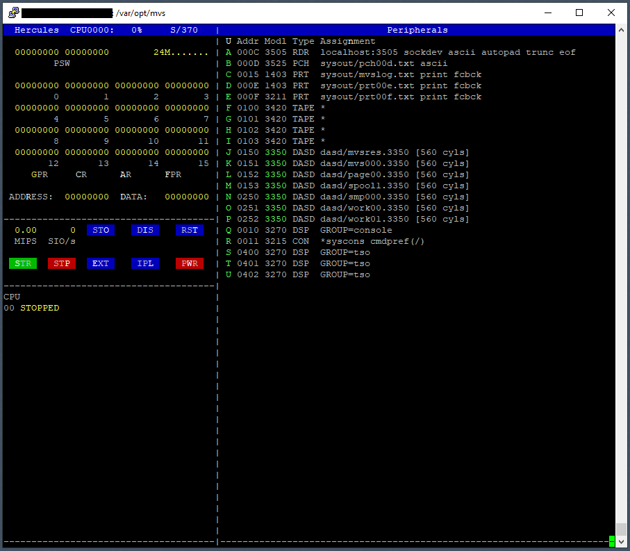</td>
</tr></table><hr>

### Attach a TN3270 Client to the Console Port 5050

```
(tn3270 ip=23.45.67.89 port=5050 LU Name=console)
<connect>
Device number : 0010
Subchannel    : 0010
```

<hr><table><tr><td>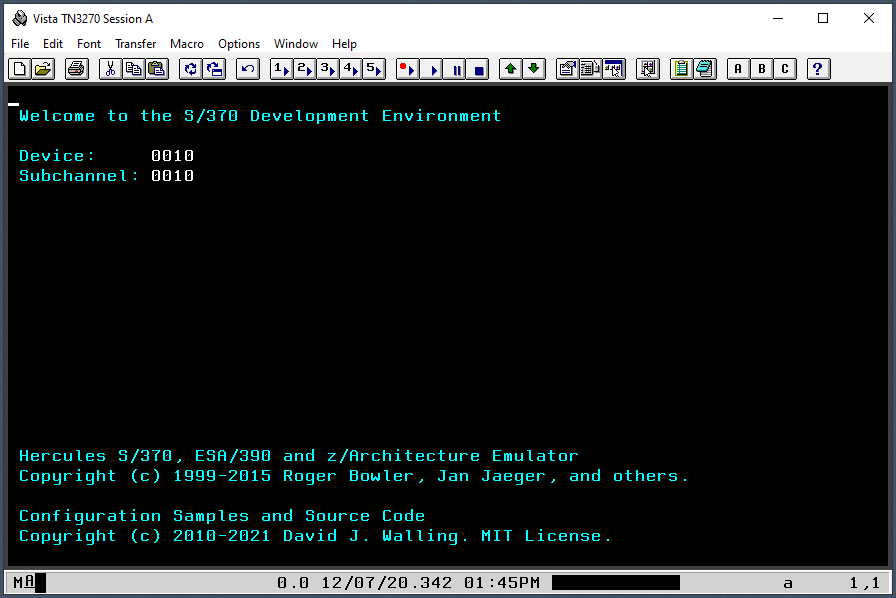</td></tr></table><hr>

### IPL MVS 3.8 using a 3270 Terminal Emulator

```
(hercules)
HHCTE009I Client 192.168.1.33 connected to 3270 device 0:0010
Command ==> ipl 150

(tn3270 console)
 | IEA101A SPECIFY SYSTEM PARAMETERS FOR RELEASE 03.8 .VS2
r 0,clpa
  IEE360I SMF NOW RECORDING ON SYS1.MANX on MVSRES TIME=16.50.13
 *00 IFB010D ENTER 'IPL REASON,SUBSYSTEM ID' OR 'U'
- AUTO COMMANDS IN COMMND00 BEING PROCESSED CN=00
  IEF677I WARNING MESSAGE(S) FOR JOB JES2     ISSUED
 *01 $HASP426 SPECIFY OPTIONS - HASP-II, VERSION JES2 4.1
r 0,u
- r 0,u
  IEE600I REPLY TO 00 IS;U
  IGF992I  MIH INIT COMPLETE, PRI=000300, SEC=000015
r 1,format,noreq
- r 1 SUPPRESSED
  IEE600I REPLY TO 01 IS;SUPPESSED
 *02 $HASP479 UNABLE TO OBTAIN CKPT DATA SET LOCK - IO ERROR -
 * REPLY Y OR N TO CONTINUE
r 2,y
- r 2 SUPPRESSED
  IEE600I REPLY TO 02 IS;SUPPRESSED
 *03 $HASP436 REPLY Y OR N TO CONFIRM CHECKPOINT RECORD CHANGE
r 3,y
- r 3 SUPPRESSED
  IEE600I REPLY TO 03 IS;SUPPRESSED
- $HASP493 JES2 COLD-START IS IN PROGRESS
- $HASP423 SPOOL1 IS BEING FORMATTED
- $HASP412 MAXIMUM OF 1   READER(S)  EXCEEDED
- $HASP412 MAXIMUM OF 1   PUNCH(ES)  EXCEEDED
  IEE041I THE SYSTEM LOG IS NOW ACTIVE
  $HASP000 OK
  $HASP000 OK
<pf12>
  ...
  $HASP099 ALL AVAILABLE FUNCTIONS COMPLETE
```
<hr><table><tr><td>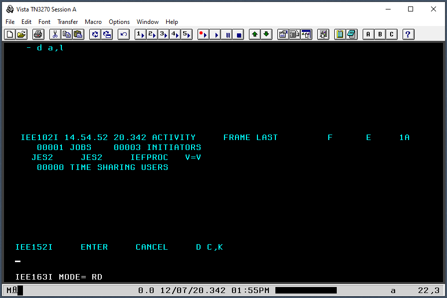</td></tr></table><hr>

### Attach Additional DASD

Use dasdinit to create DASD for catalog and sort work and to include SYSCPK. These definitions exist in mvs.cnf but are commented out.
```
(hercules)
Command ==> script conf/mvs.script
#                                                                                                      
####################################################################                                   
#                HERCULES EMULATOR SCRIPT FILE                     #                                   
####################################################################                                   
#                                                                                                      
# use for attaching new dasd volumes to target MVS 3.8j system                                         
#                                                                                                      
attach 180 3380 dasd/pub000.3380                                                                       
HHCDA020I dasd/pub000.3380 cyls=886 heads=15 tracks=13290 trklen=47616                                 
attach 190 3390 dasd/pub001.3390 cu=3880                                                               
HHCDA020I dasd/pub001.3390 cyls=1114 heads=15 tracks=16710 trklen=56832                                
attach 220 2314 dasd/sortw1.2314                                                                       
HHCDA020I dasd/sortw1.2314 cyls=203 heads=20 tracks=4060 trklen=7680                                   
attach 221 2314 dasd/sortw2.2314                                                                       
HHCDA020I dasd/sortw2.2314 cyls=203 heads=20 tracks=4060 trklen=7680                                   
attach 222 2314 dasd/sortw3.2314                                                                       
HHCDA020I dasd/sortw3.2314 cyls=203 heads=20 tracks=4060 trklen=7680                                   
attach 223 2314 dasd/sortw4.2314                                                                       
HHCDA020I dasd/sortw4.2314 cyls=203 heads=20 tracks=4060 trklen=7680                                   
attach 224 2314 dasd/sortw5.2314                                                                       
HHCDA020I dasd/sortw5.2314 cyls=203 heads=20 tracks=4060 trklen=7680                                   
attach 225 2314 dasd/sortw6.2314                                                                       
HHCDA020I dasd/sortw6.2314 cyls=203 heads=20 tracks=4060 trklen=7680                                   
attach 253 3350 dasd/syscpk.3350                                                                       
HHCDA020I dasd/syscpk.3350 cyls=560 heads=30 tracks=16800 trklen=19456                                 
HHCPN013I EOF reached on SCRIPT file. Processing complete.                                             
```

### Initialize Additional DASD

```
(hercules)
Command ==> devinit 00c jcl/mvs00.jcl
HHCSD007I Device 000C unbound from socket localhost:3505
HHCSD022I Socketdevice listener thread terminated
HHCPN098I Device 0:000C initialized

(tn3270 conosle)
| 04 ICK003D REPLY U TO ALTER VOLUME 180 CONTENTS, ELSE T
r 4,u
...
| 05 ICK003D REPLY U TO ALTER VOLUME 190 CONTENTS, ELSE T
r 5,u
...
| 06 ICK003D REPLY U TO ALTER VOLUME 220 CONTENTS, ELSE T
r 6,u
...
| 07 ICK003D REPLY U TO ALTER VOLUME 221 CONTENTS, ELSE T
r 7,u
...
| 08 ICK003D REPLY U TO ALTER VOLUME 222 CONTENTS, ELSE T
r 8,u
...
| 09 ICK003D REPLY U TO ALTER VOLUME 223 CONTENTS, ELSE T
r 9,u
...
| 10 ICK003D REPLY U TO ALTER VOLUME 224 CONTENTS, ELSE T
r 10,u
...
| 11 ICK003D REPLY U TO ALTER VOLUME 225 CONTENTS, ELSE T
r 11,u
...
$HASP099 ALL AVAILABLE FUNCTIONS COMPLETE
$sprt1
$HASP000 OK
```

Since we've moved the output to the "sysout" folder, be sure to include the "sysout/" path in the condcode.rexx command arguments.
```
(bash)
$ bin/condcode.rexx sysout/prt00e.txt mvs00
Searching sysout/prt00e.txt for MVS Job Name mvs00

Job Name    Step Name    Proc Step Name    Completion Code
--------    ---------    --------------    ---------------
MVS00       ICKDSF                         0000
MVS00       IEBGENER                       0000
MVS00       BACKUP01                       0000
MVS00       UPDATE01                       0000
MVS00       IEFBR14                        0000
MVS00       IDCAMS01                       0000

  6 steps executed in selected jobs
  6 steps received completion code = 0000
```

### Add Sort, Work, SYSCPK DASD to MVS Configuration File

Here we are uncommenting lines in the mvs.cnf for the DASD units we have manually attached and initialized using MVS so that the next time we IPL the system, these statements will instruct Hercules to perform the attachments. Only the following devices are left commented out: 01C, 01D, 310.4, 009 and 012.
```
(bash)
$ vi conf/mvs.cnf
...
0180     3380     dasd/pub000.3380
...
0190     3390     dasd/pub001.3390 cu=3880
...
0220     2314     dasd/sortw1.2314
0221     2314     dasd/sortw2.2314
0222     2314     dasd/sortw3.2314
0223     2314     dasd/sortw4.2314
0224     2314     dasd/sortw5.2314
0225     2314     dasd/sortw6.2314
...
0253     3350     dasd/syscpk.3350
```

### Create User Catalogs

```
(hercules)
Command ==> devinit 00c jcl/mvs01.jcl
HHCPN098I Device 0:000C initialized

(tn3270 console)
...
$HASP099 ALL AVAILABLE FUNCTIONS COMPLETE

(bash)
$ bin/condcode.rexx sysout/prt00e.txt mvs01
Searching sysout/prt00e.txt for MVS Job Name mvs01

Job Name    Step Name    Proc Step Name    Completion Code
--------    ---------    --------------    ---------------
MVS01       IDCAMS01                       0000

  1 steps executed in selected jobs
  1 steps received completion code = 0000
```

### Create TSO IDs

Here we replace the definition of TSO accounts HMVS01 and HMVS02 with account names that are more descriptive of the individual so that operators can identify who *should* be those active in the system. Use a stronger password than "secret" because CNSLPORT can be reached by anyone on the Internet.
```
(bash)
$ cp jcl/mvs02.jcl jcl/mvs02-original.jcl
$ vi jcl/mvs02.jcl
// EXEC TSONUSER,ID=DWALL01,   This will be the logon ID
//      PW='secret',           No password will be required to logon
//      AN='*',                No accounting number stored for user
//      OP='OPER',             Allow operator authority
//      AC='ACCT',             Allow ACCOUNT TSO COMMAND
//      JC='JCL',              alloc submit/cancel/status/output
//      MT='MOUNT'             allow tape mounts
// EXEC TSONUSER,ID=DWALL02,   This will be the logon ID
//      PW='secret',           No password will be arequired to logon
//      AN='*',                No accounting number stored for user
//      OP='OPER',             Allow operator authority:::x
//      AC='ACCT',             Allow ACCOUNT TSO COMMAND
//      JC='JCL',              alloc submit/cancel/status/output
//      MT='MOUNT'             allow tape mounts

(hercules)
Command ==> devinit 00c jcl/mvs02.jcl
HHCPN098I Device 0:000C initialized

(tn3270 console)
| 12 IEC301A S JOB MVS02    DSNAME SYS1.VSAM.MASTER.CATALOG
r 12,sysprog
...
| 13 IEC301A S JOB MVS02    DSNAME SYS1.VSAM.MASTER.CATALOG
r 13,sysprog
...
$HASP099 ALL AVAILABLE FUNCTIONS COMPLETE

(bash)
$ bin/condcode.pl sysout/prt00e.txt mvs02
Searching sysout/prt00e.txt for MVS Job Name mvs02

Job Name    Step Name    Proc Step Name    Completion Code
--------    ---------    --------------    ---------------
MVS02       DEL01                          0000
MVS02       AL02                           0000
MVS02       PW03                           0000
MVS02       PW04                           0000
MVS02       PW05                           0000
MVS02       PW06                           0000
MVS02       TSO07                          0000
MVS02       PW08                           0000
MVS02       PW09                           0000
MVS02       PW10                           0000
MVS02       PW11                           0000
MVS02       PW12                           0000
MVS02       PW13                           0000
MVS02       PW14                           0000
MVS02       IDC15                          0000
MVS02       DEL01                          0000
MVS02       AL02                           0000
MVS02       PW03                           0000
MVS02       PW04                           0000
MVS02       PW05                           0000
MVS02       PW06                           0000
MVS02       TSO07                          0000
MVS02       PW08                           0000
MVS02       PW09                           0000
MVS02       PW10                           0000
MVS02       PW11                           0000
MVS02       PW12                           0000
MVS02       PW13                           0000
MVS02       PW14                           0000
MVS02       IDC15                          0000

 30 steps executed in selected jobs
 30 steps received completion code = 0000
```

### Start VTAM

TSO clients will observe the Hercules welcome screen until or unless the network (VTAM) is started. The "START NET" (or "S NET") console command directs MVS to start the VTAM task.
```
(tn3270 port=5050 group=tso)
<connect>
Device Number : 0400
Subchannel    : 0012

(tn3270 group=console)
start net
```

<hr><table><tr><td>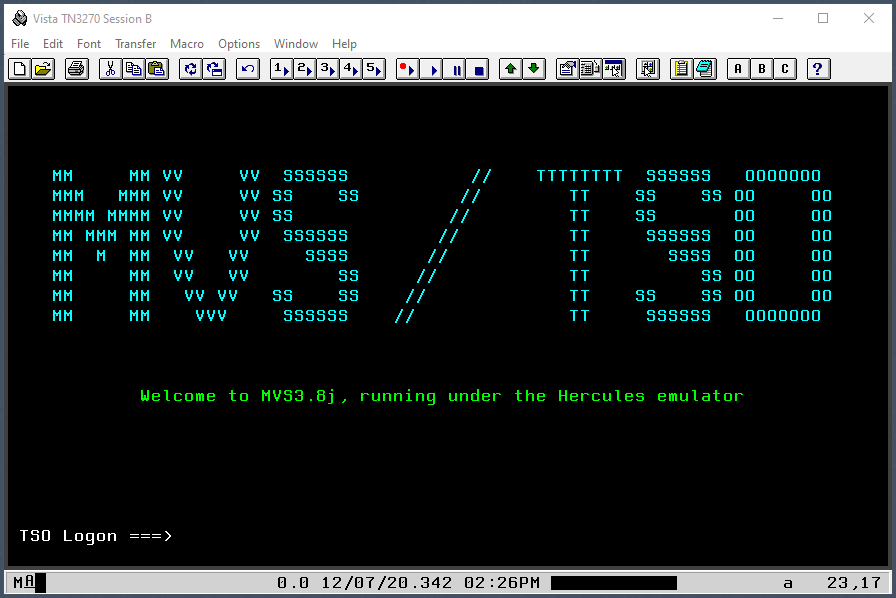</td></tr></table><hr>

### Verify TSO Logon Accounts

```
(tn3270 tso)
Logon ===> logon dwall01/secret
 READY
logoff

Logon ===> logon dwall02/secret
 READY
logoff
```

### Install File Transfer Support

Earlier installation instructions included a step to comment the execution of the DBSTOP and DBSTART procedures in the ind$file installation JCL. I've retained that edit here.
```
(bash)
cp jcl/'ind$file.jcl' jcl/'ind$file-original.jcl'
vi jcl/'ind$file.jcl'
//*DBSTOP EXEC DBSTOP
//*DBSTART EXEC DBSTART
```

T before J, except after K.
```
(hercules)
Command ==> devinit 100 tape/ind$file.het
HHCTA004I 0100: tape/ind$file.het is a Hercules Emulated Tape file
HHCPN098I Device 0:0100 initialized
Command ==> devinit 00c jcl/ind$file.jcl
HHCPN098I Device 0:000C initialized

(telnet console)
  00  $HASP100 LOADTAPE ON READER1     LOADTAPE                                
      IEF677I WARNING MESSAGE(S) FOR JOB LOADTAPE ISSUED                       
    - $HASP373 LOADTAPE STARTED - INIT  1 - CLASS A - SYS HMVS                 
    - IEF403I LOADTAPE - STARTED - TIME=17.29.55                               
    - CCI001C IND$FILE/IEBCOPY /00:00:00.02/        /00000/JCLLIB  /LOADTAPE   
      IEF234E K 100,INDFIL,PVT,LOADTAPE                                        
    - IEF404I LOADTAPE - ENDED - TIME=17.29.55                                 
    - $HASP395 LOADTAPE ENDED                                                  
      $HASP309    INIT  1 INACTIVE ******** C=A                                
      $HASP150 LOADTAPE ON PRINTER1        43 LINES                            
      $HASP160 PRINTER1 INACTIVE - CLASS=A                                     
      $HASP250 LOADTAPE IS PURGED        

(bash)
$ sudo bin/condcode.pl sysout/prt00e.txt loadtape
Searching sysout/prt00e.txt for MVS Job Name loadtape

Job Name    Step Name    Proc Step Name    Completion Code
--------    ---------    --------------    ---------------
LOADTAPE    IND$FILE                       0000

  1 steps executed in selected jobs
  1 steps received completion code = 0000
```

### Verify File Transfer Support

Replace my local folder "C:\repos\" below with a suitable, writable location on your local system.

```
(tn3270 group=tso)
TSO Logon ===> logon dwall01/secret
...
 READY
(Select menu option Transfer|Receive From Host)
(Enter source host file name 'sys1.parmlib(IEASYS00)')
(Enter target file name 'C:\repos\IEASYS00.txt')
(Click the Receive button>
 READY
logoff

(Windows Command Shell)
C:\repos> more IEASYS00.txt
APF=00,             IEAAPF00 FOR AUTHORIZED PROGRAM LIBRARIES           00000010
BLDLF=00,           IEABLD00 FOR BLDL MODULES                           00000020
CMD=00,             COMMND00 FOR AUTO COMMANDS                          00000030
CSA=2048,           2048*1K BLOCKS FOR COMMON SERVICE AREA              00000040
CVIO,               CLEAR VIO AT IPL                                    00000050
HARDCPY=(015,       SYSLOG HARDCOPY DEVICE ADDRESS,                     00000060
         ALL,         RECORD ALL WTO/WTOR WITH ROUTE CODES,             00000070
         CMDS),       RECORD ALL COMMANDS AND RESPONSES                 00000080
LNK=00,             LNKLST00 FOR LINKLIST CONCATENATION                 00000090
MAXUSER=32,         SYS TASKS+INITIATORS+TSO USERS                      00000100
PAGNUM=(3,2),       ALLOW ADDITION OF 3 PAGE D/S & 2 SWAP D/S           00000110
PAGE=(SYS1.PAGELPA,                      PAGE DATASETS                 C00000120
      SYS1.PAGECSA,                                                    C00000130
      SYS1.PAGEL00,L),                                                  00000140
REAL=128,           128*1K BLOCKS OF VIRTUAL=REAL SPACE                 00000150
SMF=00,             SMFPRM00 FOR SMP PARAMETERS                         00000160
SQA=3,              3*64K SEGMENTS RESERVED FOR SYSTEM QUEUE SPACE      00000170
VAL=00,             VATLST00 FOR VOLUME ATTRIBUTE LIST                  00000180
VRREGN=64           64 BLOCKS OF V=R ALLOCATED TO VRREGN                00000190
```

<hr><table><tr><td>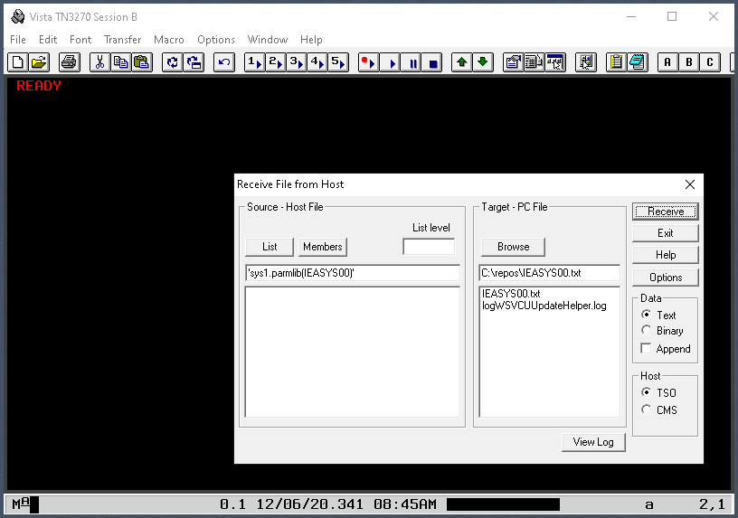</td></tr></table><hr>

### Install RPF

```
(hercules)
Command ==> devinit 100 tape/rpf184.het
HHCTA004I 0100: tape/rpf184.het is a Hercules Emulated Tape file
HHCPN098I Device 0:0100 initialized
Command ==> devinit 00c jcl/rpf184.jcl
HHCPN098I Device 0:000C initialized

(tn3270 console)
*12 IEC301A S JOB RPF153$1 DSNAME SYS1.VSAM.MASTER.CATALOG
r 12,sysprog
00- r 12 SUPPRESSED                                                       
     IEE600I REPLY TO 16 IS;SUPPRESSED                                     
   - CCI001C CLEANUP /IDCAMS  /00:00:00.10/        /00000/TSO     /RPF153$1
     IEF234E K 100,RPF153,PVT,RPF153$1,ALLOC                               
   - CCI001C ALLOC   /IEBCOPY /00:00:00.18/        /00000/TSO     /RPF153$1
   - CCI001C GENER   /IEBUPDTE/00:00:00.01/        /00000/TSO     /RPF153$1
   - CCI001C ALLOC   /IEBCOPY /00:00:00.15/        /00000/TSO     /RPF153$1
   - CCI001C HELP    /IEBCOPY /00:00:00.02/        /00000/TSO     /RPF153$1
   - IEF404I RPF153$1 - ENDED - TIME=17.36.01                              
   - $HASP395 RPF153$1 ENDED                                               
     $HASP309    INIT  3 INACTIVE ******** C=S                             
     $HASP150 RPF153$1 ON PRINTER1       672 LINES                         
     $HASP160 PRINTER1 INACTIVE - CLASS=A                                  
     $HASP250 RPF153$1 IS PURGED                                           

(bash)
$ bin/condcode.pl sysout/prt00e.txt 'RPF184$1'
Searching sysout/prt00e.txt for MVS Job Name RPF184$1

Job Name    Step Name    Proc Step Name    Completion Code
--------    ---------    --------------    ---------------
RPF184$1    CLEANUP                        0000
RPF184$1    ALLOC                          0000
RPF184$1    GENER                          0000
RPF184$1    ALLOC                          0000
RPF184$1    HELP                           0000

  5 steps executed in selected jobs
  5 steps received completion code = 0000
```

#### Verify RPF

```
(tn3270 tso)
TSO Logon ===> logon dwall01/secret
 ...
 READY
rpf
(confirm RPF main menu)
(PF3)
 READY
logoff
```

<table><tr><td>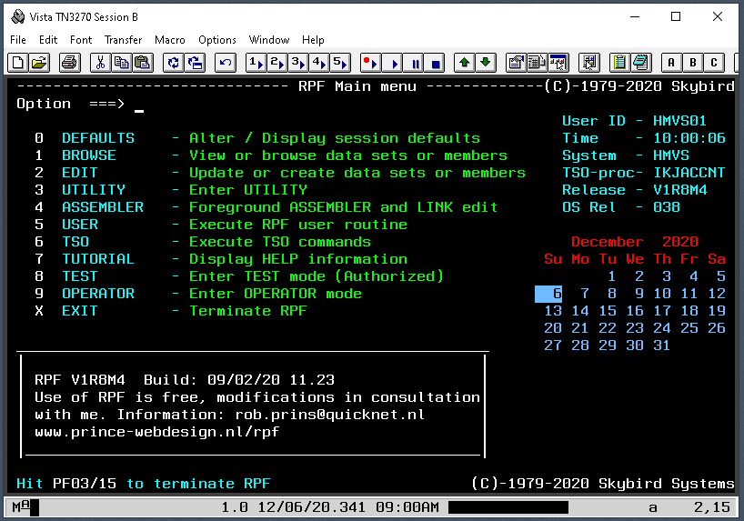</td></tr></table>

### Configure VTAM to Start Automatically

```
(tn3270 tso)
TSO Logon ===> logon dwall01/secret
 READY
rpf
Option  ===> 2
(enter)
Option  ===> 1
Member = COMMND00
Dsname = SYS1.PARMLIB
(enter)
COM='SEND 'AUTO COMMANDS IN COMMND00 BEING PROCESSED',CN=01'
COM='START JES2'                                            
COM='START SETPFKEY,M=00'                                   
COM='START ZTIMER'                                          
COM='START NET'      
(home)
"save"
(enter)
(enter)
(PF3)
 READY
logoff
(select the File|Disconnect menu option)
(select the File|Exit menu option)
```
<hr><table><tr><td>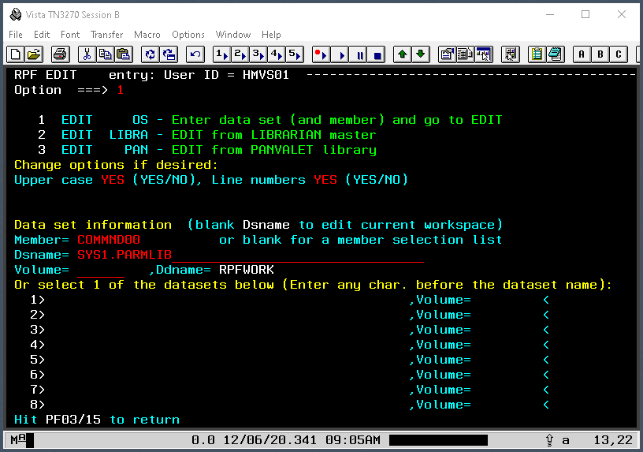</td></tr></table>
<table><tr><td>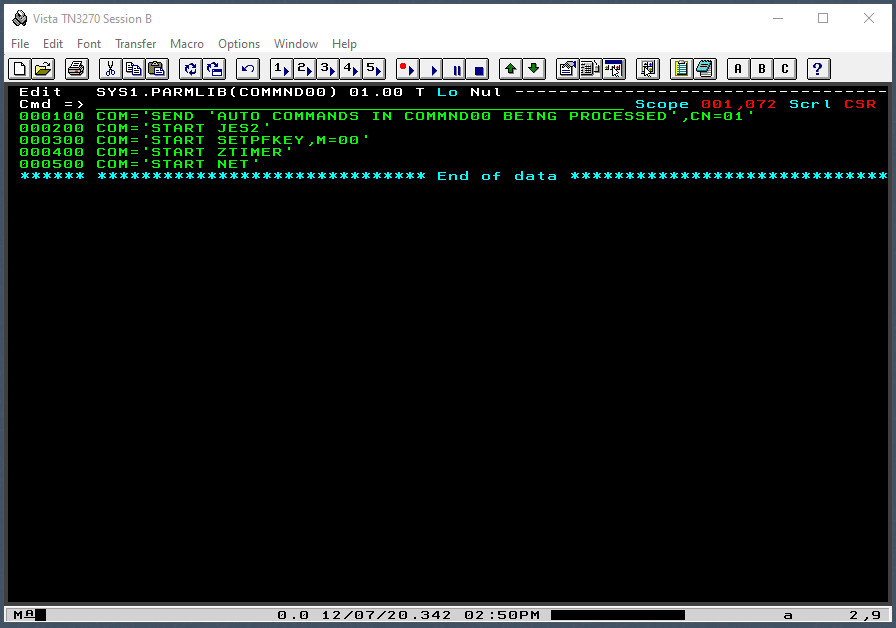</td></tr></table><hr>

### Complete Installation and Backup DASD

```
(tn3270 console)
p tso
00- p tso                                        
  - IKT006I  TCAS ENDED                          
  - IEF404I TSO - ENDED - TIME=17.39.25          
  - $HASP395 TSO      ENDED                      
z net,quick
00- z net,quick                                    
    IST097I  HALT     ACCEPTED                     
    IST133I  VTAM TERMINATION IN PROGRESS          
    IST109I  NETWORK SOLICITOR IS NOW TERMINATED   
    IST141I  NODE LCL400   NOW DORMANT             
    IST105I  LCL400   NODE NOW INACTIVE            
    IST105I  APPLTSO  NODE NOW INACTIVE            
    IST412I  VTAM COMMAND PROCESSING TERMINATED    
    IST102I  VTAM IS NOW INACTIVE                  
  - IEF404I NET - ENDED - TIME=17.40.10            
  - $HASP395 NET      ENDED                        
    $HASP099 ALL AVAILABLE FUNCTIONS COMPLETE      
$pjes2
00- $p jes2                                                           
  - IEF404I INIT - ENDED - TIME=17.40.36                              
  - $HASP395 INIT     ENDED                                           
  - IEF404I INIT - ENDED - TIME=17.40.36                              
  - $HASP395 INIT     ENDED                                           
  - IEF404I INIT - ENDED - TIME=17.40.36                              
  - $HASP395 INIT     ENDED                                           
    IEE043I A SYSTEM LOG DATA SET HAS BEEN QUEUED TO SYSOUT CLASS A   
    IEE037I LOG NOT ACTIVE                           
00- $HASP085 JES2 TERMINATION COMPLETE        
  - IEF404I JES2 - ENDED - TIME=17.41.41      
z eod
00- z eod                                                           
   *IEE362A SMF ENTER DUMP FOR SYS1.MANX ON MVSRES                  
    IEE360I SMF NOW RECORDING ON SYS1.MANY ON MVSRES TIME=17.42.10  
    IEE334I HALT     EOD SUCCESSFUL                                 
quiesce     
IEE082I SYSTEM WAIT STATE 'CCC'X - QUIESCE FUNCTION PERFORMED
(select menu option file|disconnect)
(select menu file|exit)

(hercules)
HHCTE014I 3270 device 0010 client <ip address> connection reset
HHCCP011I CPU0000: Disabled wait state
          PSW=000A0000 00000CCC
Command ==> quit
...
HHCHD909I Shutdown sequence complete
$ cp conf/mvs.cnf conf/mvs-rpf.cnf
$ tar -zcf backup/50-dasd-rpf.tar.gz dasd
```

### Setup a Service Definition for Hercules

Here we'll set up Hercules as a service, or "daemon," to run automatically on system start up and not require any user account to log in to start it. On Linux systems using systemd, create a "service" file in /lib/systemd/service. This file can define behavior systemd should take to start and stop the service. We only execute the "start" behavior. To stop, we will want to use the web console and shutdown in a controlled manner. We also specify the directory that should be "current" when the service is run. This is important because our configuration file mvs.cnf has relative path references in it. The second file /etc/modules-load.d/hercules.conf is simply an instruction to run hercules at boot time. When the service is "enabled", a symbolic link is created to this file. We ask systemd to reload its daemon configurations since we created new service files. Finally, we "enable" the hercules service.
```
(bash)
$ sudo vi /lib/systemd/system/hercules.service
# Hercules Service

[Unit]
Description=Hercules

[Service]
ExecStart=/usr/bin/hercules -f conf/mvs.cnf -b conf/herclogo
WorkingDirectory=/var/opt/mvs

[Install]
WantedBy=multi-user.target
:x
$ sudo vi /etc/modules-load.d/hercules.conf
#load at boot
hercules
:x
$ sudo systemctl daemon-reload
$ sudo systemctl enable hercules
Created symlink /etc/systemd/system/multi-user.target.wants/hercules.service → /lib/systemd/system/hercules.service.
```

### Start Hercules as a System Service

When we start the service, Hercules' normal output is routed to the /var/log/syslog file. The last few lines of that file that pertain to this service can be seen when the service status is requested.
```
(bash)
$ sudo systemctl start hercules
$ sudo systemctl status hercules
● hercules.service - Hercules
     Loaded: loaded (/lib/systemd/system/hercules.service; enabled; vendor preset: enabled)
     Active: active (running) since Sun 2020-12-06 10:41:21 EST; 6s ago
   Main PID: 4736 (hercules)
      Tasks: 9 (limit: 3524)
     Memory: 2.0M
     CGroup: /system.slice/hercules.service
             └─4736 /usr/bin/hercules -f conf/mvs.cnf -b conf/herclogo

Dec 06 10:41:21 osboxes hercules[4736]: HHCDA020I dasd/work00.3350 cyls=560 heads=30 tracks=16800 trklen=19456
Dec 06 10:41:21 osboxes hercules[4736]: HHCDA020I dasd/work01.3350 cyls=560 heads=30 tracks=16800 trklen=19456
Dec 06 10:41:21 osboxes hercules[4736]: HHCDA020I dasd/syscpk.3350 cyls=560 heads=30 tracks=16800 trklen=19456
Dec 06 10:41:21 osboxes hercules[4736]: HHCTE001I Console connection thread started: tid=7F30B2F9D700, pid=4736
Dec 06 10:41:21 osboxes hercules[4736]: HHCTE003I Waiting for console connection on port 5050
Dec 06 10:41:21 osboxes hercules[4736]: HHCCP002I CPU0000 thread started: tid=7F30B2496700, pid=4736, priority=15
Dec 06 10:41:21 osboxes hercules[4736]: HHCTT002I Timer thread started: tid=7F30B2395700, pid=4736, priority=0
Dec 06 10:41:21 osboxes hercules[4736]: HHCCP003I CPU0000 architecture mode S/370
Dec 06 10:41:21 osboxes hercules[4736]: HHCAO001I Hercules Automatic Operator thread started;
Dec 06 10:41:21 osboxes hercules[4736]:           tid=7F30B2092700, pri=0, pid=4736
```

### Confirm Hercules is Running as a System Service

```
$ ps -ef | grep hercules
...
root        4736       1 10 10:41 ?        00:00:06 /usr/bin/hercules -f conf/mvs.cnf -b conf/herclogo
...
$ netstat -an | grep :5050
tcp        0      0 0.0.0.0:5050            0.0.0.0:*               LISTEN     
$ netstat -an | grep :8081
tcp        0      0 0.0.0.0:8081            0.0.0.0:*               LISTEN     
```

### Attach the Web Console to Hercules using a Browser

Remember to use "http" and not "https" to connect.
```
(browser)
http://23.45.67.89:8081/
(enter hercules user name and password)
(click sign in)
```

<hr><table><tr><td>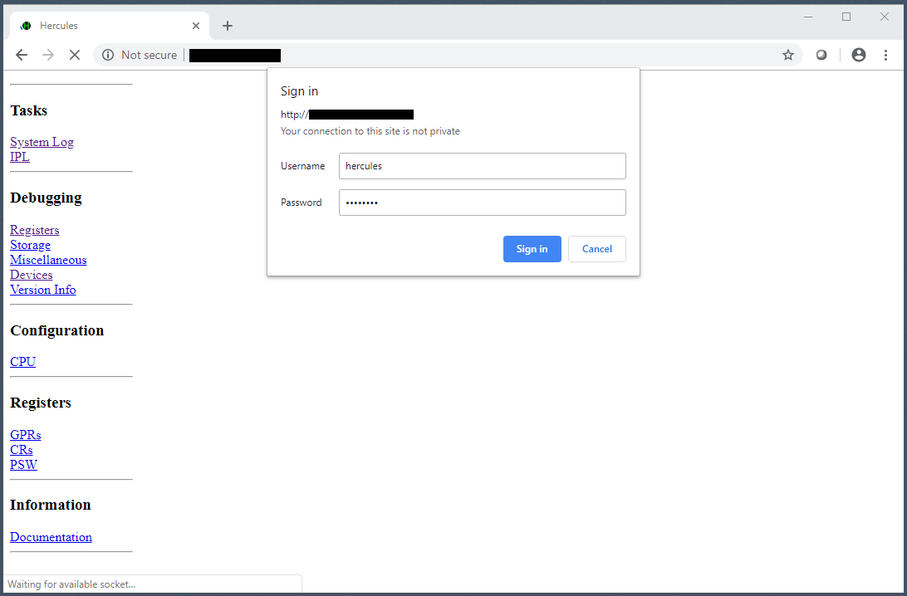</td></tr></table>
<table><tr><td>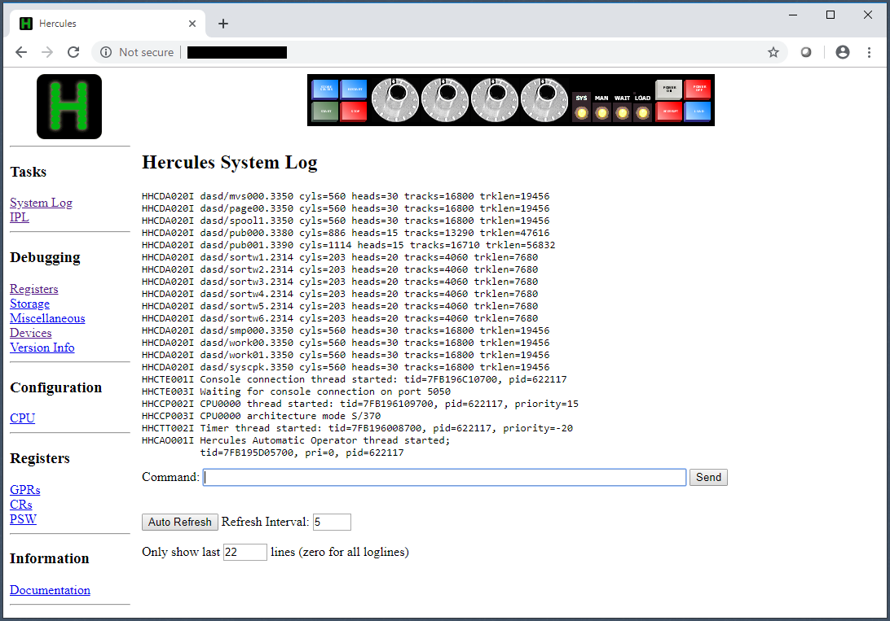</td></tr></table><hr>

### Start the System IPL from the Web Console

Click on the "IPL" link. Make sure you select the "DEV0150" device on CPU0000. Click the "IPL" button. Note that the "HHC1C001A Enter input for console device 0011" references the 3215 device we added to the configuration in sysgen01.jcl and in mvs.cnf.

<hr><table><tr><td>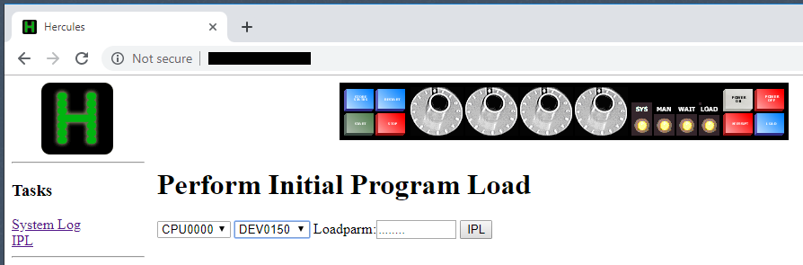</td></tr></table>
<table><tr><td>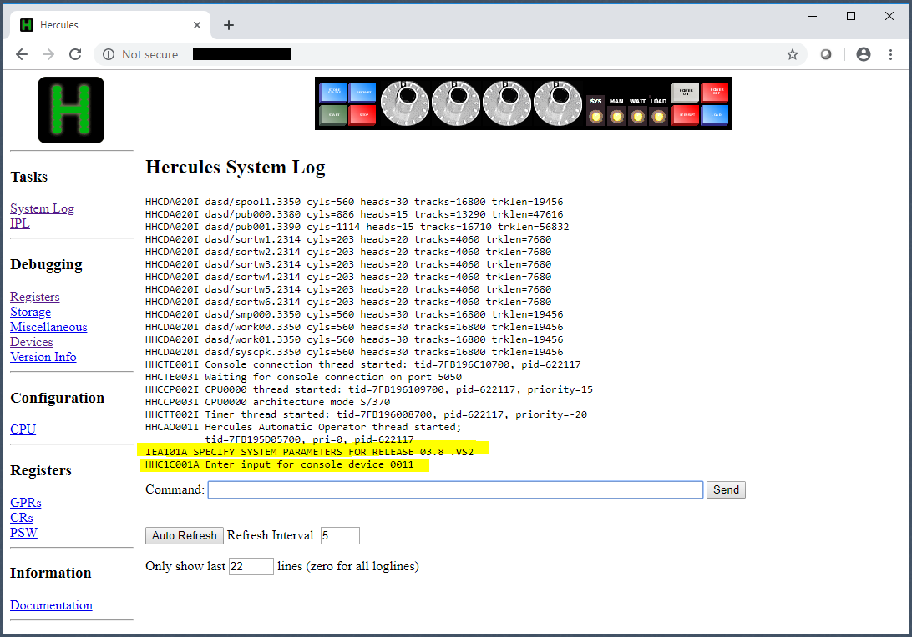</td></tr></table><hr>

### Enter startup Parameters using the Web Console

Enter IPL parameters into the Web Console with a forward slash just as we did with the internal console in the Hercules window.
```
(browser)
Command: /r 0,clpa
Command: /r 0,u
Command: /r 1,format,noreq
Command: /d a,l
/(0011) d a,l
11.07.12           IEE102I 11.07.12 20.341 ACTIVITY 172 
    00003 JOBS    00003 INITIATORS
   JES2     JES2     IEFPROC   V=V
   NET      NET      IEFPROC   V=V
   TSO      TSO      STEP1     V=V  S
    00000 TIME SHARING USERS
    00000 ACTIVE  00008 MAX VTAM TSO USERS
```

<hr><table><tr><td>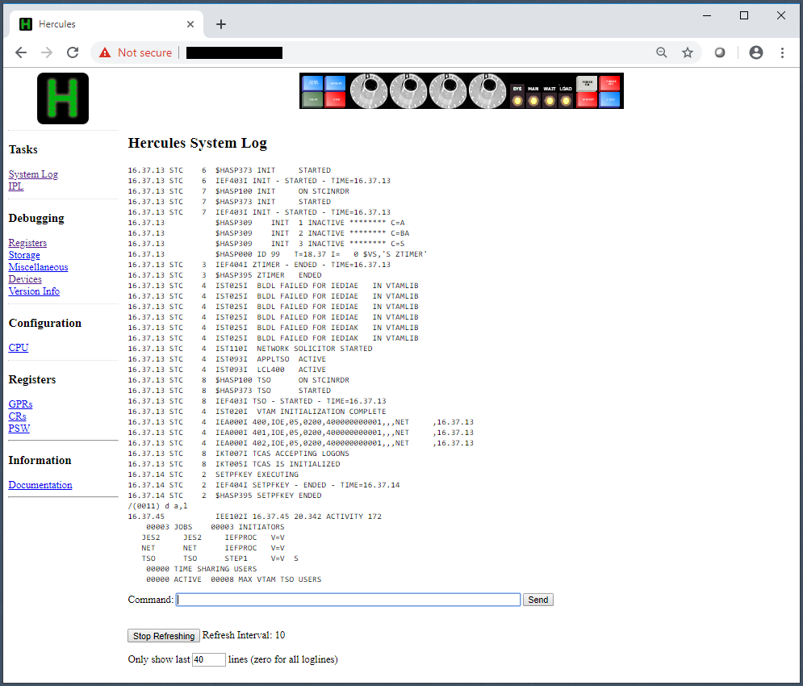</td></tr></table><hr>

### Verify TSO Connectivity to System Running as a Service

The last thing to verify is that we can still connect using a TN3270 client on CNSLPORT. While we're here, let's set our TN3270 client to be a custom size, say 120 columns by 64 rows.

<hr><table><tr><td>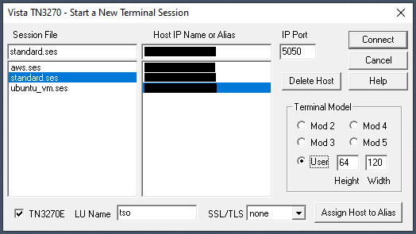</td></tr></table><hr>

```
(tn3270 group=tso)
(connect)
(confirm custom Hercules screen)
(enter)
(confirm VTAM login screen or "INPUT NOT RECOGNIZED")
logon dwall01/secret
(enter)
 READY
rpf
(confirm RPF menu)
Option  ===> 3.4
Data set level = SYS1
(enter)
(confirm list of SYS1 datasets)
```

<hr><table><tr><td>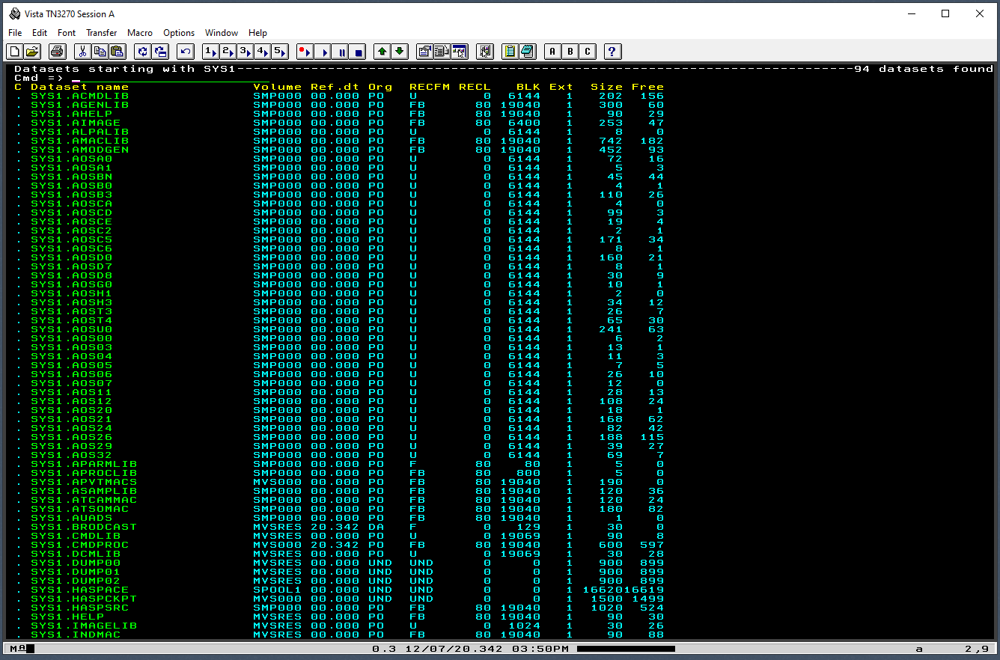</td></tr></table><hr>

This concludes the installation stage. We have installed and configured MVS 3.8j to automatically start as a system service on a cloud-based Linux server and have confirmed access to TSO using TN3270. In the next step, we will extend the system configuration, create development libraries, JCL, include members, and source code, compile and run programs, and examine program output.

Continue to [Configure the Environment](Development.md)  
Go back to [Prepare a Linux Server](Linux.md)  
Return to [README](../README.md)
